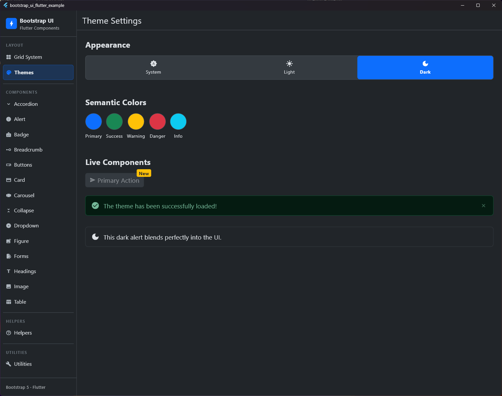
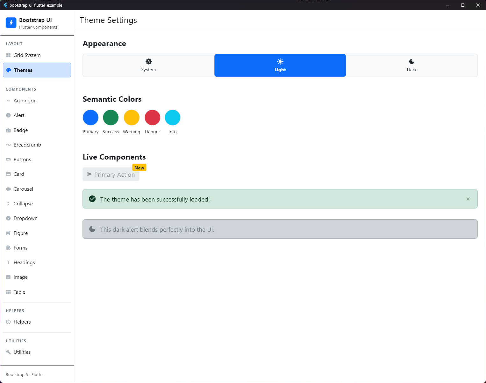

# Bootstrap UI für Flutter

<p align="center">
  
</p>

Eine Flutter-Komponentenbibliothek, die das **Bootstrap 5.3 Design-System** so getreu wie möglich implementiert. Entwickelt für Entwickler, die moderne, hochgradig responsive und ästhetische Flutter-Anwendungen für Web, Desktop und Mobile mit dem vertrauten Bootstrap-Feeling und Developer-Experience erstellen möchten.

---

<p align="center">
  <a href="https://pub.dev/packages/bootstrap_ui_flutter">
    
  </a>
  <a href="https://pub.dev/packages/bootstrap_ui_flutter">
    
  </a>
  <a href="https://github.com/Nexus633/bootstrap_ui_flutter/actions/workflows/test.yml">
    
  </a>
  <a href="https://github.com/Nexus633/bootstrap_ui_flutter/blob/main/LICENSE">
    
  </a>
</p>

---

## 🌟 Hauptmerkmale (Features)

*   **Responsives Grid-System:** Volle 12-Spalten-Layoutsteuerung mittels `BsContainer`, `BsRow` und `BsCol` unterstützt fluide Breiten und Breakpoints (`sm`, `md`, `lg`, `xl`, `xxl`).
*   **Design-Tokens:** Native Unterstützung für alle Bootstrap-Farben (primary, secondary, success, danger, warning, info, light, dark), Schriftgrößen, Abstände (s1-s5) und Eckenradien.
*   **Komponentensammlung:**
    *   *Buttons & Groups:* Gefüllte Buttons, Outline-Buttons, Pill-Style, Größen und Ladezustände.
    *   *Navigation:* Breadcrumbs (Brotkrümelnavigation), voll responsive Dropdown-Menüs.
    *   *Container & Layout:* Cards (Karten mit Header, Footer, Bild-Support), animierte Accordions, Carousels und Collapse-Widgets.
    *   *Feedback & Overlays:* Schließbare Alerts mit flexiblen Animationen.
*   **Duales Theme-System:** Nahtlose Integration in standardmäßige Flutter Light und Dark Modes, konform zu den Bootstrap 5.3 Vorgaben.
*   **Utility-Erweiterungen:** Schnelle Layout-Methoden wie `.p3()`, `.mx2()`, `.w100()` direkt auf Widgets, um verschachtelten Boilerplate-Code zu vermeiden.

---

## 🎨 Theme-Vergleich

| Light Theme | Dark Theme |
|:---:|:---:|
|  |  |

---

## 🚀 Erste Schritte

### 1. Installation

Füge `bootstrap_ui_flutter` zu deinen `pubspec.yaml` Abhängigkeiten hinzu:

```yaml
dependencies:
  bootstrap_ui_flutter: ^0.5.0
```

Führe in deinem Terminal aus:
```bash
flutter pub get
```

### 2. Grundlegende Einrichtung

Wickel deine Anwendung in `MaterialApp` ein und registriere die Bootstrap-Theme-Erweiterungen für den hellen und dunklen Modus:

```dart
import 'package:flutter/material.dart';
import 'package:bootstrap_ui_flutter/bootstrap_ui_flutter.dart';

void main() {
  runApp(const MyApp());
}

class MyApp extends StatelessWidget {
  const MyApp({super.key});

  @override
  Widget build(BuildContext context) {
    return MaterialApp(
      title: 'Bootstrap UI Flutter Demo',
      theme: ThemeData(
        brightness: Brightness.light,
        extensions: [BsThemeData.lightTheme],
      ),
      darkTheme: ThemeData(
        brightness: Brightness.dark,
        extensions: [BsThemeData.darkTheme],
      ),
      home: const MyHomePage(),
    );
  }
}
```

### 3. Anwendungsbeispiel

Erstelle eine ansprechende Bootstrap-Karte mit einem Layout-Grid und einer Schaltfläche:

```dart
import 'package:flutter/material.dart';
import 'package:bootstrap_ui_flutter/bootstrap_ui_flutter.dart';

class MyHomePage extends StatelessWidget {
  const MyHomePage({super.key});

  @override
  Widget build(BuildContext context) {
    final bs = context.bs; // Einfacher Zugriff auf Bootstrap-Tokens

    return Scaffold(
      backgroundColor: bs.bodyBg,
      body: SafeArea(
        child: BsContainer(
          type: BsContainerType.fixed,
          child: BsRow(
            gutterX: BsSpacing.s3,
            gutterY: BsSpacing.s3,
            children: [
              BsCol(
                config: const BsColConfig(xs: 12, md: 8, lg: 6),
                child: BsCard(
                  header: const BsCardHeader(child: Text('Hervorgehobene Komponente')),
                  body: BsCardBody(
                    children: [
                      BsCardTitle('Bootstrap UI Card'),
                      Text(
                        'Diese Karte ist genau wie Bootstrap-CSS-Templates strukturiert und nutzt Grids, Spacings und Buttons.',
                        style: TextStyle(color: bs.bodyColor),
                      ).mb3(),
                      BsButton(
                        label: 'Jetzt starten',
                        variant: BsButtonVariant.primary,
                        onPressed: () {},
                      ),
                    ],
                  ),
                ),
              ).py3(),
            ],
          ),
        ),
      ),
    );
  }
}
```

---

## 📚 Dokumentation & Referenz

Eine detaillierte Dokumentation ist sowohl auf Deutsch als auch auf Englisch im Ordner `doc/` verfügbar:

*   📖 **[Dokumentations-Startseite](./doc/index.md)**
*   🇩🇪 **[Deutsche Dokumentation](./doc/de)**
*   🇬🇧 **[Englische Dokumentation](./doc/en)**

Um interaktive Live-Beispiele aller Komponenten in Aktion zu sehen, starte das Projekt im Ordner `/example`:

```bash
cd example
flutter run
```

---

## 🛠️ Beitrag leisten & Entwicklung

Beiträge sind herzlich willkommen! Wenn du einen Fehler findest oder Verbesserungsvorschläge hast, erstelle gerne ein Issue oder einen Pull Request auf [GitHub](https://github.com/Nexus633/bootstrap_ui_flutter).

### Lizenz
Dieses Projekt ist lizenziert unter der MIT-Lizenz - siehe die Datei [LICENSE](LICENSE) für Details.
