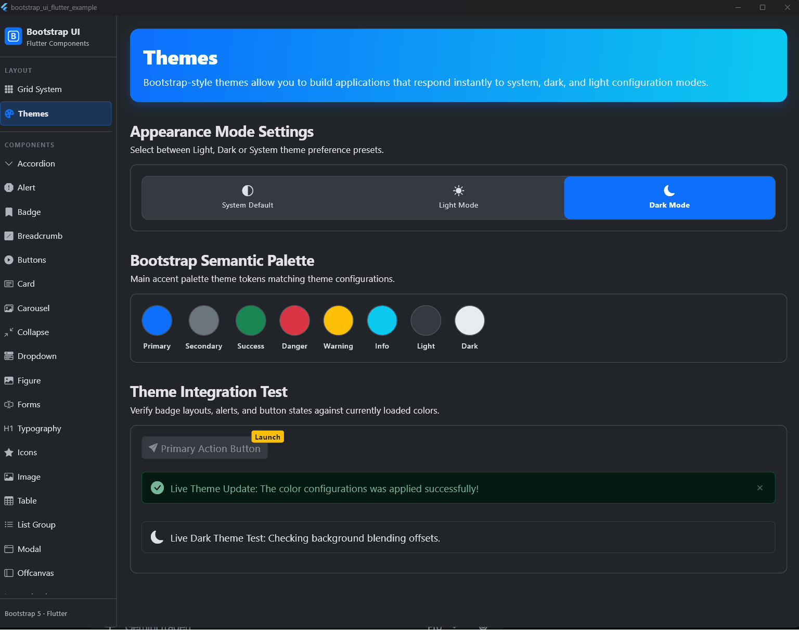
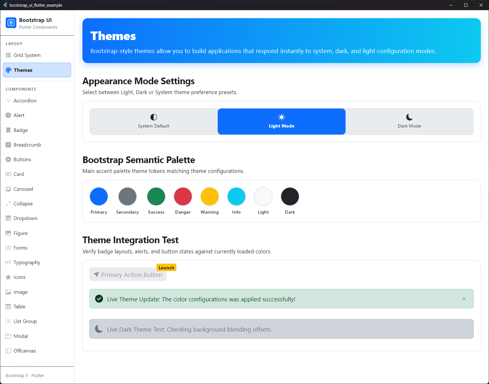
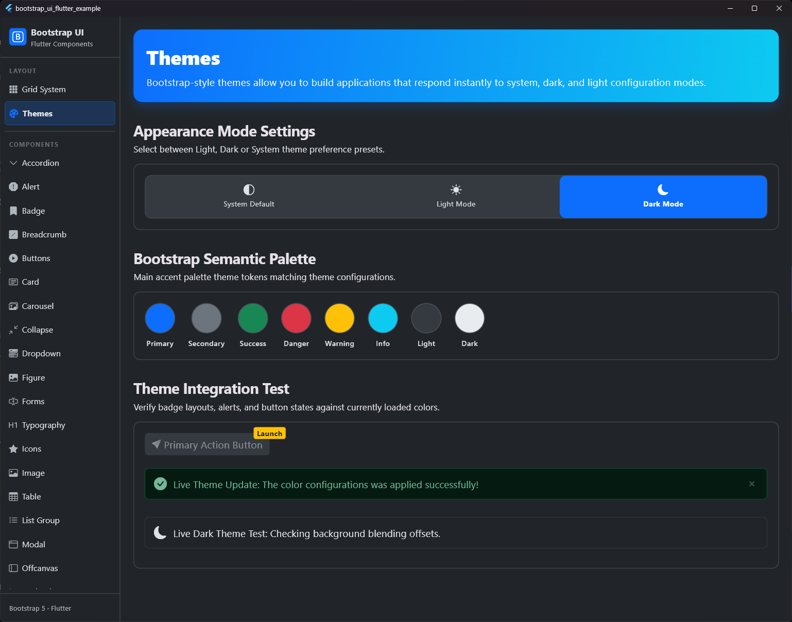

# Bootstrap UI for Flutter

<p align="center">
  
</p>

A Flutter component library that faithfully implements the **Bootstrap 5.3 design system**. Built for developers who want to create modern, highly responsive, and beautiful Flutter web, desktop, and mobile applications with the familiar Bootstrap aesthetic and developer experience.

---

<p align="center">
  <a href="https://pub.dev/packages/bootstrap_ui_flutter">
    
  </a>
  <a href="https://pub.dev/packages/bootstrap_ui_flutter">
    
  </a>
  <a href="https://github.com/Nexus633/bootstrap_ui_flutter/actions/workflows/test.yml">
    
  </a>
  <a href="https://github.com/Nexus633/bootstrap_ui_flutter/blob/main/LICENSE">
    
  </a>
</p>

---

## 🌟 Key Features

*   **Responsive Grid System:** Full 12-column layout control using `BsContainer`, `BsRow`, and `BsCol` supporting fluid widths and breakpoints (`sm`, `md`, `lg`, `xl`, `xxl`).
*   **Design Tokens:** Built-in Bootstrap color palettes (primary, secondary, success, danger, warning, info, light, dark), typography sizes, spacing helpers (s1-s5), and border radii.
*   **Rich Component Suite:**
    *   *Buttons & Groups:* Solid, outline, pill, different sizing, and loading states.
    *   *Navigation:* Breadcrumbs, fully responsive dropdown menus.
    *   *Containers & Layout:* Cards (with header, footer, image support), animated accordions, carousels, and collapse widgets.
    *   *Feedback & Overlays:* Dismissible alerts with custom animation transitions.
*   **Dual Theme Support:** Seamless, native integration with standard Flutter Light and Dark modes matching Bootstrap 5.3 specifications.
*   **Utility Extensions:** Fast layout methods like `.p3()`, `.mx2()`, `.w100()` directly on widgets to avoid nested boilerplate code.

---

## 🎨 Theme Comparison

| Light Theme | Dark Theme |
|:---:|:---:|
|  |  |

---

## 🚀 Getting Started

### 1. Installation

Add `bootstrap_ui_flutter` to your `pubspec.yaml` dependencies:

```yaml
dependencies:
  bootstrap_ui_flutter: ^0.5.0
```

Run in your terminal:
```bash
flutter pub get
```

### 2. Basic Setup

Wrap your application in `MaterialApp` and register the Bootstrap theme extensions for light and dark modes:

```dart
import 'package:flutter/material.dart';
import 'package:bootstrap_ui_flutter/bootstrap_ui_flutter.dart';

void main() {
  runApp(const MyApp());
}

class MyApp extends StatelessWidget {
  const MyApp({super.key});

  @override
  Widget build(BuildContext context) {
    return MaterialApp(
      title: 'Bootstrap UI Flutter Demo',
      theme: ThemeData(
        brightness: Brightness.light,
        extensions: [BsThemeData.lightTheme],
      ),
      darkTheme: ThemeData(
        brightness: Brightness.dark,
        extensions: [BsThemeData.darkTheme],
      ),
      home: const MyHomePage(),
    );
  }
}
```

### 3. Usage Example

Create a beautiful Bootstrap-style card with a layout grid and a button group:

```dart
import 'package:flutter/material.dart';
import 'package:bootstrap_ui_flutter/bootstrap_ui_flutter.dart';

class MyHomePage extends StatelessWidget {
  const MyHomePage({super.key});

  @override
  Widget build(BuildContext context) {
    final bs = context.bs; // Access Bootstrap tokens easily

    return Scaffold(
      backgroundColor: bs.bodyBg,
      body: SafeArea(
        child: BsContainer(
          type: BsContainerType.fixed,
          child: BsRow(
            gutterX: BsSpacing.s3,
            gutterY: BsSpacing.s3,
            children: [
              BsCol(
                config: const BsColConfig(xs: 12, md: 8, lg: 6),
                child: BsCard(
                  header: const BsCardHeader(child: Text('Featured Component')),
                  body: BsCardBody(
                    children: [
                      BsCardTitle('Bootstrap UI Card'),
                      Text(
                        'This card is structured exactly like Bootstrap CSS templates, utilizing grids, spacing, and buttons.',
                        style: TextStyle(color: bs.bodyColor),
                      ).mb3(),
                      BsButton(
                        label: 'Get Started',
                        variant: BsButtonVariant.primary,
                        onPressed: () {},
                      ),
                    ],
                  ),
                ),
              ).py3(),
            ],
          ),
        ),
      ),
    );
  }
}
```

---

## 📚 Documentation & Reference

Detailed documentation is available in both English and German under the `doc/` directory:

*   📖 **[Documentation Home](./doc/index.md)**
*   🇩🇪 **[German Documentation](./doc/de)**
*   🇬🇧 **[English Documentation](./doc/en)**

To view interactive, live examples of all components in action, run the project inside the `/example` directory:

```bash
cd example
flutter run
```

---

## 🛠️ Contribution & Development

Contributions are welcome! If you find a bug or have a suggestion, feel free to open an issue or submit a pull request on [GitHub](https://github.com/Nexus633/bootstrap_ui_flutter).

### License
This project is licensed under the MIT License - see the [LICENSE](LICENSE) file for details.
