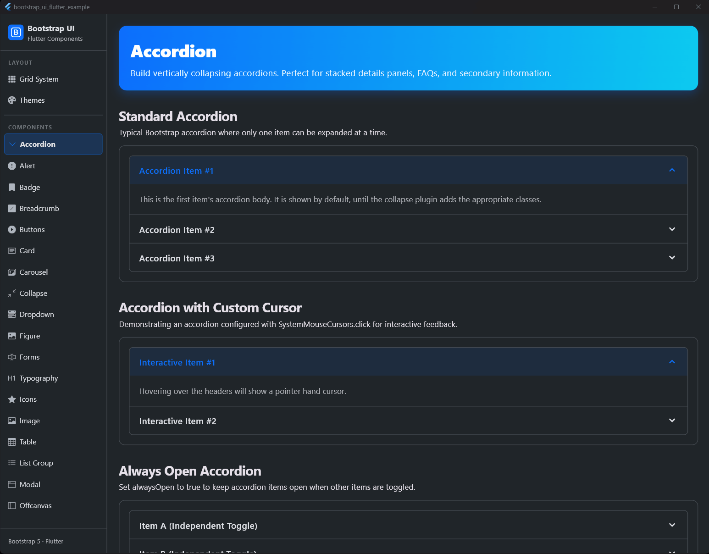

# Accordion

## Vorschau




Das `BsAccordion` ist eine Komponente, die es ermöglicht, Inhalte platzsparend in ausklappbaren Bereichen zu organisieren.

## Verwendung

```dart
BsAccordion(
  items: [
    BsAccordionItem(
      title: 'Erstes Element',
      body: Text('Inhalt des ersten Elements'),
    ),
    BsAccordionItem(
      title: 'Zweites Element',
      body: Text('Inhalt des zweiten Elements'),
    ),
  ],
)
```

## Eigenschaften

| Eigenschaft | Typ | Standard | Beschreibung |
| :--- | :--- | :--- | :--- |
| `items` | `List<BsAccordionItem>` | **Erforderlich** | Die Liste der anzuzeigenden Accordion-Elemente. |
| `alwaysOpen` | `bool` | `false` | Wenn `true`, können mehrere Elemente gleichzeitig geöffnet sein. |
| `flush` | `bool` | `false` | Wenn `true`, werden äußere Ränder und Rundungen entfernt (analog zu Bootstrap `.accordion-flush`). |
| `activeColor` | `Color?` | `bsTheme.primary` | Die Farbe des Headers und Icons, wenn das Element geöffnet ist. |
| `mouseCursor` | `MouseCursor?` | `null` | Der Mauszeiger beim Hovern über den Header. |

### BsAccordionItem

| Eigenschaft | Typ | Standard | Beschreibung |
| :--- | :--- | :--- | :--- |
| `title` | `String` | **Erforderlich** | Der Text im Header des Elements. |
| `body` | `Widget` | **Erforderlich** | Der Inhalt, der beim Aufklappen sichtbar wird. |
| `initiallyExpanded` | `bool` | `false` | Legt fest, ob das Element beim ersten Rendern geöffnet ist. |