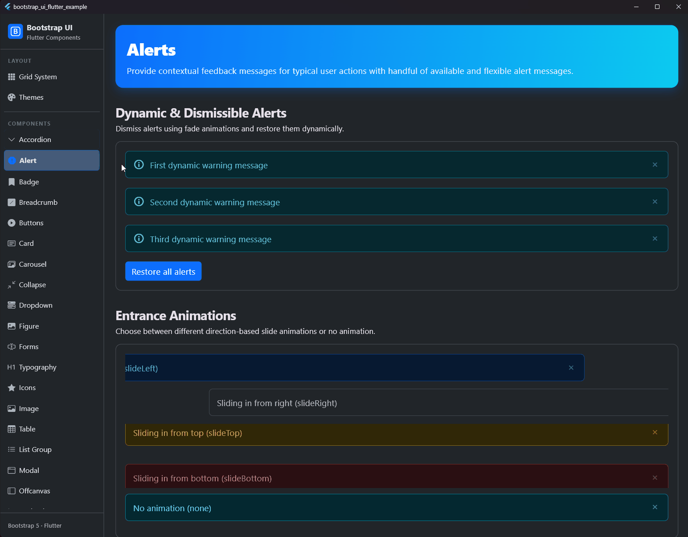

# Alert

## Vorschau




Das `BsAlert` bietet kontextbezogene Feedback-Nachrichten für typische Benutzeraktionen.

## Verwendung

```dart
BsAlert(
  variant: .success,
  icon: BsIcons.infoCircleFill,
  dismissible: true,
  child: Text('Erfolgreich gespeichert!'),
)
```

## Eigenschaften

| Eigenschaft | Typ | Standard | Beschreibung |
| :--- | :--- | :--- | :--- |
| `child` | `Widget` | **Erforderlich** | Der Inhalt des Alerts. |
| `variant` | `BsAlertVariant` | `.primary` | Das Farbschema des Alerts. |
| `icon` | `IconData?` | `null` | Ein optionales Icon auf der linken Seite. |
| `iconColor` | `Color?` | `null` | Direkte Farbwahl für das Icon. |
| `iconVariant` | `BsIconVariant?` | `null` | Spezifisches Farbschema für das Icon. |
| `animation` | `BsAlertAnimation` | `.fade` | Die Art der Animation beim Ein- und Ausblenden (fade, none, slideTop, slideBottom, slideLeft, slideRight). |
| `animationInDuration` | `Duration` | `Duration(milliseconds: 200)` | Die Dauer der Animation beim Einblenden. |
| `animationOutDuration` | `Duration` | `Duration(milliseconds: 200)` | Die Dauer der Animation beim Ausblenden. |
| `autoCloseDuration` | `Duration?` | `null` | Wenn gesetzt, schließt sich der Alert nach dieser Dauer automatisch. |
| `dismissible` | `bool` | `false` | Wenn `true`, wird ein Schließen-Button angezeigt. |
| `onClose` | `VoidCallback?` | `null` | Wird aufgerufen, wenn der Alert geschlossen wird (nach der Animation). |
