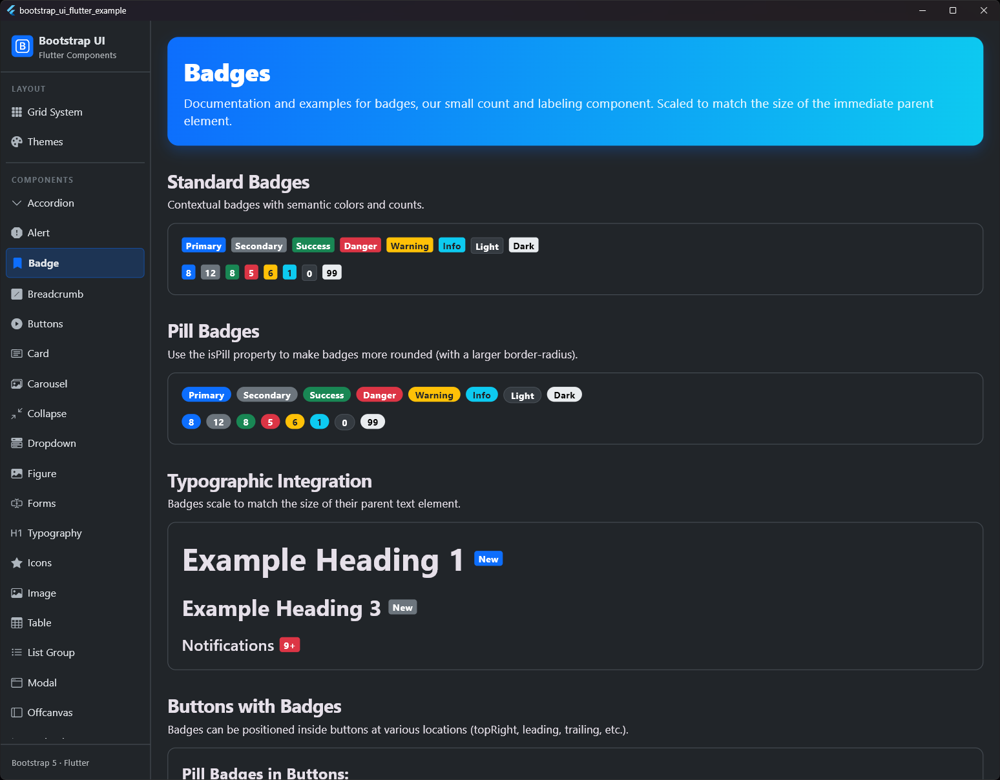
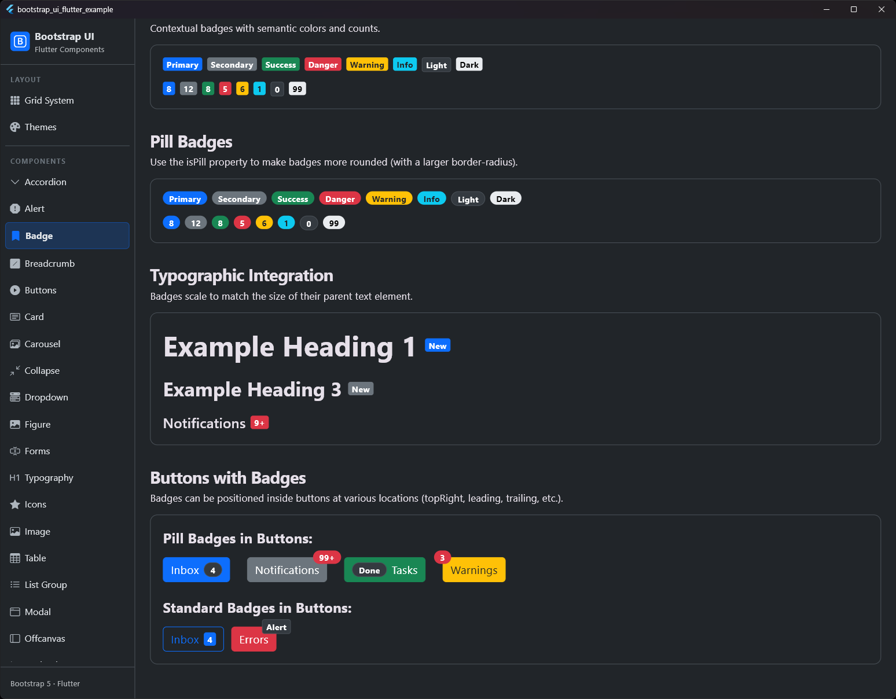

# Badge

## Vorschau

| Badges Vorschau 1 | Badges Vorschau 2 |
|:---:|:---:|
|  |  |


Das `BsBadge` wird verwendet, um kleine Informationseinheiten wie Zähler oder Status-Labels anzuzeigen.

## Verwendung

```dart
BsBadge(
  label: 'Neu',
  variant: .primary,
  isPill: true,
)
```

## Eigenschaften

| Eigenschaft | Typ | Standard | Beschreibung |
| :--- | :--- | :--- | :--- |
| `label` | `String` | **Erforderlich** | Der anzuzeigende Text. |
| `variant` | `BsBadgeVariant` | `.primary` | Das Farbschema des Badges. |
| `isPill` | `bool` | `false` | Wenn `true`, wird das Badge vollständig abgerundet (Pill-Style). |