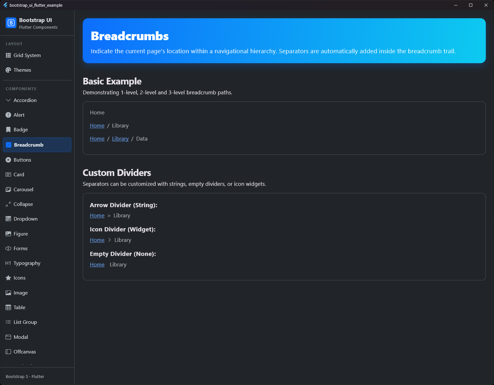

# Breadcrumb

## Vorschau




Zeigt den Standort der aktuellen Seite innerhalb einer Navigationshierarchie an, wobei Trennzeichen automatisch hinzugefügt werden.

## Verwendung

Breadcrumbs werden verwendet, um die aktuelle Position innerhalb einer Hierarchie anzuzeigen.

```dart
BsBreadcrumb(
  items: [
    BsBreadcrumbItem(
      label: Text('Home'),
      onPressed: () {
        // Navigiere zu Home
      },
    ),
    BsBreadcrumbItem(
      label: Text('Library'),
      onPressed: () {
        // Navigiere zu Library
      },
    ),
    BsBreadcrumbItem(
      label: Text('Data'),
      active: true,
    ),
  ],
)
```

## Ändern des Trennzeichens (Divider)

Das Trennzeichen kann durch Angabe der Eigenschaft `divider` bei `BsBreadcrumb` geändert werden. Es akzeptiert einen `String` oder ein `Widget`.

```dart
BsBreadcrumb(
  divider: '>',
  items: [...],
)

// Oder mit einem Icon
BsBreadcrumb(
  divider: Icon(Icons.chevron_right, size: 16),
  items: [...],
)
```

## Eigenschaften

### BsBreadcrumb

| Eigenschaft | Typ | Beschreibung |
| --- | --- | --- |
| `items` | `List<BsBreadcrumbItem>` | Die Liste der Breadcrumb-Elemente, die angezeigt werden sollen. |
| `divider` | `dynamic` | Das Trennzeichen, das zwischen den Elementen angezeigt werden soll. Standardmäßig "/". Kann ein `String` oder ein `Widget` sein. |

### BsBreadcrumbItem

| Eigenschaft | Typ | Beschreibung |
| --- | --- | --- |
| `label` | `Widget` | Die Beschriftung des Breadcrumb-Elements. |
| `onPressed` | `VoidCallback?` | Callback, wenn das Element gedrückt wird. |
| `active` | `bool` | Gibt an, ob dieses Element die aktuell aktive Seite ist. |