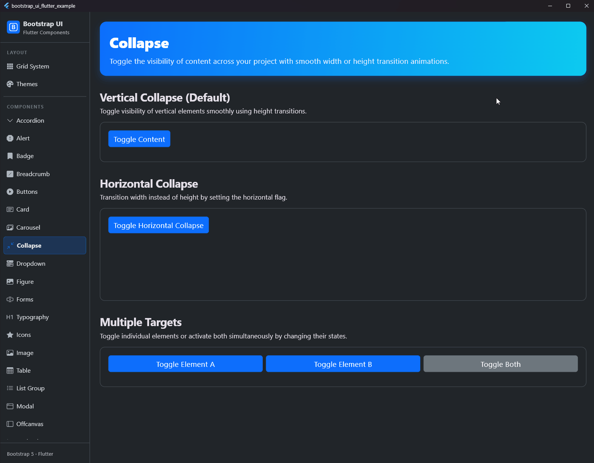

# Kollabieren (Collapse)

## Vorschau




Die `BsCollapse`-Komponente schaltet die Sichtbarkeit von Inhalten mit einer weichen vertikalen (Höhe) oder horizontalen (Breite) Übergangsanimation um. Sie entspricht den Bootstrap-Utility-Klassen `.collapse` und `.collapse-horizontal`.

## Verwendung

### Vertikales Kollabieren (Standard)

```dart
bool _isExpanded = false;

BsButton(
  label: 'Kollabieren umschalten',
  onPressed: () => setState(() => _isExpanded = !_isExpanded),
),
BsCollapse(
  isExpanded: _isExpanded,
  child: Card(
    child: Padding(
      padding: EdgeInsets.all(16.0),
      child: Text('Dieser Inhalt kollabiert und expandiert vertikal!'),
    ),
  ),
)
```

### Horizontales Kollabieren

```dart
bool _isExpanded = false;

BsButton(
  label: 'Horizontal umschalten',
  onPressed: () => setState(() => _isExpanded = !_isExpanded),
),
BsCollapse(
  isExpanded: _isExpanded,
  horizontal: true,
  child: SizedBox(
    width: 250.0,
    child: Card(
      child: Padding(
        padding: EdgeInsets.all(16.0),
        child: Text('Dieser Inhalt kollabiert und expandiert horizontal!'),
      ),
    ),
  ),
)
```

## Eigenschaften

| Eigenschaft | Typ | Standard | Beschreibung |
| :--- | :--- | :--- | :--- |
| `isExpanded` | `bool` | **Erforderlich** | Steuert den Expansionszustand des Inhalts (sichtbar bei `true`, verborgen bei `false`). |
| `child` | `Widget` | **Erforderlich** | Der ein- und auszublendende Inhalt. |
| `horizontal` | `bool` | `false` | Bestimmt, ob der Übergang horizontal (Breite) statt vertikal (Höhe) verläuft. Entspricht `.collapse-horizontal`. |
| `duration` | `Duration` | `Duration(milliseconds: 350)` | Die Dauer der Übergangs-Animation. |
| `curve` | `Curve` | `Curves.easeInOut` | Die für den Übergang verwendete Animationskurve. |