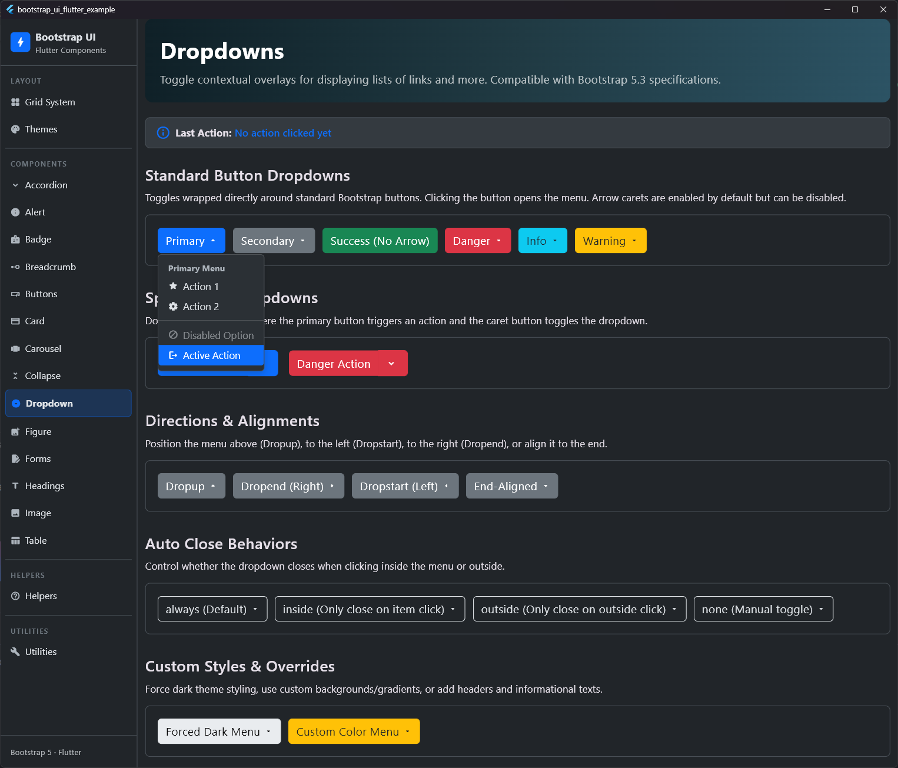
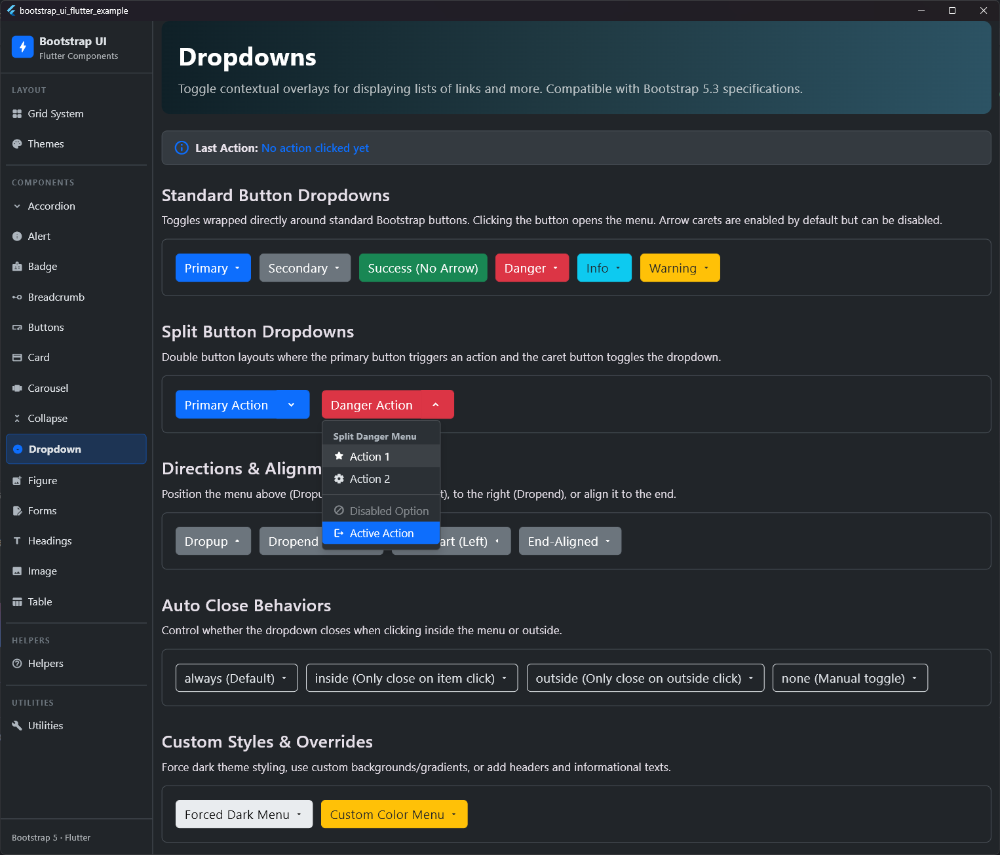
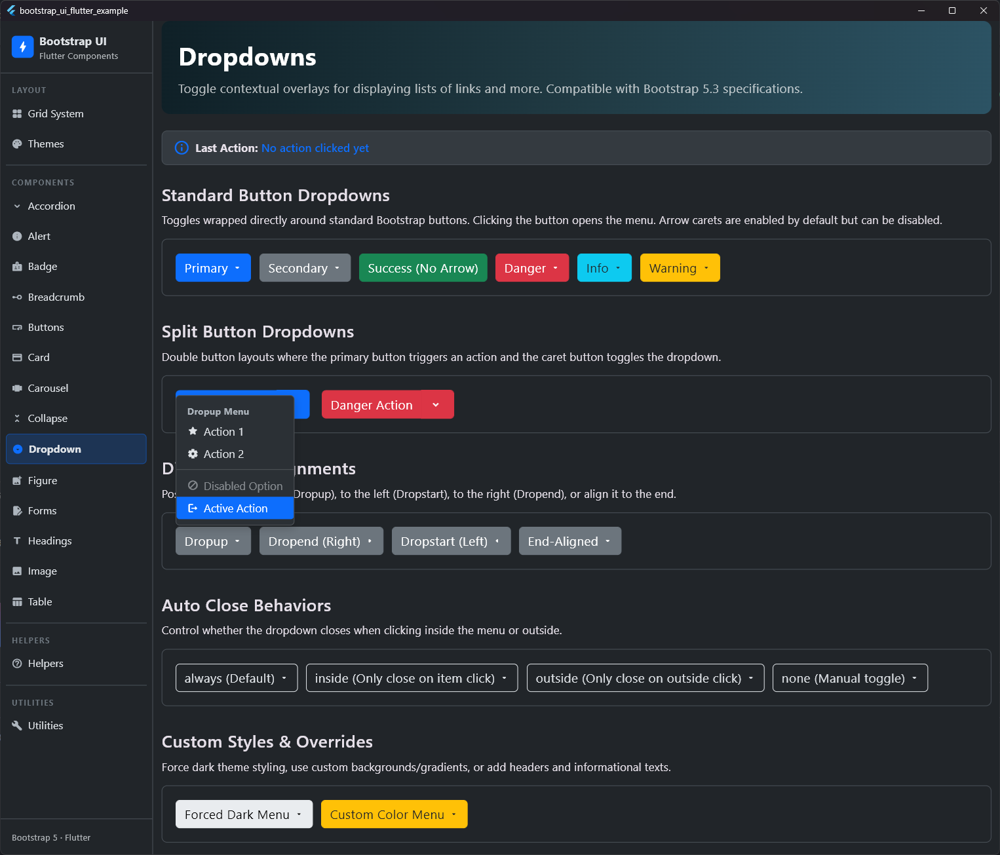
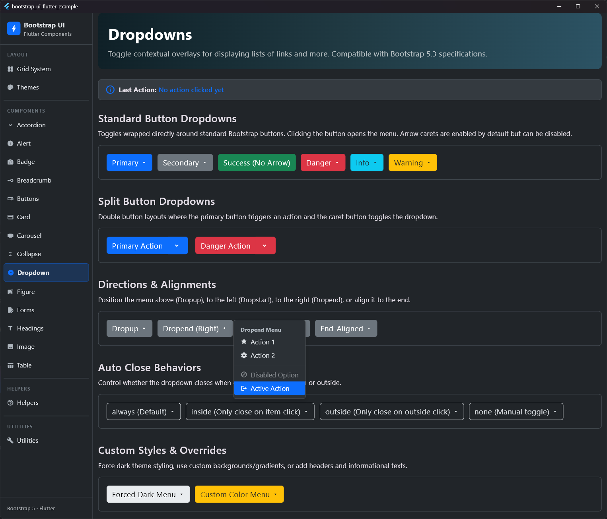
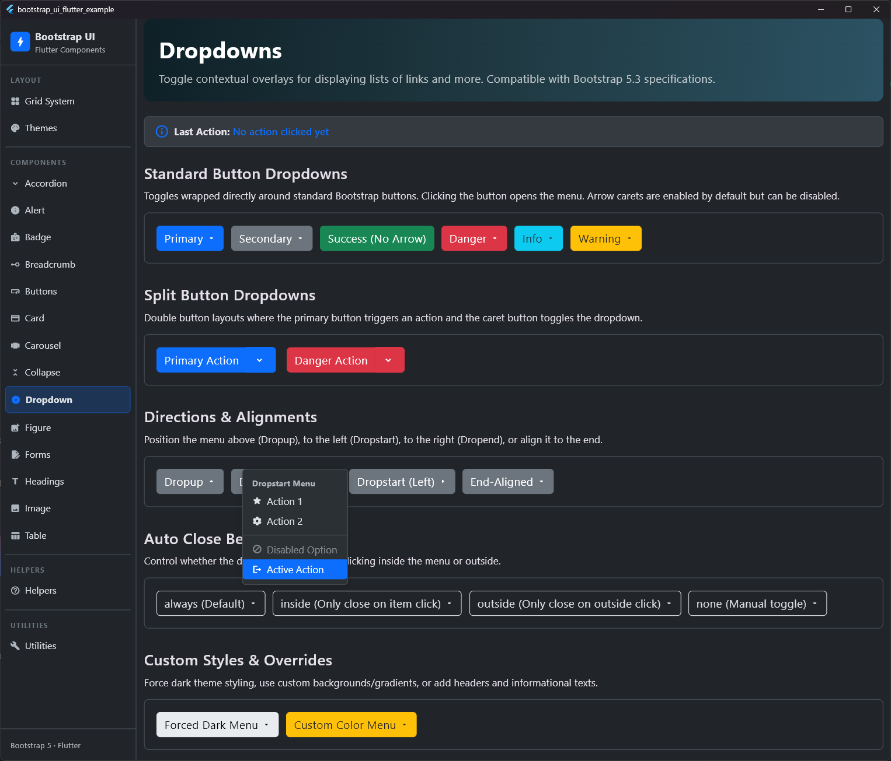
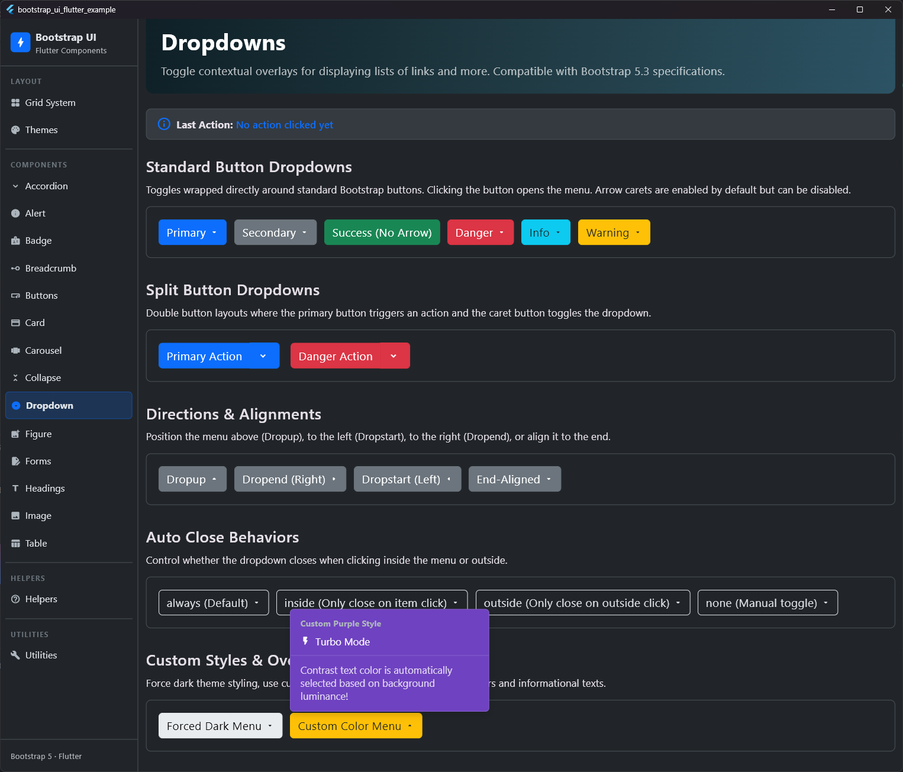

# Dropdown

## Vorschau

| Dropdown Links | Dropdown Split Button | Dropdown Oben |
|:---:|:---:|:---:|
|  |  |  |
| **Dropdown Rechts** | **Dropdown Links** | **Dropdown Ausrichtung** |
|  |  |  |


Dropdowns sind einblendbare Menüs, die Listen von Links oder Aktionen anzeigen. Das Paket enthält:
* `BsDropdown`: Die Hauptkomponente, die den Trigger und die schwebende Positionierung verwaltet.
* `BsDropdownMenu`: Der eigentliche Menü-Container.
* `BsDropdownItem`: Auswählbare Aktionen innerhalb des Menüs.
* `BsDropdownHeader`: Überschriften zur Gruppierung von Einträgen.
* `BsDropdownDivider`: Horizontale Trennlinien.
* `BsDropdownText`: Reine Informations- und Textabschnitte.

---

## Verwendung

### Einfaches Dropdown
Ein Standard-Dropdown kann ganz einfach über einen `label` definiert werden. Es rendert automatisch einen Trigger-Button mit einem kleinen Pfeil (Caret).

```dart
BsDropdown(
  label: 'Dropdown Button',
  toggleVariant: BsButtonVariant.primary,
  menu: BsDropdownMenu(
    children: [
      BsDropdownItem(
        child: Text('Aktion 1'),
        onPressed: () => print('Klick'),
      ),
      BsDropdownItem(
        child: Text('Aktion 2'),
        onPressed: () {},
      ),
      BsDropdownDivider(),
      BsDropdownItem(
        child: Text('Separater Link'),
        onPressed: () {},
      ),
    ],
  ),
)
```

### Split Button Dropdown (Zweigeteilter Button)
Für geteilte Buttons, bei denen der linke Teil eine Aktion ausführt und der rechte Caret-Pfeil das Menü öffnet, verwenden Sie `toggleBuilder`.

```dart
BsDropdown(
  toggleBuilder: (context, toggleMenu, isOpen) {
    return BsButtonGroup(
      children: [
        BsButton(
          label: 'Aktion ausführen',
          onPressed: () => print('Hauptaktion'),
        ),
        BsButton(
          label: '',
          icon: isOpen ? Icons.keyboard_arrow_up : Icons.keyboard_arrow_down,
          onPressed: toggleMenu,
        ),
      ],
    );
  },
  menu: BsDropdownMenu(
    children: [
      BsDropdownItem(child: Text('Option A'), onPressed: () {}),
      BsDropdownItem(child: Text('Option B'), onPressed: () {}),
    ],
  ),
)
```

### Richtungen & Ausrichtungen (Directions & Alignments)
Das Dropdown kann in vier Richtungen geöffnet werden: `down` (Standard), `up` (Dropup), `end` (Dropend / rechts) und `start` (Dropstart / links). Zudem kann das Menü links- oder rechtsbündig mit dem Button ausgerichtet werden.

```dart
BsDropdown(
  direction: BsDropdownDirection.up, // Öffnet sich nach oben
  alignment: BsDropdownAlignment.end, // Rechtsbündig ausgerichtet
  toggle: BsButton(label: 'Dropup rechts', onPressed: () {}),
  menu: BsDropdownMenu(
    children: [
      BsDropdownItem(child: Text('Eintrag 1'), onPressed: () {}),
    ],
  ),
)
```

### Kollisionserkennung & Auto-Flip
Dropdowns verfügen über eine integrierte intelligente Kollisionserkennung. Wenn ein Dropdown-Menü über den Bildschirmrand hinausgehen würde (z. B. ganz unten am Fensterrand), ändert es automatisch seine Öffnungsrichtung (z. B. nach oben als Dropup). Falls der Platz in beiden Richtungen nicht ausreicht, begrenzt das Menü automatisch seine maximale Höhe und wird scrollbar (mit sauberer Eckenrundung), um Layout-Überläufe zu verhindern.

### Auto-Close-Verhalten
Sie können konfigurieren, wann sich das Menü automatisch schließt:
* `always` (Standard): Schließt sich beim Klick auf ein Menü-Element ODER beim Klick außerhalb des Menüs.
* `inside`: Schließt sich nur beim Klick auf ein Menü-Element.
* `outside`: Schließt sich nur beim Klick außerhalb des Menüs.
* `none`: Schließt sich nur manuell durch erneuten Klick auf den Trigger.

```dart
BsDropdown(
  autoClose: BsDropdownAutoClose.outside,
  toggle: BsButton(label: 'Klick außerhalb schließt', onPressed: () {}),
  menu: BsDropdownMenu(
    children: [
      BsDropdownItem(child: Text('Klick auf mich schließt nicht'), onPressed: () {}),
    ],
  ),
)
```

### Farb- & Dark-Varianten
Standardmäßig passt sich das Dropdown-Menü automatisch dem aktiven `ThemeMode` (Hell/Dunkel) an. Sie können das Verhalten überschreiben, Farbvarianten zuweisen oder benutzerdefinierte Hintergrundfarben verwenden.

```dart
// 1. Explizit ein dunkles Menü erzwingen (.dropdown-menu-dark)
BsDropdownMenu(
  dark: true,
  children: [...],
)

// 2. Eine semantische Farbvariante anwenden
BsDropdownMenu(
  variant: BsCardVariant.success,
  children: [...],
)

// 3. Eine benutzerdefinierte Hintergrundfarbe setzen
BsDropdownMenu(
  color: Colors.purple.shade900,
  children: [...],
)
```

---

## Eigenschaften (Properties)

### `BsDropdown`

| Eigenschaft | Typ | Standard | Beschreibung |
| :--- | :--- | :--- | :--- |
| `label` | `String?` | `null` | Der Text, der auf dem Standard-Trigger-Button angezeigt werden soll (wenn toggle/toggleBuilder null sind). |
| `toggle` | `Widget?` | `null` | Ein benutzerdefiniertes Trigger-Widget, welches das Dropdown öffnet. |
| `toggleBuilder` | `Widget Function(BuildContext, VoidCallback, bool)?` | `null` | Ein Builder-Callback zur individuellen Steuerung des Triggers (optimal für Split-Buttons). |
| `menu` | `BsDropdownMenu` | **Erforderlich** | Das Dropdown-Menü mit den enthaltenen Elementen. |
| `direction` | `BsDropdownDirection` | `BsDropdownDirection.down` | Öffnungsrichtung (down, up, start, end). |
| `alignment` | `BsDropdownAlignment` | `BsDropdownAlignment.start` | Ausrichtung des Menüs (start, end). |
| `autoClose` | `BsDropdownAutoClose` | `BsDropdownAutoClose.always` | Legt das Verhalten beim Schließen fest. |
| `toggleVariant` | `BsButtonVariant` | `BsButtonVariant.primary` | Die Farbvariante des Standard-Trigger-Buttons. |
| `toggleSize` | `BsButtonSize` | `BsButtonSize.md` | Die Größenvariante des Standard-Trigger-Buttons. |
| `showCaret` | `bool` | `true` | Bestimmt, ob das Pfeilsymbol (Caret) auf dem Standard-Trigger-Button angezeigt wird. |
| `disabled` | `bool` | `false` | Deaktiviert die Interaktion mit dem Dropdown bei `true`. |

### `BsDropdownMenu`

| Eigenschaft | Typ | Standard | Beschreibung |
| :--- | :--- | :--- | :--- |
| `children` | `List<Widget>` | **Erforderlich** | Liste der enthaltenen Items, Divider, Header etc. |
| `dark` | `bool?` | `null` | Erzwingt Dunkles Design (true) oder Helles Design (false). Bei null erfolgt automatische Anpassung. |
| `variant` | `BsCardVariant?` | `null` | Semantische Bootstrap-Farbvariante für das Menü. |
| `color` | `Color?` | `null` | Benutzerdefinierte Hintergrundfarbe. |
| `minWidth` | `double` | `160.0` | Mindestbreite des Dropdown-Menüs. |
| `padding` | `EdgeInsetsGeometry` | `EdgeInsets.symmetric(vertical: 8.0)` | Innenabstand des Menü-Containers. |

### `BsDropdownItem`

| Eigenschaft | Typ | Standard | Beschreibung |
| :--- | :--- | :--- | :--- |
| `child` | `Widget` | **Erforderlich** | Das Text- oder Icon-Widget als Inhalt des Elements. |
| `onPressed` | `VoidCallback?` | `null` | Aktion beim Anklicken des Elements. Falls null, ist das Element deaktiviert. |
| `active` | `bool` | `false` | Kennzeichnet das Element als aktiv (erhält primären Farb-Hintergrund). |
| `disabled` | `bool` | `false` | Stellt das Element ausgegraut und nicht anklickbar dar. |
| `icon` | `Widget?` | `null` | Optionales Icon links neben dem Inhalt. |
