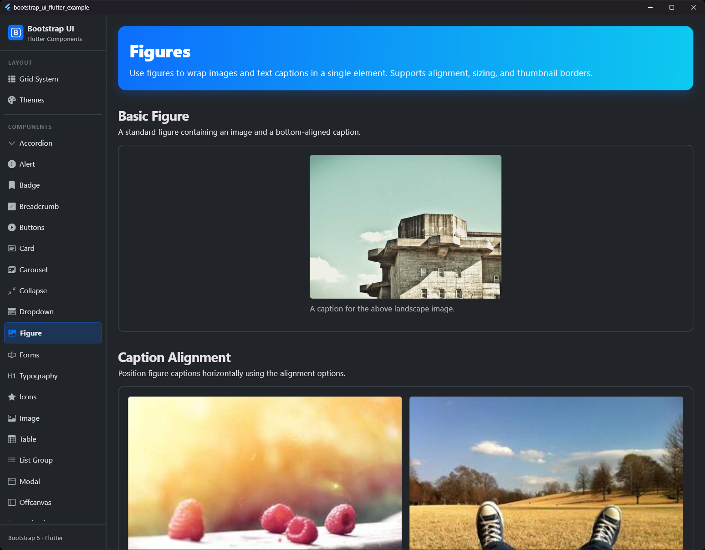
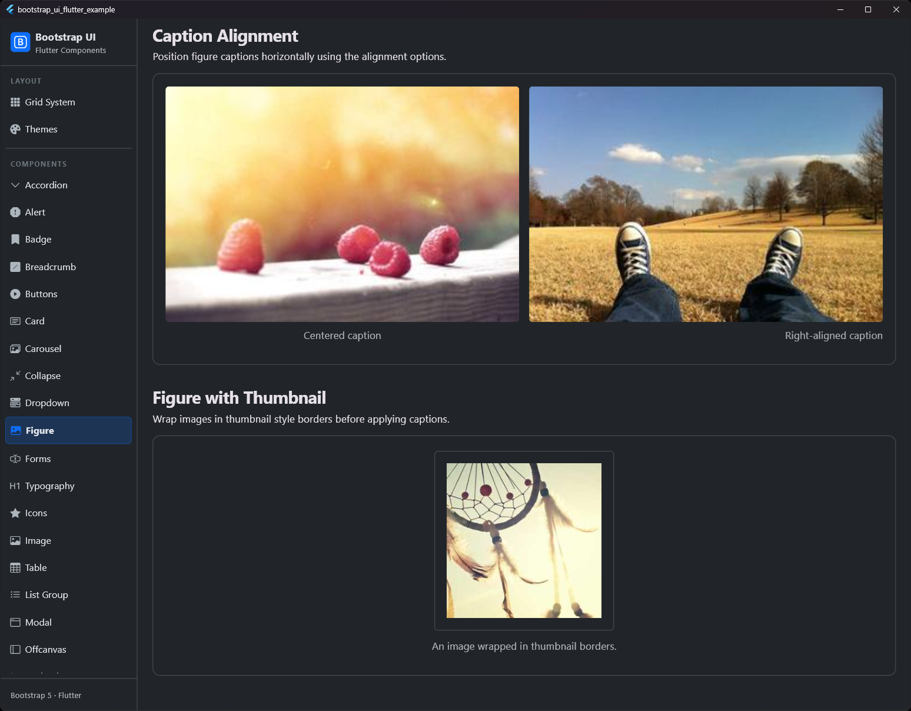

# Figure (Abbildung)

## Vorschau

| Figure Standard | Figure mit Beschriftung |
|:---:|:---:|
|  |  |


Die Figure-Komponente wird verwendet, um zusammengehörige Inhalte wie ein Bild mit einer optionalen Beschriftung anzuzeigen, entsprechend der Bootstrap 5 Funktionalität.

## Zweck
`BsFigure` umschließt ein Bild und eine Beschriftung und sorgt für die korrekten Abstände und das richtige Styling. Es folgt dem HTML5-Muster von `<figure>` und `<figcaption>`.

## Eigenschaften

| Eigenschaft | Typ | Standard | Beschreibung |
| :--- | :--- | :--- | :--- |
| `image` | `Widget` | *Erforderlich* | Das anzuzeigende Bild (normalerweise ein `BsImage`). |
| `caption` | `Widget?` | `null` | Optionale Beschriftung unter dem Bild. |
| `captionAlignment` | `AlignmentGeometry?` | `null` | Horizontale Ausrichtung der Beschriftung. |
| `margin` | `EdgeInsetsGeometry` | `EdgeInsets.only(bottom: BsSpacing.s3)` | Äußerer Abstand der Figure. |
| `imageMargin` | `EdgeInsetsGeometry` | `EdgeInsets.only(bottom: BsSpacing.s2)` | Abstand zwischen Bild und Beschriftung. |

## Verwendung

### Einfache Abbildung
Eine einfache Figure mit einem Bild und einer Beschriftung.

```dart
BsFigure(
  image: BsImage(
    image: NetworkImage('...'),
    fluid: true,
  ),
  caption: Text('Eine Beschriftung für das Bild.'),
)
```

### Ausrichtung der Beschriftung
Die Beschriftung kann mit `captionAlignment` links, mittig oder rechts ausgerichtet werden.

```dart
BsFigure(
  image: BsImage(...),
  caption: Text('Zentrierte Beschriftung'),
  captionAlignment: Alignment.center,
)
```

## Styling
Die Beschriftung wird automatisch wie folgt formatiert:
- **Schriftgröße**: `BsTypography.fontSizeSm` (14px)
- **Farbe**: `BsColors.secondary` (Muted/Sekundäres Grau)
- **Zeilenhöhe**: `BsTypography.lineHeightBase` (1.5)