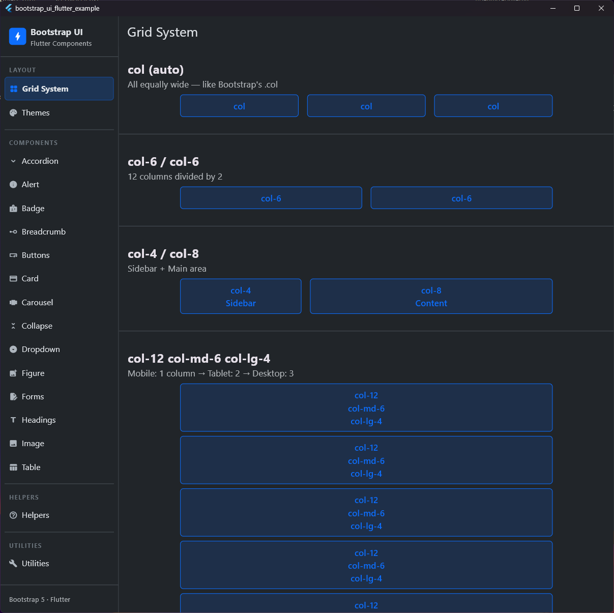
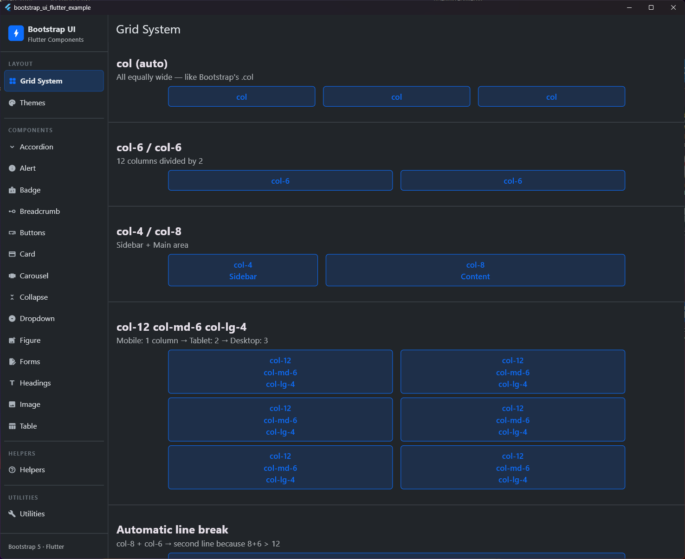
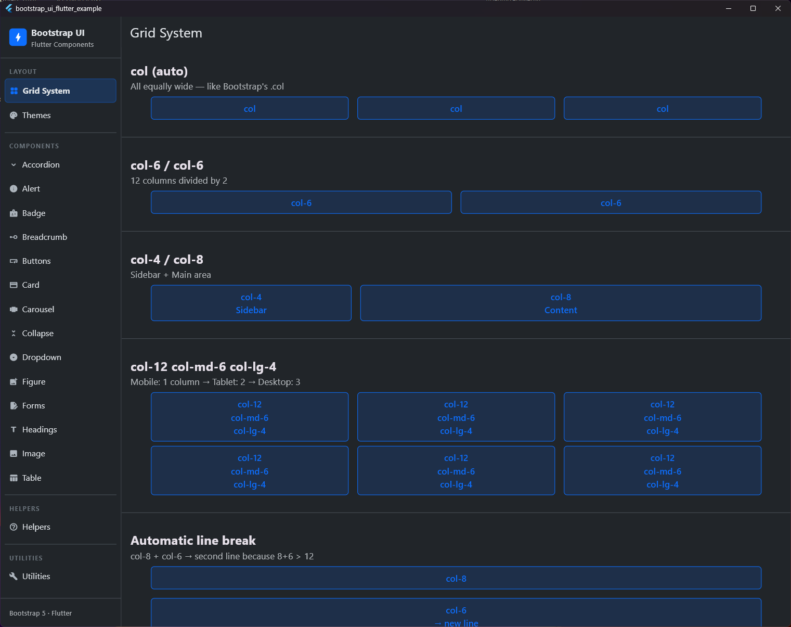
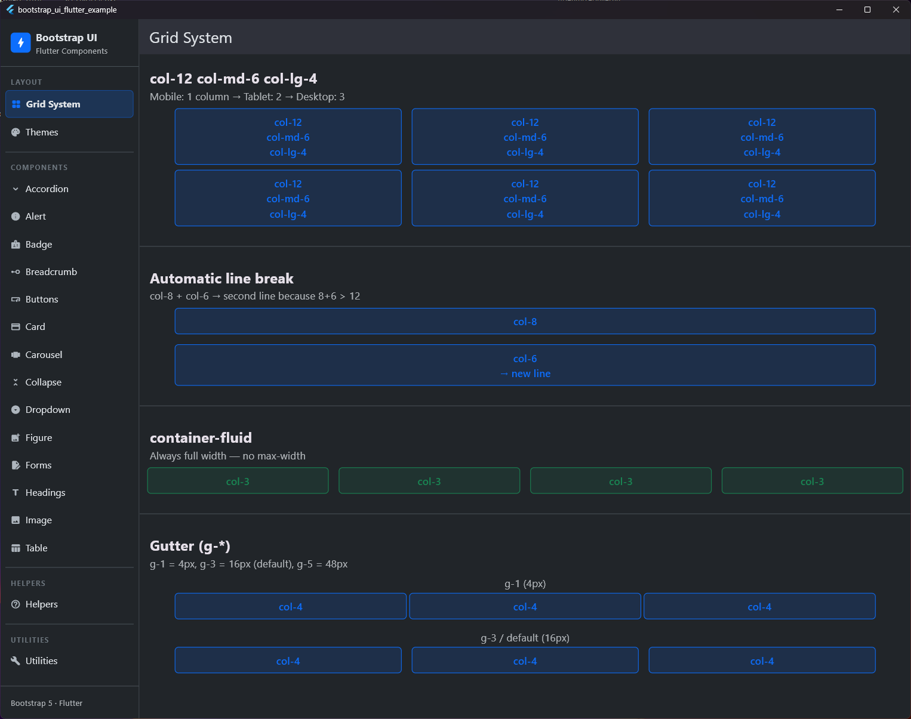

# Grid System

## Vorschau

| Grid Auto | Grid MD |
|:---:|:---:|
|  |  |
| **Grid LG** | **Container Fluid & Gutter** |
|  |  |


Das Bootstrap-Grid-System basiert auf einem 12-Spalten-Layout und ist vollständig responsive.

## Container

`BsContainer` zentriert den Inhalt horizontal und bietet ein Standard-Padding.

```dart
BsContainer(
  type: BsContainerType.fixed, // oder .fluid, .sm, .md, etc.
  child: MyContent(),
)
```

## Row & Col

`BsRow` und `BsCol` bilden das eigentliche Grid.

```dart
BsRow(
  gutterX: BsSpacing.s3,
  gutterY: BsSpacing.s3,
  children: [
    BsCol(
      config: BsColConfig(xs: 12, md: 6, lg: 4),
      child: MyWidget(),
    ),
    BsCol(
      config: BsColConfig(xs: 12, md: 6, lg: 8),
      child: AnotherWidget(),
    ),
  ],
)
```

### BsColConfig

Definiert die Spaltenanzahl pro Breakpoint (Mobile-first).

| Breakpoint | Beschreibung |
| :--- | :--- |
| `xs` | < 576px (Standard) |
| `sm` | >= 576px |
| `md` | >= 768px |
| `lg` | >= 992px |
| `xl` | >= 1200px |
| `xxl` | >= 1400px |