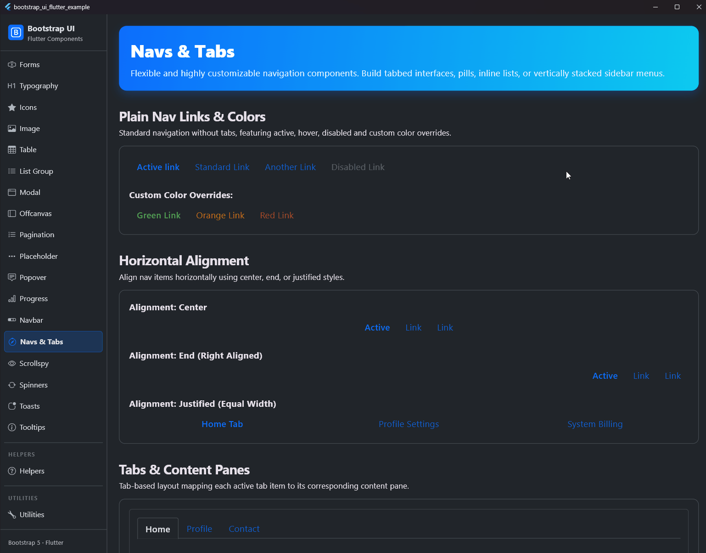

# Navs und Tabs (Navigationen)

## Vorschau



`BsNav` ist eine flexible Navigationskomponente, die auf Flexbox basiert. Sie unterstützt verschiedene Darstellungsstile (einfache Links, Tabs, Pills und Underline), Ausrichtungen, vertikale Anordnung sowie das Umschalten von Tab-Inhalten mit weichen Übergangsanimationen.

## Features

- **Visuelle Varianten**:
  - `plain`: Eine einfache Liste von Navigationslinks ohne zusätzliche Dekoration.
  - `tabs`: Der klassische Reiter-Stil (Tabbed) mit unterer Grenzlinie und nahtloser Überlagerung für den aktiven Reiter.
  - `pills`: Pillenförmig hervorgehobene Links.
  - `underline`: Ein moderner Stil mit einer farbigen Unterstreichung für den aktiven Link.
- **Horizontale & Vertikale Layouts**: Mit `vertical: true` werden die Navigationselemente untereinander gestapelt.
- **Ausrichtungen**: Unterstützt Ausrichtungsoptionen wie `start`, `center`, `end` sowie das Strecken der Elemente über die gesamte Breite (`fill` und `justified`).
- **Tab-Inhaltsbereiche**: Einfaches Umschalten von Inhalten mit [BsTabContent] und [BsTabPane] inklusive weicher Fade-in-Animationen.
- **Custom Triggers**: `BsNavLink` akzeptiert auch beliebige Custom Widgets und wendet Farbthemen automatisch auf Kindelemente an.

## Verwendung

### Einfache Tab-Navigation (Reiter-Menü)

Hier ist ein Beispiel für ein funktionales Reiter-Menü mit Inhaltsbereichen:

```dart
class MyTabbedWidget extends StatefulWidget {
  const MyTabbedWidget({super.key});

  @override
  State<MyTabbedWidget> createState() => _MyTabbedWidgetState();
}

class _MyTabbedWidgetState extends State<MyTabbedWidget> {
  int _activeTab = 0;

  @override
  Widget build(BuildContext context) {
    return Column(
      children: [
        BsNav(
          variant: BsNavVariant.tabs,
          children: [
            BsNavLink(
              label: 'Startseite',
              active: _activeTab == 0,
              onPressed: () => setState(() => _activeTab = 0),
            ),
            BsNavLink(
              label: 'Profil',
              active: _activeTab == 1,
              onPressed: () => setState(() => _activeTab = 1),
            ),
            BsNavLink(
              label: 'Kontakt',
              active: _activeTab == 2,
              onPressed: () => setState(() => _activeTab = 2),
            ),
            const BsNavLink(
              label: 'Deaktiviert',
              disabled: true,
            ),
          ],
        ),
        Expanded(
          child: BsTabContent(
            activeIndex: _activeTab,
            children: const [
              BsTabPane(child: Center(child: Text('Inhalt der Startseite'))),
              BsTabPane(child: Center(child: Text('Profil-Details'))),
              BsTabPane(child: Center(child: Text('Kontakt-Formular'))),
            ],
          ),
        ),
      ],
    );
  }
}
```

### Pills-Navigation (Pillen-Stil)

Pills heben den aktiven Link mit einer soliden Hintergrundfarbe hervor:

```dart
BsNav(
  variant: BsNavVariant.pills,
  alignment: BsNavAlignment.center,
  children: [
    BsNavLink(label: 'Aktiv', active: true, onPressed: () {}),
    BsNavLink(label: 'Link 1', onPressed: () {}),
    BsNavLink(label: 'Link 2', onPressed: () {}),
  ],
)
```

### Underline-Navigation (Unterstrichener Stil)

Underline verwendet eine farbige Linie direkt unter dem Text, um den aktiven Zustand anzuzeigen:

```dart
BsNav(
  variant: BsNavVariant.underline,
  children: [
    BsNavLink(label: 'Aktiv', active: true, onPressed: () {}),
    BsNavLink(label: 'Link 1', onPressed: () {}),
    BsNavLink(label: 'Link 2', onPressed: () {}),
  ],
)
```

### Eigene Link-Farben

Du kannst die Text- und Icon-Farben der Links im inaktiven und aktiven Zustand individuell anpassen:

```dart
BsNav(
  variant: BsNavVariant.plain,
  children: [
    BsNavLink(
      label: 'Grüner Link',
      color: Colors.green,
      activeColor: Colors.green,
      onPressed: () {},
    ),
    BsNavLink(
      label: 'Roter Link',
      color: Colors.red,
      activeColor: Colors.red,
      onPressed: () {},
    ),
  ],
)
```

---

## Eigenschaften (Properties)

### BsNav

| Eigenschaft | Typ | Standard | Beschreibung |
| :--- | :--- | :--- | :--- |
| `children` | `List<Widget>` | *erforderlich* | Die Liste der Navigationselemente (meistens [BsNavLink]). |
| `variant` | `BsNavVariant` | `BsNavVariant.plain` | Der visuelle Stil der Navigation (`plain`, `tabs`, `pills`, `underline`). |
| `alignment` | `BsNavAlignment` | `BsNavAlignment.start` | Horizontale Ausrichtung der Links (`start`, `center`, `end`, `fill`, `justified`). |
| `vertical` | `bool` | `false` | Legt fest, ob die Elemente vertikal gestapelt werden. |
| `padding` | `EdgeInsetsGeometry` | `EdgeInsets.zero` | Innenabstand des Navigations-Containers. |

### BsNavLink

| Eigenschaft | Typ | Standard | Beschreibung |
| :--- | :--- | :--- | :--- |
| `label` | `String?` | `null*` | Der anzuzeigende Text (erforderlich, wenn `child` null ist). |
| `child` | `Widget?` | `null*` | Ein benutzerdefiniertes Widget (erforderlich, wenn `label` null ist). |
| `active` | `bool` | `false` | Kennzeichnet das Element als aktiv und wendet Hervorhebungs-Stile an. |
| `disabled` | `bool` | `false` | Deaktiviert die Interaktion und stellt den Link ausgegraut dar. |
| `onPressed` | `VoidCallback?` | `null` | Aktion, wenn das Element angetippt wird. |
| `padding` | `EdgeInsetsGeometry?` | `null` | Eigener Innenabstand (überschreibt Standardwerte). |
| `color` | `Color?` | `null` | Optionale benutzerdefinierte Text-/Icon-Farbe im inaktiven Zustand. |
| `activeColor` | `Color?` | `null` | Optionale benutzerdefinierte Text-/Icon-Farbe im aktiven Zustand. |

### BsTabContent

| Eigenschaft | Typ | Standard | Beschreibung |
| :--- | :--- | :--- | :--- |
| `children` | `List<Widget>` | *erforderlich* | Die Liste der Inhaltsseiten (normalerweise [BsTabPane]). |
| `activeIndex` | `int` | *erforderlich* | Der Index der aktuell sichtbaren Seite. |
| `fade` | `bool` | `true` | Schaltet die weiche Überblend-Animation beim Reiterwechsel ein oder aus. |
