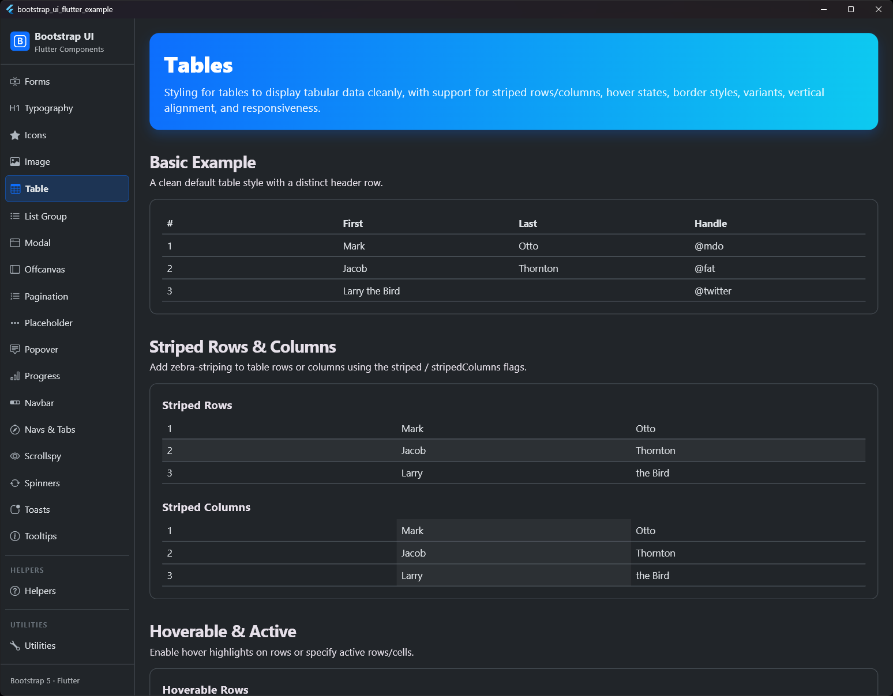
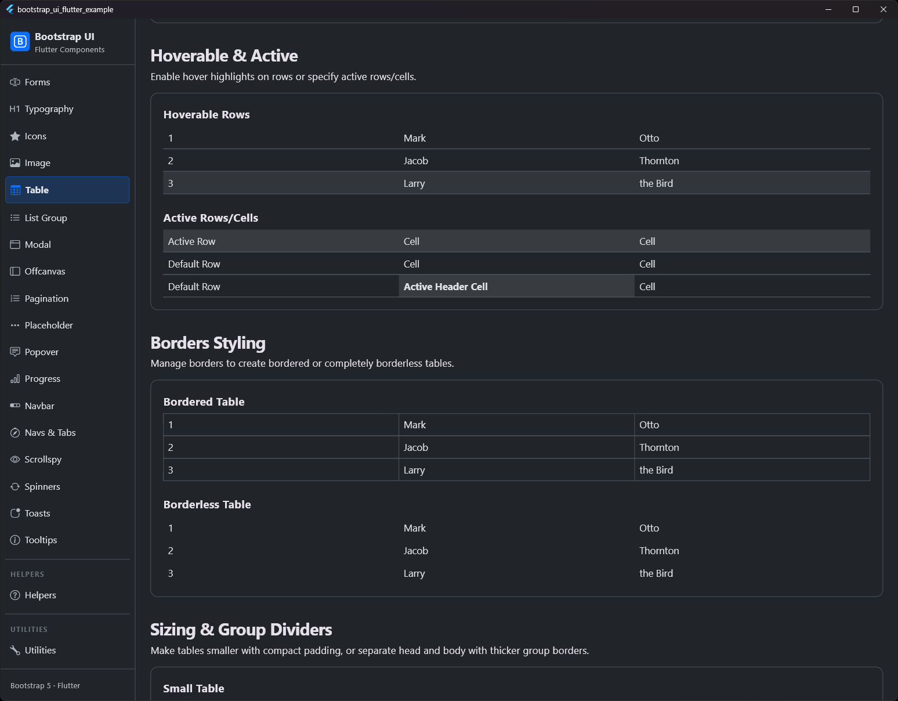
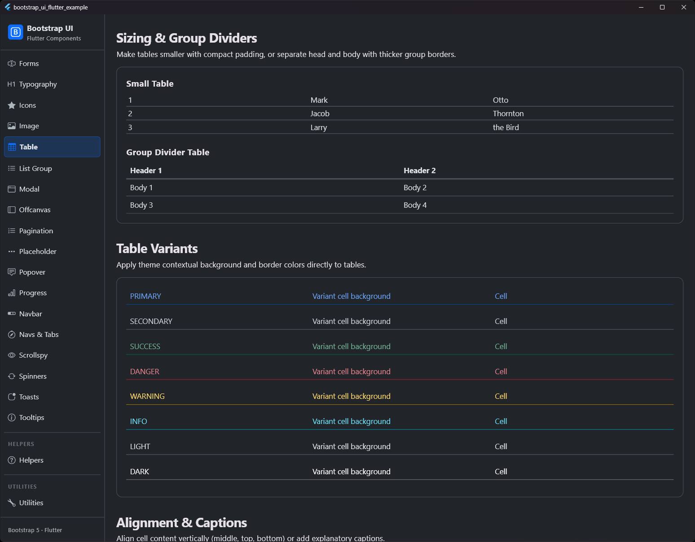
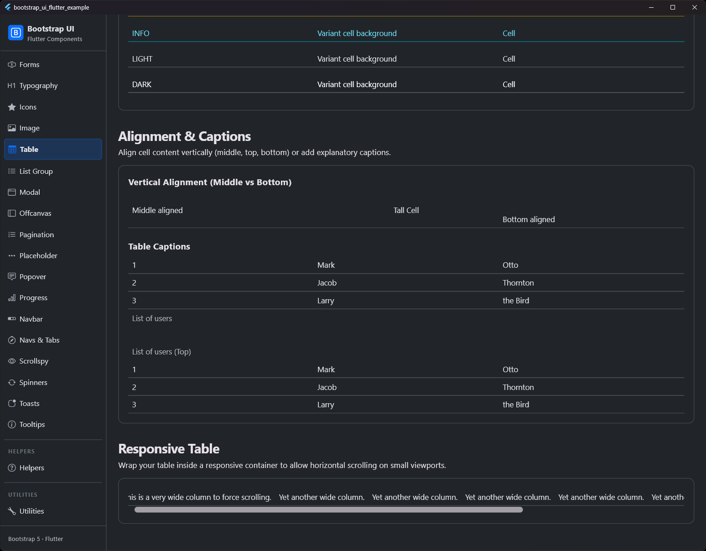

# Tabelle (Table)

## Vorschau

| Tabelle Standard | Tabelle Gestreift | Tabelle Dunkel | Tabelle Rahmenlos |
|:---:|:---:|:---:|:---:|
|  |  |  |  |


Dokumentation und Beispiele für das Styling von Tabellen nach Bootstrap-Standard.

## Features

- **Semantische Struktur**: Unterstützung für `head` (Kopf), `body` (Inhalt) und `foot` (Fuß).
- **Kontextuelle Varianten**: Mit `BsTableVariant` können die gesamte Tabelle, einzelne Zeilen oder Zellen eingefärbt werden.
- **Gestreifte Zeilen**: Fügt Zebra-Streifen zu den Tabellenzeilen im Body hinzu.
- **Gestreifte Spalten**: Fügt Zebra-Streifen zu den Tabellen-Spalten hinzu.
- **Hover-Effekt**: Aktiviert einen Hover-Zustand für Zeilen.
- **Aktiver Zustand**: Hebt eine bestimmte Zeile oder Zelle hervor.
- **Rahmen**: Unterstützung für umrandete (`bordered`) und rahmenlose (`borderless`) Varianten.
- **Kompakte Tabellen**: Die Eigenschaft `small` halbiert das Padding der Zellen.
- **Beschriftungen (Captions)**: Positionierbare Beschriftungen für Barrierefreiheit und Beschreibungen.
- **Responsive**: Horizontales Scrollen für breite Tabellen auf kleinen Bildschirmen.

## Verwendung

```dart
BsTable(
  head: BsTableHead(
    rows: [
      BsTableRow(
        children: [
          BsTableCell.header(child: Text('#')),
          BsTableCell.header(child: Text('Vorname')),
          BsTableCell.header(child: Text('Nachname')),
        ],
      ),
    ],
  ),
  children: [
    BsTableRow(
      children: [
        BsTableCell(child: Text('1')),
        BsTableCell(child: Text('Mark')),
        BsTableCell(child: Text('Otto')),
      ],
    ),
  ],
)
```

## Eigenschaften

### BsTable

| Eigenschaft | Typ | Beschreibung |
| :--- | :--- | :--- |
| `head` | `BsTableHead?` | Konfiguration für den `<thead>` Bereich. |
| `foot` | `BsTableFoot?` | Konfiguration für den `<tfoot>` Bereich. |
| `children` | `List<BsTableRow>` | Die Inhaltszeilen der Tabelle. |
| `variant` | `BsTableVariant?` | Basisfarbvariante für die Tabelle. |
| `striped` | `bool` | Aktiviert Zebra-Streifen für Zeilen. |
| `stripedColumns` | `bool` | Aktiviert Zebra-Streifen für Spalten. |
| `hover` | `bool` | Aktiviert den Hover-Zustand für Zeilen. |
| `bordered` | `bool` | Fügt Rahmen an allen Seiten der Tabelle und Zellen hinzu. |
| `borderless` | `bool` | Entfernt alle Rahmen. |
| `small` | `bool` | Macht die Tabelle kompakter. |
| `caption` | `Widget?` | Optionales Beschriftungs-Widget. |
| `captionTop` | `bool` | Verschiebt die Beschriftung nach oben. |
| `isResponsive` | `bool` | Aktiviert horizontales Scrollen. |
| `verticalAlign` | `BsTableVerticalAlign` | Vertikale Ausrichtung für alle Zellen. |
| `groupDivider` | `bool` | Fügt einen dickeren Rahmen zwischen Kopf und Inhalt hinzu. |

### BsTableRow

| Eigenschaft | Typ | Beschreibung |
| :--- | :--- | :--- |
| `variant` | `BsTableVariant?` | Farbvariante für die Zeile. |
| `active` | `bool` | Hebt die Zeile hervor. |
| `verticalAlign` | `BsTableVerticalAlign?` | Vertikale Ausrichtung für Zellen in dieser Zeile. |
| `children` | `List<BsTableCell>` | Die Zellen in der Zeile. |

### BsTableCell

| Eigenschaft | Typ | Beschreibung |
| :--- | :--- | :--- |
| `variant` | `BsTableVariant?` | Farbvariante für die Zelle. |
| `active` | `bool` | Hebt die Zelle hervor. |
| `isHeader` | `bool` | Gibt an, ob es sich um eine Kopfzelle handelt (fetter Text). |
| `verticalAlign` | `BsTableVerticalAlign?` | Vertikale Ausrichtung für diese Zelle. |
| `child` | `Widget` | Inhalt der Zelle. |

## Varianten

Verfügbare Varianten: `primary`, `secondary`, `success`, `danger`, `warning`, `info`, `light`, `dark`.

```dart
BsTable(
  variant: BsTableVariant.dark,
  children: [...],
)
```
