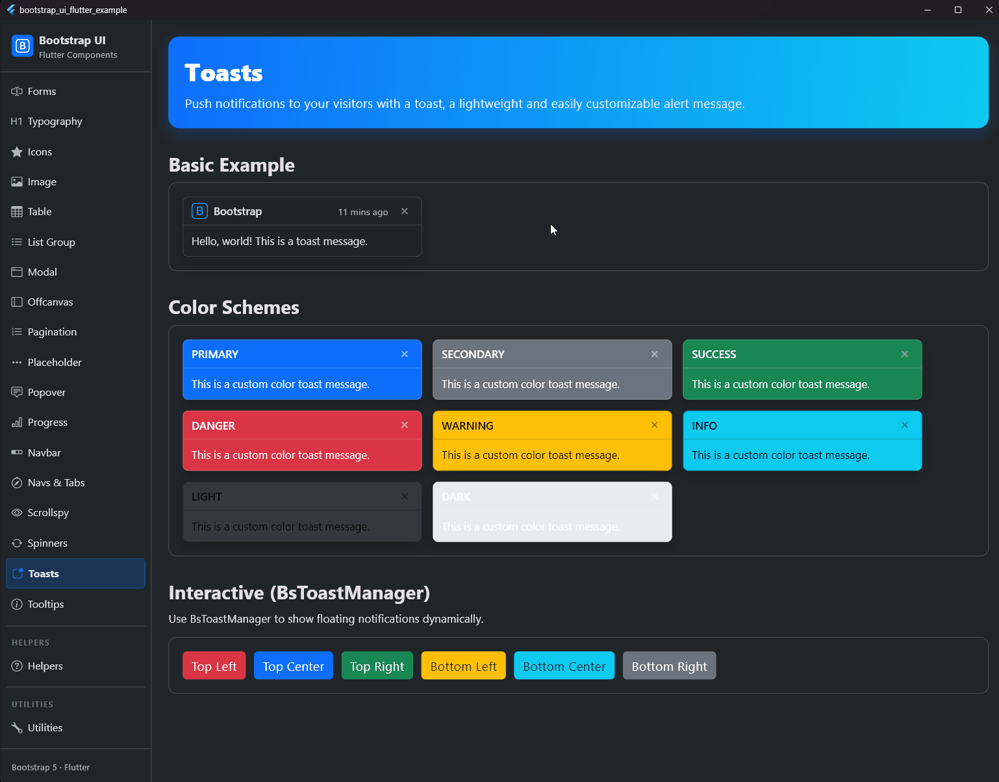

# Toasts

## Vorschau



Sende Push-Benachrichtigungen an deine Besucher mit einem Toast – einer leichtgewichtigen und einfach anpassbaren Warnmeldung.

## Übersicht

Toasts sind leichtgewichtige Benachrichtigungen, die den Push-Benachrichtigungen nachempfunden sind, die durch mobile und Desktop-Betriebssysteme populär wurden. Sie basieren auf Flexbox, wodurch sie einfach auszurichten und zu positionieren sind.

## Basis-Beispiel

Um erweiterbare und vorhersehbare Toasts zu fördern, empfehlen wir einen Header und einen Body. Toast-Header verwenden Flexbox, was eine einfache Ausrichtung des Inhalts ermöglicht.

```dart
BsToast(
  header: BsToastHeader(
    icon: const BsIcon(BsIcons.bootstrap, color: Colors.blue),
    title: const Text('Bootstrap'),
    subtitle: const Text('Vor 11 Minuten'),
    onClose: () {},
  ),
  child: const Text('Hallo Welt! Dies ist eine Toast-Nachricht.'),
)
```

## Toast Manager

Für das schwebende Verhalten solltest du `BsToastManager` verwenden. Er kümmert sich automatisch um das `Overlay`, weiche Eingangs-Animationen und das automatische Schließen.

```dart
BsToastManager.show(
  context,
  duration: const Duration(seconds: 4),
  toast: BsToast(
    header: BsToastHeader(
      title: const Text('Benachrichtigung'),
      onClose: () => BsToastManager.dismissAll(),
    ),
    child: const Text('Dieser Toast verschwindet in 4 Sekunden.'),
  ),
);
```

## Farbvarianten

Wie andere Komponenten auch, kommen Toasts in verschiedenen Varianten:

```dart
BsToast(
  variant: BsVariant.success,
  header: BsToastHeader(
    title: const Text('Erfolg'),
    onClose: () {},
  ),
  child: const Text('Aktion erfolgreich abgeschlossen.'),
)
```
