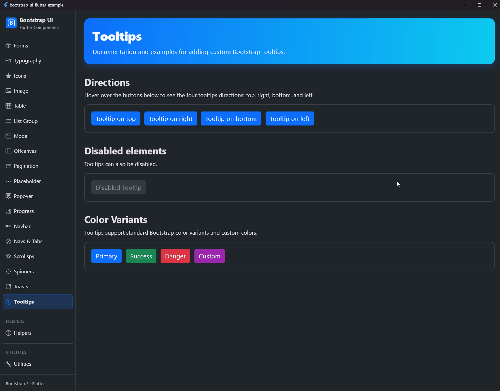

# Tooltips

## Vorschau



Dokumentation und Beispiele zum Hinzufügen von benutzerdefinierten Bootstrap-Tooltips.

## Übersicht

Tooltips bieten kleine, schwebende Labels, die beim Hovern oder bei Fokussierung erscheinen. Sie verwenden die `CompositedTransformTarget` und `OverlayEntry` APIs in Flutter, um sich dynamisch zu positionieren.

## Basis-Beispiel

Umschließe das Widget, das den Tooltip auslösen soll, mit einem `BsTooltip`. Übergib den `message` String.

```dart
BsTooltip(
  message: 'Tooltip oben',
  placement: BsPlacement.top,
  child: BsButton(
    label: 'Hover mich',
    onPressed: () {},
  ),
)
```

## Platzierung

Vier Richtungen sind verfügbar: `top`, `end` (rechts), `bottom` und `start` (links) ausgerichtet.

- `BsPlacement.top`
- `BsPlacement.bottom`
- `BsPlacement.start`
- `BsPlacement.end`

Hinweis: Tooltips versuchen automatisch, ihre Position anzupassen, wenn sie erkennen, dass sie die Bildschirmgrenzen überschreiten.

## Deaktivierte Elemente

Elemente mit dem `disabled`-Attribut sind nicht interaktiv, was bedeutet, dass Benutzer sie nicht fokussieren, hovern oder klicken können, um einen Tooltip (oder Popover) auszulösen. Du kannst den Tooltip deaktivieren, indem du die Eigenschaft `disabled` setzt:

```dart
BsTooltip(
  message: 'Wird nicht angezeigt',
  disabled: true,
  child: BsButton(
    label: 'Deaktivierter Tooltip',
    onPressed: null,
  ),
)
```

## Farben & Varianten

Tooltips unterstützen benutzerdefinierte Hintergrundfarben sowie alle Bootstrap-Varianten. Wenn beides angegeben wird, überschreibt `color` die `variant`. Die Standardfarbe ist schwarz.

```dart
BsTooltip(
  message: 'Erfolgsaktion',
  variant: BsVariant.success,
  child: BsButton(label: 'Speichern', onPressed: () {}),
)

// Benutzerdefinierte Farbe
BsTooltip(
  message: 'Markenfarben',
  color: Colors.purple,
  child: BsButton(label: 'Benutzerdefiniert', onPressed: () {}),
)
```
