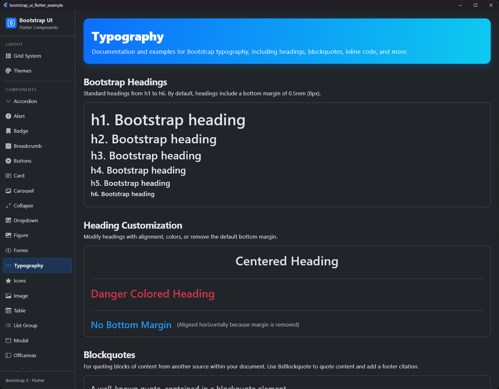
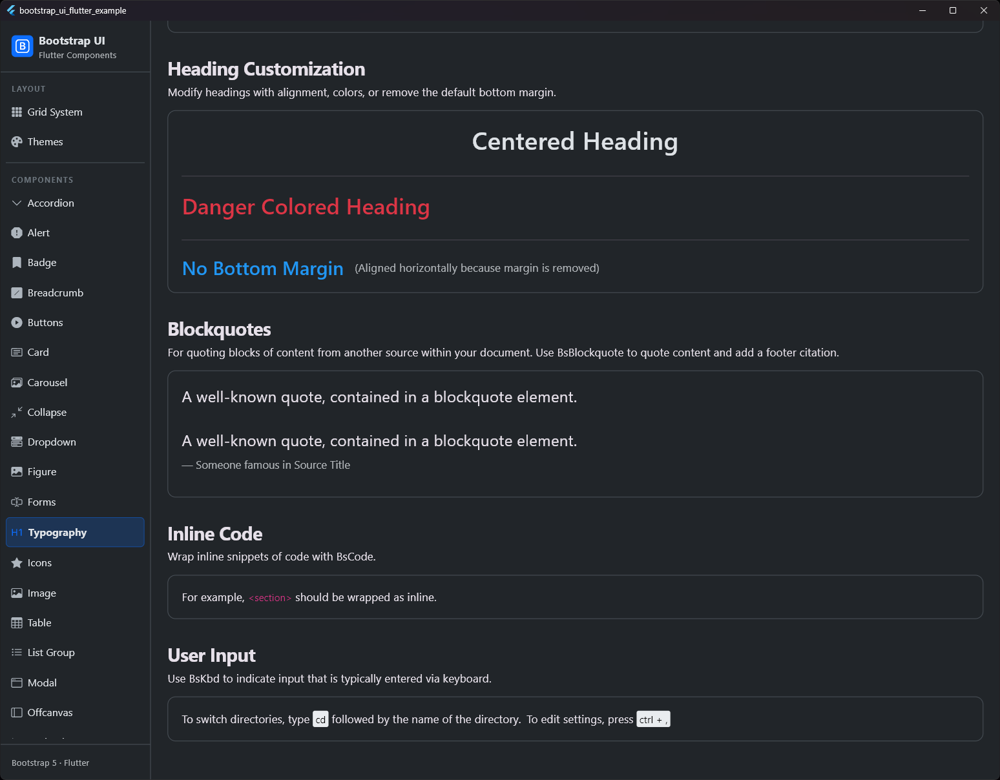

# Typografie (Typography)

## Vorschau

| Typografie Vorschau 1 | Typografie Vorschau 2 |
|:---:|:---:|
|  |  |


Das `BsHeading`-Widget wird verwendet, um Standard-Überschriften von `<h1>` bis `<h6>` mit Bootstrap-kompatiblen Stilen zu rendern, einschließlich des standardmäßigen unteren Abstands (Margin) und der korrekten Zeilenhöhe (Line-Height).

## Verwendung

```dart
BsHeading(
  'Beispiel Überschrift 1',
  level: BsHeadingLevel.h1,
)

BsHeading(
  'Beispiel Überschrift 6 ohne Abstand',
  level: BsHeadingLevel.h6,
  removeMargin: true,
  color: BsColors.secondary,
)
```

## Eigenschaften

| Eigenschaft | Typ | Standard | Beschreibung |
| :--- | :--- | :--- | :--- |
| `text` | `String` | **Erforderlich** | Der anzuzeigende Text der Überschrift. |
| `level` | `BsHeadingLevel` | `BsHeadingLevel.h1` | Die Überschriften-Ebene von `h1` (am größten) bis `h6` (am kleinsten). |
| `color` | `Color?` | `null` | Eigene Textfarbe. Standardmäßig die Textfarbe des Themes (`bodyText`). |
| `textAlign` | `TextAlign?` | `null` | Optionale horizontale Ausrichtung des Textes. **Hinweis:** Wenn gesetzt, verhält sich die Überschrift wie ein Block-Level-Element und nimmt `double.infinity` als Breite ein. Bei Verwendung innerhalb einer `Row` muss das Widget in ein `Expanded` gepackt werden, um Layout-Fehler zu vermeiden. |
| `removeMargin` | `bool` | `false` | Wenn `true`, wird der standardmäßige untere Abstand von `0.5rem` (8px) entfernt (mittels Padding-Bottom umgesetzt). |

## Blockzitat (Blockquote)

Zum Zitieren von Inhalten aus einer anderen Quelle in deinem Dokument. Verwende `BsBlockquote` und füge optional eine Fußzeile (Footer) als Quellenangabe hinzu.

```dart
BsBlockquote(
  footer: const Text('Jemand Bekanntes im Quellentitel'),
  child: const Text('Ein bekanntes Zitat, eingefasst in ein Blockquote-Element.'),
)
```

## Inline-Code

Umschließe Inline-Code-Schnipsel mit `BsCode`. Dies formatiert den Text in einer Monospace-Schriftart und wendet die Bootstrap-Standardfarbe für Code an (pink-500).

```dart
BsCode('import bs;')
```

## Benutzereingaben (KBD)

Verwende das `BsKbd`-Widget, um Eingaben zu kennzeichnen, die üblicherweise über die Tastatur erfolgen. Dies formatiert den Text mit einem dunklen Hintergrund, weißer Schrift, abgerundeten Ecken und einer Monospace-Schriftart.

```dart
BsKbd('cd')
BsKbd('ctrl + ,')
```