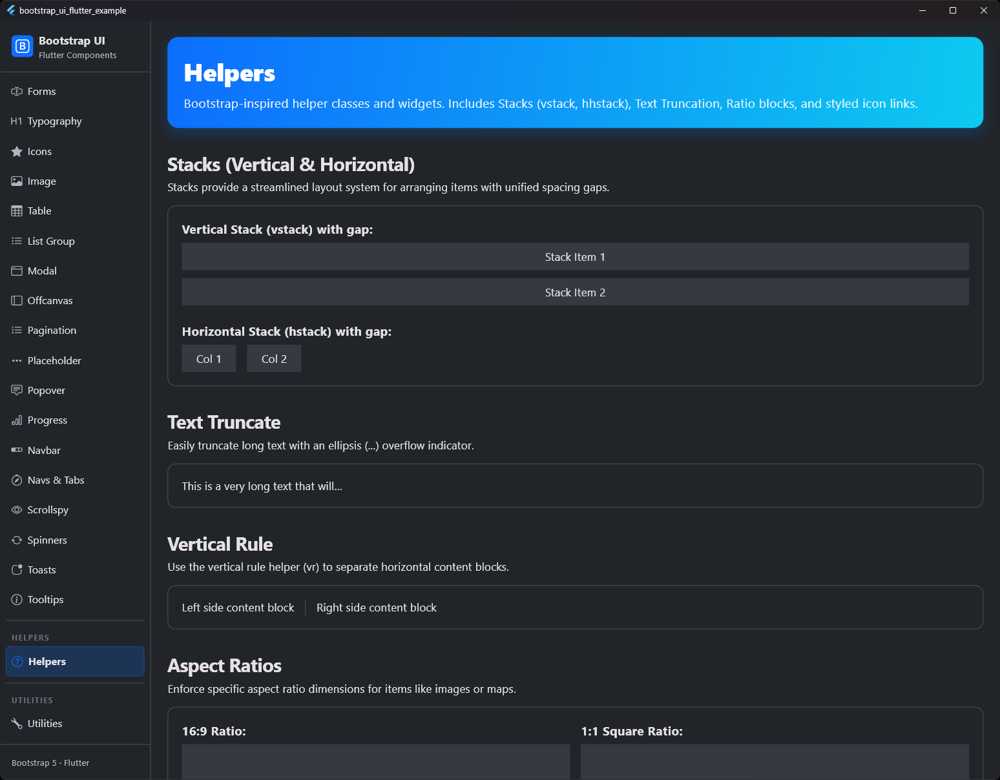
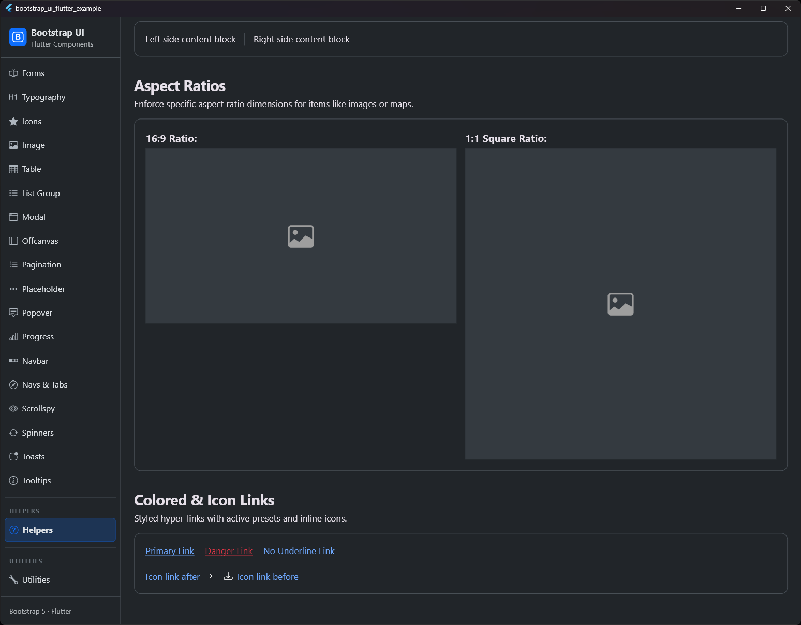

# Helfer (Helpers)

## Vorschau

| Hilfeklassen 1 | Hilfeklassen 2 |
|:---:|:---:|
|  |  |


Von Bootstrap inspirierte Hilfsklassen und Widgets, um die Entwicklung zu beschleunigen und Konsistenz zu gewährleisten.

## Übersicht

| Helfer | Typ | Beschreibung |
| :--- | :--- | :--- |
| **Stacks** | Widget | `BsVStack` und `BsHStack` für einfache vertikale/horizontale Layouts mit Abständen (Gaps). |
| **Ratio** | Widget | `BsRatio` zur Verwaltung von Seitenverhältnissen (z.B. 16:9). |
| **Vertical Rule** | Widget | `BsVerticalRule` für vertikale Trennlinien. |
| **Links** | Widget | `BsLink` und `BsIconLink` für semantisch gefärbte Links mit Hover-Effekten. |
| **Truncation** | Extension | `.truncate()` Erweiterung für `Text` Widgets zum Abschneiden von Text. |

---

## Stacks

Stacks bieten eine optimierte Möglichkeit, Komponenten mit einem konsistenten Abstand (Gap) zwischen den Elementen anzuordnen.

### Vertical Stack (vstack)

```dart
BsVStack(
  gap: 16,
  children: [
    Text('Element 1'),
    Text('Element 2'),
  ],
)
```

### Horizontal Stack (hstack)

```dart
BsHStack(
  gap: 8,
  children: [
    Text('Links'),
    BsVerticalRule(),
    Text('Rechts'),
  ],
)
```

---

## Ratio

Verwalten Sie das Seitenverhältnis von Inhalten (z.B. für Bilder oder Videos).

```dart
BsRatio(
  type: BsRatioType.ratio16x9,
  child: Image.network('...'),
)
```

---

## Vertical Rule

Verwenden Sie den Helfer für vertikale Linien, um vertikale Trenner zu erstellen.

```dart
IntrinsicHeight(
  child: Row(
    children: [
      Text('Sektion 1'),
      BsVerticalRule().px3(),
      Text('Sektion 2'),
    ],
  ),
)
```

---

## Links

### Farbige Links

```dart
BsLink(
  label: Text('Gefahren-Link'),
  color: context.bs.danger,
  onPressed: () => print('Gedrückt'),
)
```

### Icon-Links

```dart
BsIconLink(
  label: Text('Mehr lesen'),
  icon: Icon(Icons.arrow_forward, size: 16),
  onPressed: () {},
)
```

---

## Text Truncation

Langen Text ganz einfach mit Auslassungspunkten abschneiden.

```dart
Text('Ein sehr langer Text, der abgeschnitten werden soll').truncate()
```