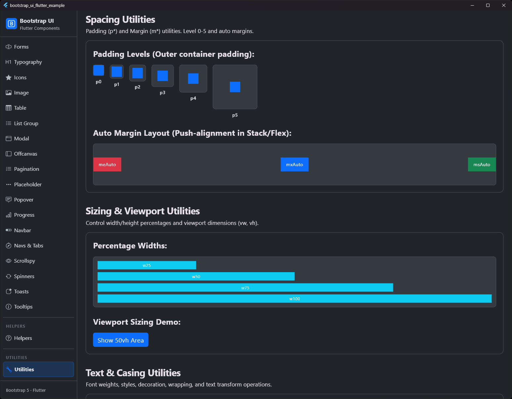

# Weitere Utilities

## Vorschau




Zusätzlich zum Spacing bietet die Bibliothek weitere Extensions, um die UI-Entwicklung zu beschleunigen.

## Breakpoint-Unterstützung

Die meisten Utility-Extensions unterstützen einen optionalen `breakpoint`-Parameter vom Typ `double?` (z. B. über `BsBreakpoints`). Wenn dieser übergeben wird, wendet die Extension das Verhalten nur an, wenn die Bildschirmbreite mindestens dem Breakpoint entspricht (Mobile First).

```dart
// Erst ab mittleren Bildschirmen unsichtbar
Text('Versteckt').dNone(BsBreakpoints.md);

// Erst ab großen Bildschirmen zentriert
Container().center(BsBreakpoints.lg);
```

## Anzeige & Sichtbarkeit (Display)

`BsDisplayExtension` kümmert sich um das Ein-/Ausblenden und die Transparenz.

| Methode | Beschreibung |
| :--- | :--- |
| `.visible(bool, [double? breakpoint])` | Wrapper für das `Visibility`-Widget. |
| `.gone(bool, [double? breakpoint])` | `Visibility` mit `maintainState: false`. |
| `.dNone([double? breakpoint])` | Alias für `.gone(true)`. Versteckt das Element. |
| `.dBlock([double? breakpoint])` | Alias für `.gone(false)`. Zeigt das Element an. |
| `.opacity(double, [double? breakpoint])` | Wrapper für das `Opacity`-Widget. |

```dart
Text('Versteckt').dNone();
Text('Transparent').opacity(0.5);
```

## Ausrichtung (Alignment)

`BsAlignmentExtension` kümmert sich um die Positionierung.

| Methode | Beschreibung |
| :--- | :--- |
| `.align(Alignment)` | Wrapper für das `Align`-Widget. |
| `.center()` | Wrapper für das `Center`-Widget. |
| `.alignStart()` | Ausrichtung am Anfang (`centerStart`). |
| `.alignEnd()` | Ausrichtung am Ende (`centerEnd`). |
| `.alignTop()` | Ausrichtung oben (`topCenter`). |
| `.alignBottom()` | Ausrichtung unten (`bottomCenter`). |

```dart
Text('Zentriert').center();
Text('Links').alignStart();
```

### Inline Vertikale Ausrichtung (Vertical Align)

`BsVerticalAlignExtension` kümmert sich um die vertikale Ausrichtung von Elementen (z. B. Icons, Badges oder Bildern) innerhalb eines Textflusses (`RichText` oder `Text.rich`). Diese Methoden geben ein `WidgetSpan` zurück und entsprechen den Bootstrap-Klassen `.align-*`.

| Methode | Beschreibung | Entspricht Bootstrap-Klasse |
| :--- | :--- | :--- |
| `.alignBaseline()` | Richtet die Grundlinie des Elements an der des Elternteils aus. | `.align-baseline` |
| `.alignTopInline()` | Richtet das Element am oberen Ende der Zeile aus. | `.align-top` |
| `.alignMiddle()` | Zentriert das Element vertikal in der Zeile. | `.align-middle` |
| `.alignBottomInline()` | Richtet das Element am unteren Ende der Zeile aus. | `.align-bottom` |
| `.alignTextTop()` | Richtet das Element an der Oberkante der Schriftart aus. | `.align-text-top` |
| `.alignTextBottom()` | Richtet das Element an der Unterkante der Schriftart aus. | `.align-text-bottom` |

```dart
Text.rich(
  TextSpan(
    children: [
      TextSpan(text: 'Text mit '),
      const Icon(Icons.star).alignMiddle(),
      TextSpan(text: ' zentriertem Icon.'),
    ],
  ),
)
```

## Größenanpassung (Sizing)

`BsSizeExtension` kümmert sich um Dimensionen und Flexibilität.

| Methode | Beschreibung | Entspricht Bootstrap |
| :--- | :--- | :--- |
| `.w(double)` | Setzt eine feste Breite via `SizedBox`. | - |
| `.h(double)` | Setzt eine feste Höhe via `SizedBox`. | - |
| `.w100()`, `.w75()`, `.w50()`, `.w25()` | Setzt Breite relativ zum Eltern-Element. | `.w-*` |
| `.h100()`, `.h75()`, `.h50()`, `.h25()` | Setzt Höhe relativ zum Eltern-Element. | `.h-*` |
| `.size100()` | Setzt Breite und Höhe auf Unendlich. | `.w-100.h-100` |
| `.vw100(context)` | Setzt die Breite auf 100% der Bildschirmbreite (Viewport Width). | `.vw-100` |
| `.vh100(context)` | Setzt die Höhe auf 100% der Bildschirmhöhe (Viewport Height). | `.vh-100` |
| `.vw50(context)` | Setzt die Breite auf 50% der Bildschirmbreite. | `.vw-50` |
| `.vh50(context)` | Setzt die Höhe auf 50% der Bildschirmhöhe. | `.vh-50` |
| `.minVw100(context)` | Setzt die Mindestbreite auf 100% der Bildschirmbreite. | `.min-vw-100` |
| `.minVh100(context)` | Setzt die Mindesthöhe auf 100% der Bildschirmhöhe. | `.min-vh-100` |
| `.minVw50(context)` | Setzt die Mindestbreite auf 50% der Bildschirmbreite. | `.min-vw-50` |
| `.minVh50(context)` | Setzt die Mindesthöhe auf 50% der Bildschirmhöhe. | `.min-vh-50` |
| `.minW100()` | Setzt die Mindestbreite auf 100% des Eltern-Elements. | `.min-w-100` |
| `.minH100()` | Setzt die Mindesthöhe auf 100% des Eltern-Elements. | `.min-h-100` |
| `.expanded([flex])` | Wrapper für das `Expanded`-Widget. | - |

```dart
Container(color: Colors.red).w(50).h(50);
Button('50% Breite').w50();
Container().vh100(context); // Nimmt die volle Bildschirmhöhe ein
Container().vh50(context);  // Nimmt genau 50% der Bildschirmhöhe ein
```
