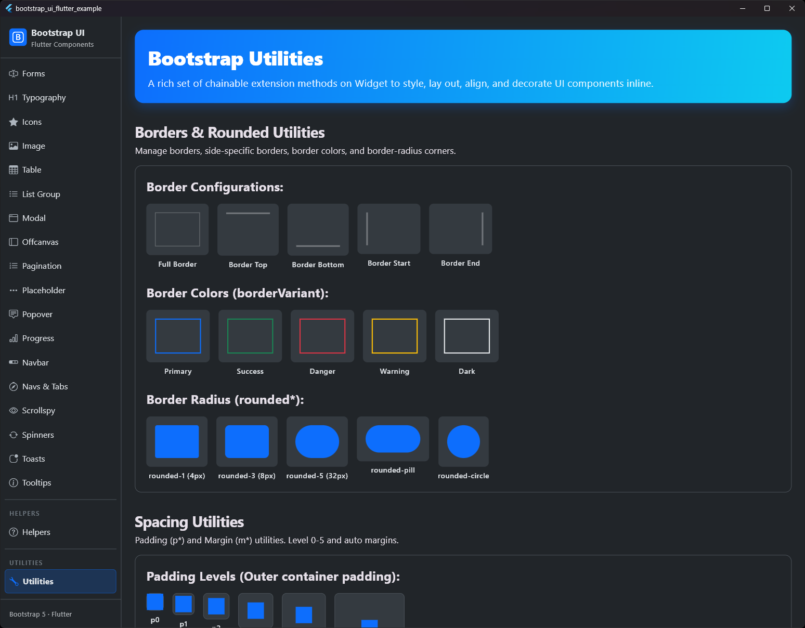

# Abstands-Utilities (Spacing)

## Vorschau




Die `BsSpacingExtension` bietet eine Reihe von prägnanten Methoden, um Padding (Innenabstand) und Margin (Außenabstand) auf jedes Flutter-Widget anzuwenden. Dabei wird die Namenskonvention der Bootstrap-Utility-Klassen übernommen.

## Features

- **Prägnante Syntax**: Verkettbare Methoden wie `.p3()`, `.mb2()`, etc.
- **Bootstrap-Konformität**: Nutzt die standardmäßigen Bootstrap-Abstandsstufen (1-5).
- **Responsive**: Unterstützt Breakpoints (`BsBreakpoints`) für bedingte Anwendung.
- **Flexibel**: Erlaubt benutzerdefinierte Werte über `.p(double)`, `.m(double)`, etc.
- **Kontextbewusst**: Berücksichtigt die Konzepte von Padding (innerhalb eines Rahmens) und Margin (außerhalb eines Rahmens) im Flutter-Widget-Baum.

## Verwendung

Anstatt ein Widget manuell in ein `Padding`-Widget zu verschachteln:

```dart
// Standard Flutter (Padding)
Padding(
  padding: EdgeInsets.all(16.0),
  child: Text('Hallo'),
)

// Mit BsSpacingExtension
Text('Hallo').p3()

// Responsive Spacing
Text('Hallo').p3(BsBreakpoints.md) // Wendet das Padding nur ab md an

// Margin (Abstand außerhalb einer Dekoration/Box)
Container(color: Colors.red, child: Text('Alarm'))
  .mb3() // Fügt Außenabstand unten außerhalb der roten Box hinzu
```

## Verfügbare Methoden

### Standard-Stufen (0-5)

Diese Methoden verwenden die vordefinierten `BsSpacing`-Tokens (inklusive Level 0 für den Wert 0.0):

| Typ | Padding-Methoden | Margin-Methoden | Bootstrap-Äquivalent |
| :--- | :--- | :--- | :--- |
| **Gleichmäßig** | `.p0()` bis `.p5()` | `.m0()` bis `.m5()` | `p-*` / `m-*` |
| **Horizontal** | `.px0()` bis `.px5()` | `.mx0()` bis `.mx5()` | `px-*` / `mx-*` |
| **Vertikal** | `.py0()` bis `.py5()` | `.my0()` bis `.my5()` | `py-*` / `my-*` |
| **Oben (Top)** | `.pt0()` bis `.pt5()` | `.mt0()` bis `.mt5()` | `pt-*` / `mt-*` |
| **Unten (Bottom)** | `.pb0()` bis `.pb5()` | `.mb0()` bis `.mb5()` | `pb-*` / `mb-*` |
| **Anfang (Start)** | `.ps0()` bis `.ps5()` | `.ms0()` bis `.ms5()` | `ps-*` / `ms-*` |
| **Ende (End)** | `.pe0()` bis `.pe5()` | `.me0()` bis `.me5()` | `pe-*` / `me-*` |

---

### Automatische Außenabstände (Auto Margins)

Entspricht den Bootstrap-Klassen `.m-auto`, `.mx-auto` etc. Diese eignen sich hervorragend, um Widgets in übergeordneten Flexbox- oder Stack-Layouts auszurichten.

| Methode | Beschreibung | Entspricht |
| :--- | :--- | :--- |
| `.mAuto()` | Zentriert das Widget horizontal und vertikal. | `m-auto` |
| `.mxAuto()` | Zentriert das Widget horizontal. | `mx-auto` |
| `.myAuto()` | Zentriert das Widget vertikal. | `my-auto` |
| `.msAuto()` | Richtet das Widget am Ende (rechts) aus (Auto-Margin Start). | `ms-auto` |
| `.meAuto()` | Richtet das Widget am Anfang (links) aus (Auto-Margin End). | `me-auto` |
| `.mtAuto()` | Richtet das Widget unten aus. | `mt-auto` |
| `.mbAuto()` | Richtet das Widget oben aus. | `mb-auto` |

```dart
// Schiebt das Widget im Row-Layout nach ganz rechts
Text('Rechtsbündig').msAuto();
```

---

### Benutzerdefinierte Werte

Falls ein spezifischer Pixelwert benötigt wird, der nicht durch die Standardstufen abgedeckt ist:

- Padding: `.p(val)`, `.px(val)`, `.py(val)`, `.pt(val)`, `.pb(val)`, `.ps(val)`, `.pe(val)`
- Margin: `.m(val)`, `.mx(val)`, `.my(val)`, `.mt(val)`, `.mb(val)`, `.ms(val)`, `.me(val)`

## Beispiel

```dart
Column(
  children: [
    Text('Titel').mb3(), // Außenabstand unten (Abstand zwischen Elementen)
    Row(
      children: [
        Icon(Icons.star).pe2(), // Innenabstand Ende Stufe 2
        Text('Bewertung'),
      ],
    ).px4(), // Horizontales Padding Stufe 4
  ],
).p5() // Gleichmäßiges Padding Stufe 5 für den gesamten Container
```