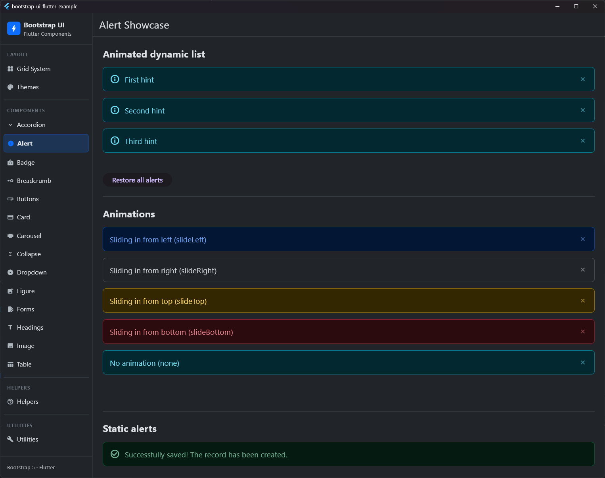

# Alert

## Preview




The `BsAlert` provides contextual feedback messages for typical user actions.

## Usage

```dart
BsAlert(
  variant: BsAlertVariant.success,
  icon: Icons.check_circle,
  dismissible: true,
  child: Text('Successfully saved!'),
)
```

## Properties

| Property | Type | Default | Description |
| :--- | :--- | :--- | :--- |
| `child` | `Widget` | **Required** | The content of the alert. |
| `variant` | `BsAlertVariant` | `BsAlertVariant.primary` | The color scheme of the alert. |
| `icon` | `IconData?` | `null` | An optional icon on the left side. |
| `iconColor` | `Color?` | `null` | Direct color choice for the icon. |
| `iconVariant` | `BsIconVariant?` | `null` | Specific color scheme for the icon. |
| `animation` | `BsAlertAnimation` | `BsAlertAnimation.fade` | The type of animation when showing and hiding (fade, none, slideTop, slideBottom, slideLeft, slideRight). |
| `animationInDuration` | `Duration` | `Duration(milliseconds: 200)` | The duration of the animation when showing. |
| `animationOutDuration` | `Duration` | `Duration(milliseconds: 200)` | The duration of the animation when hiding. |
| `autoCloseDuration` | `Duration?` | `null` | If set, the alert closes automatically after this duration. |
| `dismissible` | `bool` | `false` | If `true`, shows a close button. |
| `onClose` | `VoidCallback?` | `null` | Called when the alert is closed (after animation). |