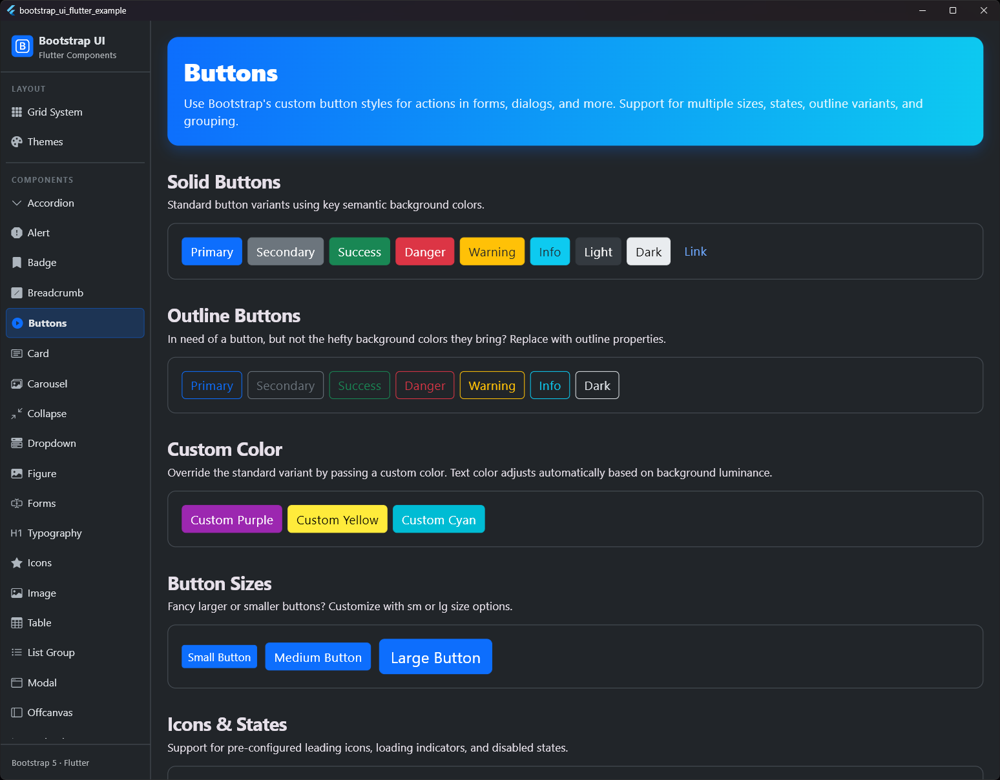
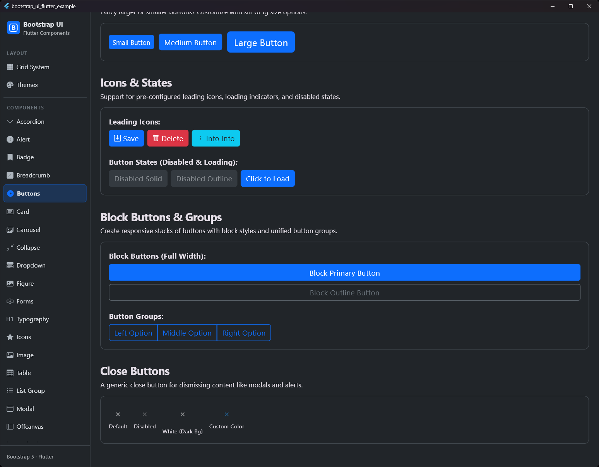

# Button

## Preview

| Buttons Preview 1 | Buttons Preview 2 |
|:---:|:---:|
|  |  |


The `BsButton` component provides various styles for actions in forms, dialogs, and more.

## Usage

```dart
BsButton(
  label: 'Click me',
  onPressed: () => print('Clicked!'),
  variant: .primary,
  size: .md,
)
```

## Custom Colors

If you need a button color outside the standard variants, you can pass a custom `Color` directly. The text color is automatically adjusted for contrast based on the background color's luminance.

```dart
BsButton(
  label: 'Brand Color',
  color: Colors.purple,
  onPressed: () {},
)
```

## Custom Colors

If you need a button color outside the standard variants, you can pass a custom `Color` directly. The text color is automatically adjusted for contrast based on the background color's luminance.

```dart
BsButton(
  label: 'Brand Color',
  color: Colors.purple,
  onPressed: () {},
)
```

## Properties

| Property | Type | Default | Description |
| :--- | :--- | :--- | :--- |
| `label` | `String` | **Required** | The text on the button. |
| `onPressed` | `VoidCallback?` | `null` | The function executed on click. If `null`, the button is disabled. |
| `variant` | `BsButtonVariant` | `.primary` | The style of the button (e.g., primary, outlineSuccess, link). |
| `size` | `BsButtonSize` | `.md` | The size of the button (sm, md, lg). |
| `isLoading` | `bool` | `false` | Shows a loading indicator and disables the button. |
| `icon` | `IconData?` | `null` | An optional icon. |
| `iconVariant` | `BsIconVariant?` | `null` | Specific color scheme for the icon. |
| `iconColor` | `Color?` | `null` | Direct color choice for the icon. |
| `fullWidth` | `bool` | `false` | If `true`, the button takes up the full available width. |
| `badge` | `Widget?` | `null` | An optional badge in or on the button. |
| `badgePosition` | `BsBadgePosition` | `.trailing` | Position of the badge (leading, trailing, or absolute in corners). |

---

# Button Group

`BsButtonGroup` allows grouping multiple buttons in a row or column.

## Usage

```dart
BsButtonGroup(
  children: [
    BsButton(label: 'Left', onPressed: () {}),
    BsButton(label: 'Middle', onPressed: () {}),
    BsButton(label: 'Right', onPressed: () {}),
  ],
)
```

## Properties

| Property | Type | Default | Description |
| :--- | :--- | :--- | :--- |
| `children` | `List<BsButton>` | **Required** | The list of buttons in the group. |
| `vertical` | `bool` | `false` | If `true`, buttons are arranged vertically. |
| `groupSize` | `BsButtonSize?` | `null` | Overrides the size of all buttons in the group. |