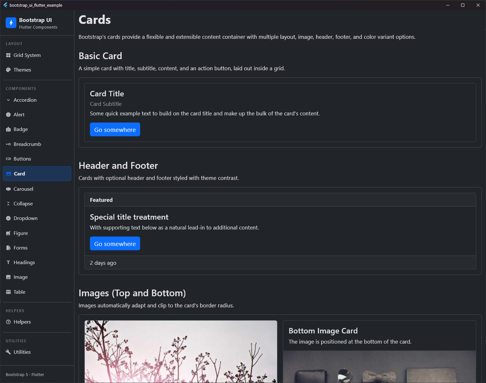
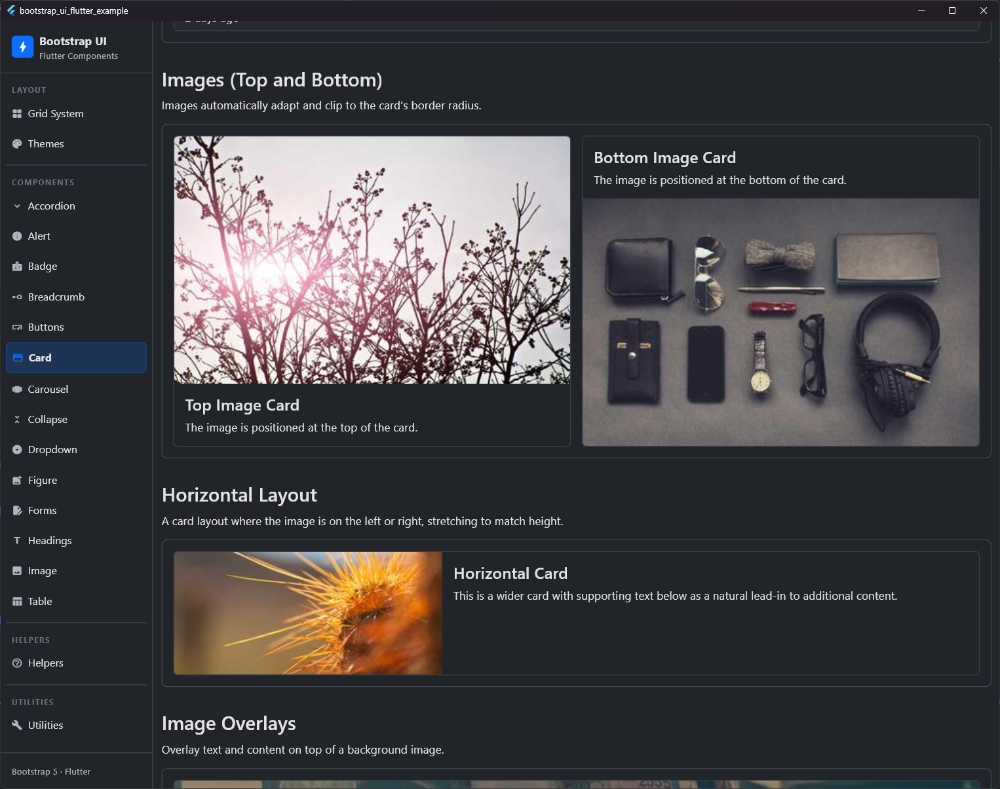
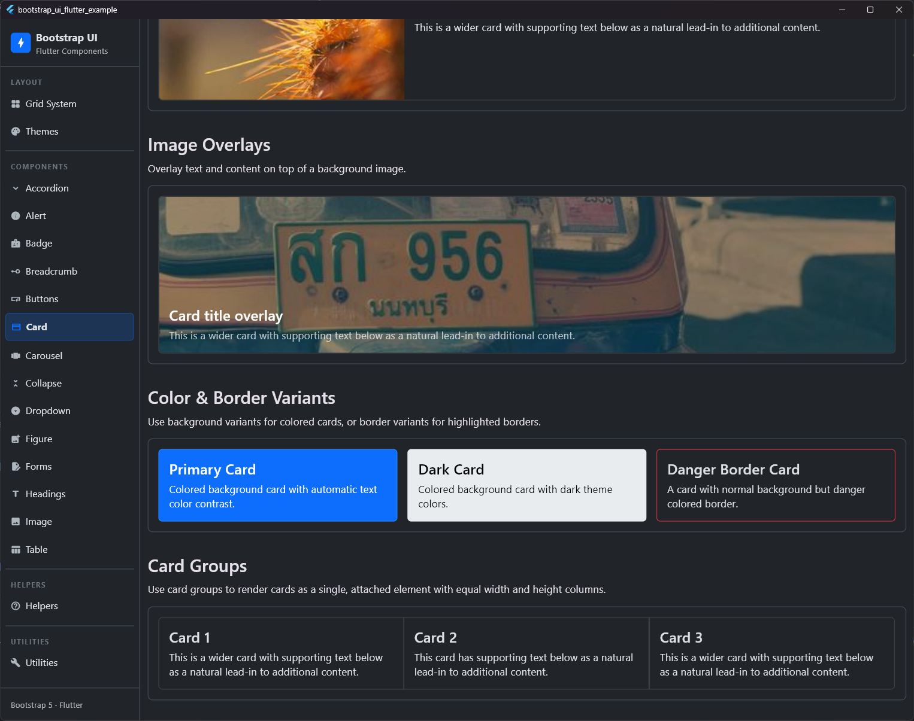

# Card

## Preview

| Standard Card | Header & Footer / Image | Card Group |
|:---:|:---:|:---:|
|  |  |  |


The `BsCard` widget is a flexible and extensible content container. It supports headers, footers, body content, images (top, bottom, left, right, overlay), color variants, and custom layouts.

## Usage

### Basic Card (using `children` list)
```dart
BsCard(
  body: BsCardBody(
    children: [
      BsCardTitle('Card Title'),
      BsCardSubtitle('Card Subtitle'),
      Text('Some quick example text to build on the card title.'),
      SizedBox(height: 16),
      BsButton(
        label: 'Go somewhere',
        onPressed: () {},
      ),
    ],
  ),
)
```

### With Header and Footer
```dart
BsCard(
  header: BsCardHeader(child: Text('Featured')),
  body: BsCardBody(
    children: [
      BsCardTitle('Special title treatment'),
      Text('With supporting text below as a natural lead-in to additional content.'),
    ],
  ),
  footer: BsCardFooter(child: Text('2 days ago')),
)
```

### With Image
```dart
BsCard(
  image: Image.network('https://picsum.photos/300/200'),
  imagePosition: BsCardImagePosition.top,
  body: BsCardBody(
    children: [
      BsCardTitle('Card with Top Image'),
      Text('This card has an image on top.'),
    ],
  ),
)
```

### Horizontal Layout
```dart
BsCard(
  image: Image.network('https://picsum.photos/300/200', fit: BoxFit.cover),
  imagePosition: BsCardImagePosition.left,
  imageFlex: 4,
  contentFlex: 8,
  body: BsCardBody(
    children: [
      BsCardTitle('Horizontal Card'),
      Text('This card has an image on the left and content on the right.'),
    ],
  ),
)
```

### Color Variants & Border Variants
```dart
// Colored background and text contrast
BsCard(
  variant: BsCardVariant.primary,
  body: BsCardBody(
    children: [
      BsCardTitle('Primary Card Title'),
      Text('This card uses the primary background variant.'),
    ],
  ),
)

// Border colored variant only
BsCard(
  borderVariant: BsCardVariant.danger,
  body: BsCardBody(
    children: [
      BsCardTitle('Danger Border Card'),
      Text('This card has a danger border variant.'),
    ],
  ),
)
```

### Card Groups
Card groups (`BsCardGroup`) connect multiple cards together, ensuring equal width and height columns.
```dart
BsCardGroup(
  children: [
    BsCard(
      body: BsCardBody(
        children: [
          BsCardTitle('Card 1'),
          Text('First card content in a horizontal card group.'),
        ],
      ),
    ),
    BsCard(
      body: BsCardBody(
        children: [
          BsCardTitle('Card 2'),
          Text('Second card content.'),
        ],
      ),
    ),
  ],
)
```

## Properties

### `BsCard`

| Property | Type | Default | Description |
| :--- | :--- | :--- | :--- |
| `header` | `Widget?` | `null` | Optional header widget (typically `BsCardHeader`). |
| `body` | `Widget?` | `null` | Optional main body widget (typically `BsCardBody`). |
| `footer` | `Widget?` | `null` | Optional footer widget (typically `BsCardFooter`). |
| `children` | `List<Widget>?` | `null` | Overrides individual layout parameters to stack widgets vertically. |
| `image` | `Widget?` | `null` | Image widget to include. |
| `imagePosition` | `BsCardImagePosition` | `BsCardImagePosition.top` | Position of the image (top, bottom, left, right, overlay). |
| `imageFlex` | `int` | `4` | Flex ratio for horizontal image layout. |
| `contentFlex` | `int` | `8` | Flex ratio for horizontal content layout. |
| `variant` | `BsCardVariant?` | `null` | Background and text color variant (`.text-bg-*`). |
| `borderVariant` | `BsCardVariant?` | `null` | Border color variant (`.border-*`). |
| `color` | `Color?` | `null` | Custom background color override. |
| `borderColor` | `Color?` | `null` | Custom border color override. |
| `borderRadius` | `BorderRadius?` | `null` | Custom border radius override. |
| `width` | `double?` | `null` | Custom width. |
| `height` | `double?` | `null` | Custom height. |

### `BsCardBody`

| Property | Type | Default | Description |
| :--- | :--- | :--- | :--- |
| `child` | `Widget?` | `null` | Single child widget. |
| `children` | `List<Widget>?` | `null` | List of children widgets to be laid out vertically. |
| `padding` | `EdgeInsetsGeometry?` | `BsSpacing.s3` (16px) | Custom padding of the body. |

### `BsCardGroup`

| Property | Type | Default | Description |
| :--- | :--- | :--- | :--- |
| `children` | `List<BsCard>` | **Required** | The list of cards to group. |
| `vertical` | `bool` | `false` | If true, cards stack vertically instead of side-by-side. |