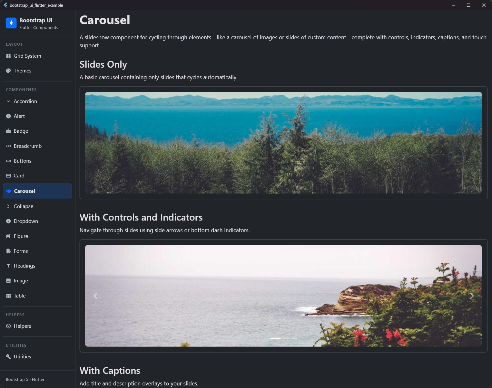
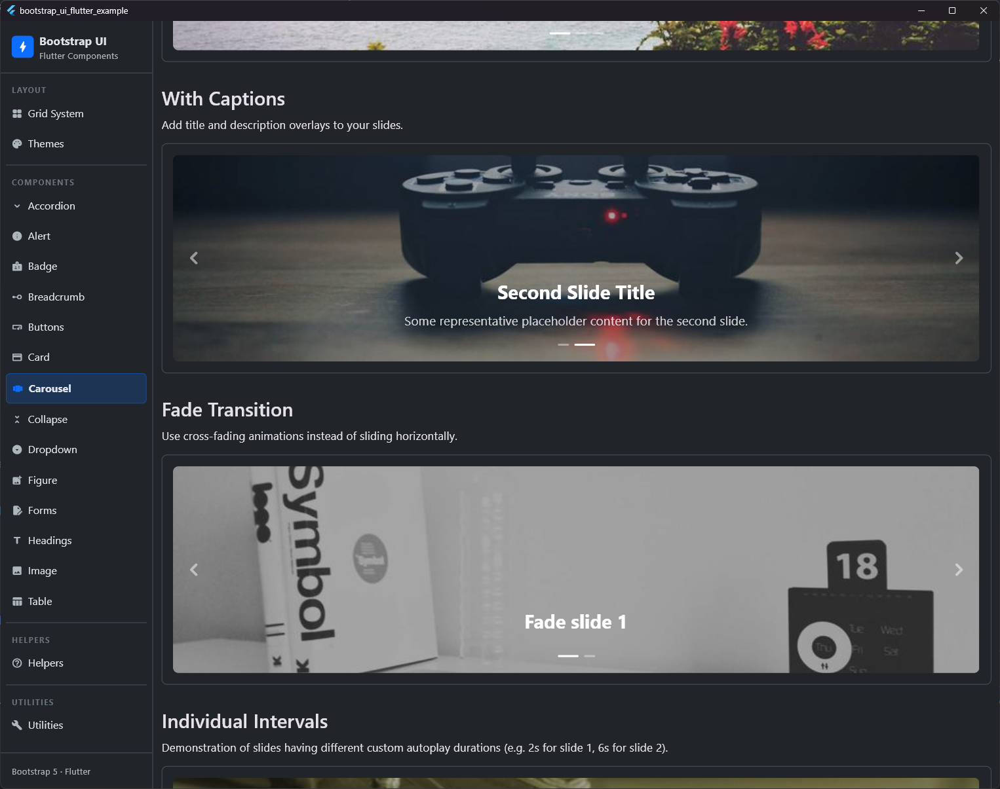
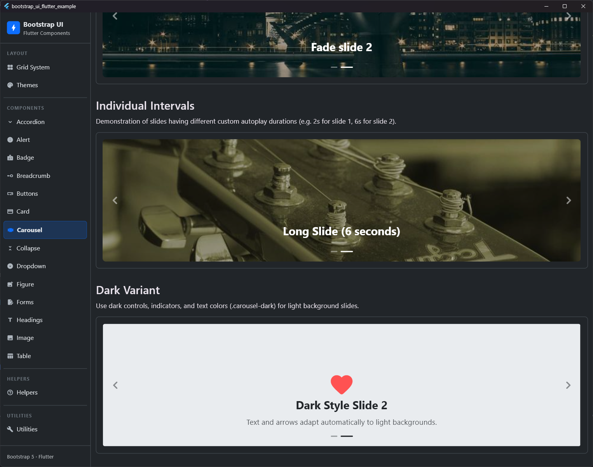

# Carousel

## Preview

| Slide 1 | Slide 2 | Slide 3 |
|:---:|:---:|:---:|
|  |  |  |


A slideshow component for cycling through elements (like images or slides of custom content) with support for controls, indicators, captions, autoplay cycling (with custom intervals), transitions (slide/fade), dark variant, and touch gestures.

## Usage

```dart
BsCarousel(
  autoplay: true,
  defaultInterval: Duration(seconds: 5),
  controls: true,
  indicators: true,
  items: [
    BsCarouselItem(
      caption: BsCarouselCaption(
        title: Text('First Slide Title'),
        description: Text('First slide description content.'),
      ),
      child: Image.network('https://picsum.photos/id/10/800/400', fit: BoxFit.cover),
    ),
    BsCarouselItem(
      interval: Duration(seconds: 10), // custom 10s interval for this slide
      caption: BsCarouselCaption(
        title: Text('Second Slide Title'),
      ),
      child: Image.network('https://picsum.photos/id/11/800/400', fit: BoxFit.cover),
    ),
  ],
)
```

## Properties

### BsCarousel

| Property | Type | Default | Description |
| :--- | :--- | :--- | :--- |
| `items` | `List<BsCarouselItem>` | **Required** | The list of slides to display. Must have at least 1 item. |
| `autoplay` | `bool` | `true` | Whether the carousel should cycle automatically. |
| `defaultInterval` | `Duration` | `Duration(seconds: 5)` | Default duration between slides when cycling. |
| `controls` | `bool` | `true` | Whether to show the previous and next control arrows. |
| `indicators` | `bool` | `true` | Whether to show slide indicator dashes at the bottom. |
| `fade` | `bool` | `false` | Whether to use a cross-fade transition instead of a horizontal slide transition. |
| `pauseOnHover` | `bool` | `true` | Whether to pause autoplay when the user hovers over the carousel. |
| `touch` | `bool` | `true` | Whether to enable swipe gestures to navigate slides. |
| `dark` | `bool` | `false` | Apply the dark variant styling (`.carousel-dark`) for light backgrounds. |
| `height` | `double?` | `300.0` (if both null) | A fixed height for the carousel. |
| `aspectRatio` | `double?` | `null` | An aspect ratio to constrain the carousel size. Wraps in an `AspectRatio` widget. |
| `initialIndex` | `int` | `0` | The index of the slide to display initially. |
| `onSlideChanged` | `ValueChanged<int>?` | `null` | Callback triggered when the active slide changes. |

### BsCarouselItem

| Property | Type | Default | Description |
| :--- | :--- | :--- | :--- |
| `child` | `Widget` | **Required** | The content of the slide (typically an image). |
| `interval` | `Duration?` | `null` | Custom autoplay interval for this specific slide. Overrides the carousel's default interval. |
| `caption` | `BsCarouselCaption?` | `null` | Optional caption overlay for this slide. |

### BsCarouselCaption

| Property | Type | Default | Description |
| :--- | :--- | :--- | :--- |
| `title` | `Widget?` | `null` | Optional title widget (typically heading styled). |
| `description` | `Widget?` | `null` | Optional description widget. |
| `color` | `Color?` | `null` | Custom text color. Inherits white or dark based on the carousel variant. |
| `alignment` | `AlignmentGeometry` | `Alignment.bottomCenter` | Alignment of the caption within the slide. |