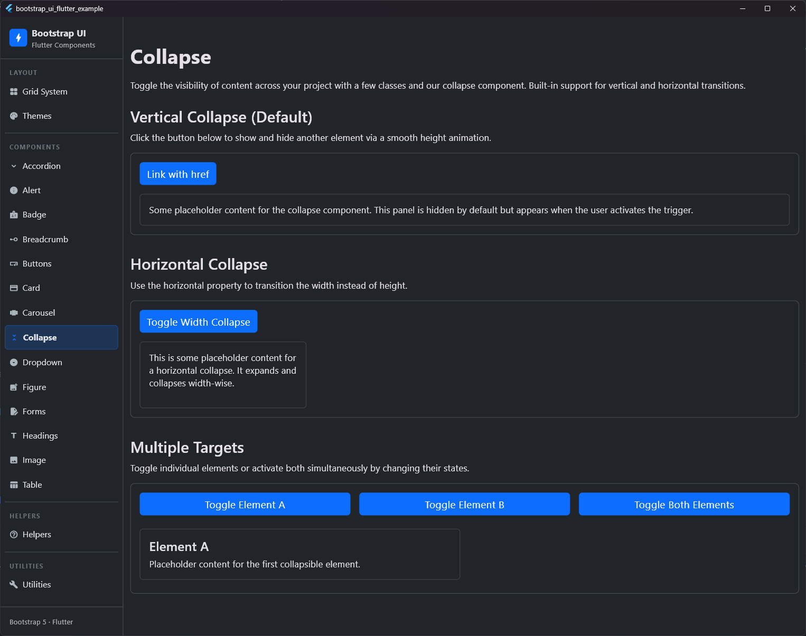

# Collapse

## Preview




The `BsCollapse` component toggles the visibility of content with a smooth vertical (height) or horizontal (width) transition. It corresponds to Bootstraps `.collapse` and `.collapse-horizontal` utility classes.

## Usage

### Vertical Collapse (Default)

```dart
bool _isExpanded = false;

BsButton(
  label: 'Toggle Collapse',
  onPressed: () => setState(() => _isExpanded = !_isExpanded),
),
BsCollapse(
  isExpanded: _isExpanded,
  child: Card(
    child: Padding(
      padding: EdgeInsets.all(16.0),
      child: Text('This content collapses and expands vertically!'),
    ),
  ),
)
```

### Horizontal Collapse

```dart
bool _isExpanded = false;

BsButton(
  label: 'Toggle Horizontal',
  onPressed: () => setState(() => _isExpanded = !_isExpanded),
),
BsCollapse(
  isExpanded: _isExpanded,
  horizontal: true,
  child: SizedBox(
    width: 250.0,
    child: Card(
      child: Padding(
        padding: EdgeInsets.all(16.0),
        child: Text('This content collapses and expands horizontally!'),
      ),
    ),
  ),
)
```

## Properties

| Property | Type | Default | Description |
| :--- | :--- | :--- | :--- |
| `isExpanded` | `bool` | **Required** | Controls the expansion state of the content (visible when `true`, hidden when `false`). |
| `child` | `Widget` | **Required** | The content to collapse or expand. |
| `horizontal` | `bool` | `false` | Whether to transition horizontally (width) instead of vertically (height). Corresponds to `.collapse-horizontal`. |
| `duration` | `Duration` | `Duration(milliseconds: 350)` | The duration of the collapse transition animation. |
| `curve` | `Curve` | `Curves.easeInOut` | The animation curve used for the transition. |