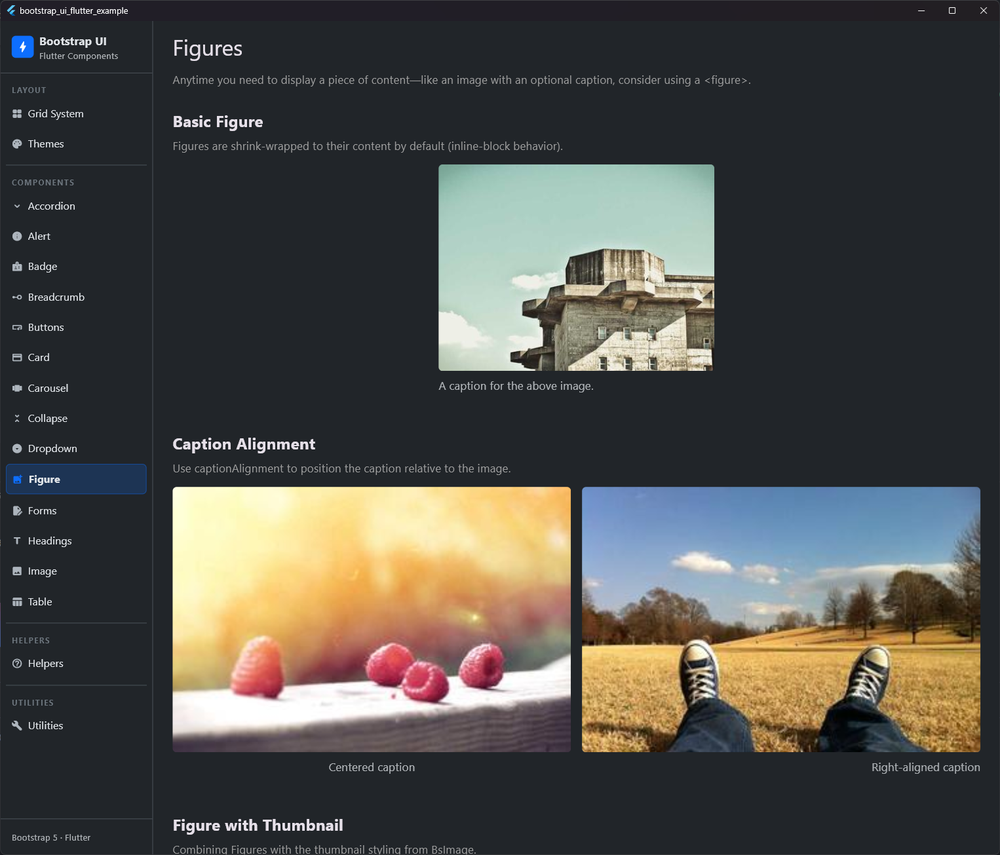
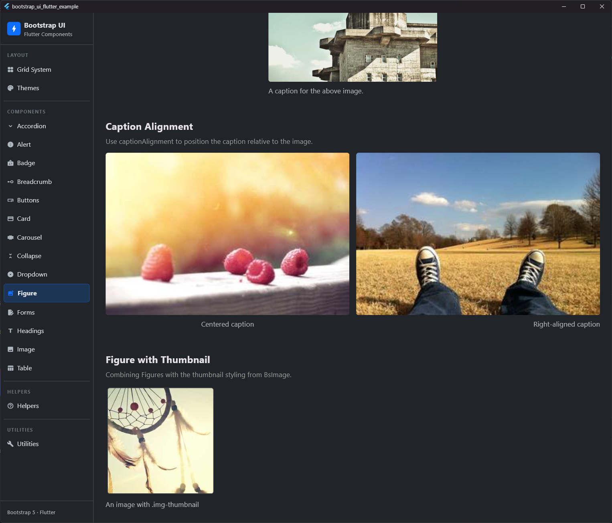

# Figure

## Preview

| Standard Figure | Figure with Caption |
|:---:|:---:|
|  |  |


The Figure component is used for displaying related content, such as an image with an optional caption, mimicking Bootstrap 5 functionality.

## Purpose
`BsFigure` wraps an image and a caption, providing appropriate spacing and styling. It follows the HTML5 `<figure>` and `<figcaption>` pattern.

## Properties

| Property | Type | Default | Description |
| :--- | :--- | :--- | :--- |
| `image` | `Widget` | *Required* | The image to display (usually a `BsImage`). |
| `caption` | `Widget?` | `null` | Optional caption displayed below the image. |
| `captionAlignment` | `AlignmentGeometry?` | `null` | Horizontal alignment of the caption. |
| `margin` | `EdgeInsetsGeometry` | `EdgeInsets.only(bottom: BsSpacing.s3)` | Outer margin of the figure. |
| `imageMargin` | `EdgeInsetsGeometry` | `EdgeInsets.only(bottom: BsSpacing.s2)` | Margin between image and caption. |

## Usage

### Basic Figure
A simple figure with an image and a caption.

```dart
BsFigure(
  image: BsImage(
    image: NetworkImage('...'),
    fluid: true,
  ),
  caption: Text('A caption for the image.'),
)
```

### Caption Alignment
You can align the caption to the left, center, or right using `captionAlignment`.

```dart
BsFigure(
  image: BsImage(...),
  caption: Text('Centered caption'),
  captionAlignment: Alignment.center,
)
```

## Styling
The caption is automatically styled with:
- **Font Size**: `BsTypography.fontSizeSm` (14px)
- **Color**: `BsColors.secondary` (Muted/Secondary gray)
- **Line Height**: `BsTypography.lineHeightBase` (1.5)