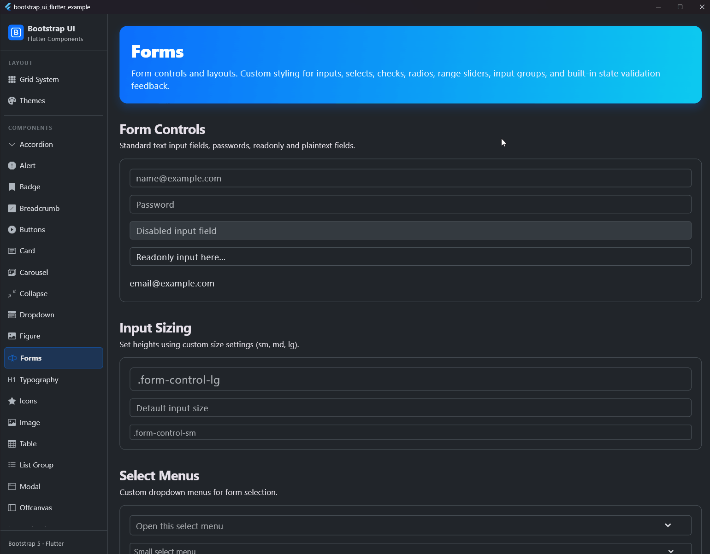

# Forms

## Preview




Form components are essential for gathering user input. The `bootstrap_ui_flutter` package provides a comprehensive set of form controls that closely mimic Bootstrap 5's `.form-control`, `.form-select`, `.form-check`, and `.input-group` behaviors, while integrating natively with Flutter's `Form` and `FormField` system.

## Features

- **Native Validation**: All form components extend `FormField<T>`, allowing you to use Flutter's standard `validator` property and `GlobalKey<FormState>`.
- **Validation Feedback**: Integrated `.is-valid` and `.is-invalid` states with automatically generated feedback messages (`BsFormFeedback`).
- **Sizing**: Support for standard Bootstrap sizes (`sm`, `md`, `lg`).
- **Focus Rings**: Bootstrap-style custom focus rings using shadows.
- **Input Groups**: Easily combine text addons, buttons, and inputs on a single horizontal line with intelligent border-radius management.

## Components

### 1. `BsInput` (Form Controls)

A versatile text input component replacing `TextFormField`.

```dart
BsInput(
  placeholder: 'name@example.com',
  size: .md, // .form-control-md
  disabled: false,
  readonly: false,
  plainText: false, // .form-control-plaintext
  validator: (val) => val == null || val.isEmpty ? 'Required' : null,
)
```

### 2. `BsSelect` (Select Menus)

A custom dropdown select replacing `DropdownButtonFormField`.

```dart
BsSelect<String>(
  placeholder: const Text('Open this select menu'),
  items: const [
    DropdownMenuItem(value: '1', child: Text('One')),
    DropdownMenuItem(value: '2', child: Text('Two')),
  ],
  onChanged: (val) => print(val),
)
```

### 3. `BsCheckbox` (Checks and Switches)

A unified component for standard checkboxes and toggle switches.

```dart
// Standard Checkbox
BsCheckbox(
  label: const Text('Default checkbox'),
  initialValue: false,
)

// Switch
BsCheckbox(
  label: const Text('Toggle switch'),
  isSwitch: true, // .form-switch
)
```

### 4. `BsRadio` (Radios)

A component for standard radio buttons matching Bootstrap's check/radio controls.

```dart
BsRadio<String>(
  value: 'one',
  groupValue: selectedValue,
  onChanged: (val) => setState(() => selectedValue = val),
  label: const Text('Option One'),
)
```

### 5. `BsRange` (Sliders)

A custom styled range slider matching `.form-range`.

```dart
BsRange(
  initialValue: 50.0,
  min: 0.0,
  max: 100.0,
  onChanged: (val) => print(val),
)
```

### 6. `BsInputGroup` (Input Groups)

Combine inputs with addons or buttons seamlessly. The `BsInputGroup` acts as a Flex container that communicates with its children (`BsInput`, `BsSelect`, `BsButton`, `BsInputGroupText`) to automatically adjust border radii, preventing double-thick borders between elements.

```dart
BsInputGroup(
  children: [
    const BsInputGroupText('@'), // Text Addon
    BsInput(placeholder: 'Username').expanded(), // The input itself
  ],
)

// Addons can also be widgets, such as checkboxes:
BsInputGroup(
  children: [
    BsInputGroupText.widget(child: BsCheckbox(initialValue: true)),
    BsInput(placeholder: 'Checkbox within group...').expanded(),
  ],
)
```

### 7. Floating Labels (`.form-floating`)

Create beautifully simple form labels that float over your input fields using the `floatingLabel` parameter on `BsInput` or `BsSelect`.

```dart
BsInput(
  floatingLabel: 'Email address',
  placeholder: 'name@example.com',
)

BsSelect<String>(
  floatingLabel: 'Works with selects',
  placeholder: const Text('Open this select menu'),
  items: const [
    DropdownMenuItem(value: '1', child: Text('One')),
  ],
)
```

## Validation & State

All inputs support a `validationState` property for explicit state management (e.g., when validating via an external API without using a Flutter `Form`). Furthermore, inputs natively display Bootstrap's custom `BsShadows.focusRing` (in red or green) when focused in a validated state.

```dart
BsInput(
  validationState: .valid, // Forces .is-valid styling
)
```

### The `.was-validated` approach (`BsValidatedForm`)

In traditional Bootstrap, applying the `.was-validated` class to a `<form>` triggers valid (green) or invalid (red) feedback for all nested fields based on their HTML5 validation state.
To replicate this exact behavior in Flutter, wrap your `Form` in a `BsValidatedForm` widget:

```dart
BsValidatedForm(
  wasValidated: _hasSubmitted, // Set to true when the user submits the form
  child: Form(
    key: _formKey,
    child: BsInput(
      validator: (val) => val == null || val.isEmpty ? 'Error' : null,
    ),
  ),
)
```
When `wasValidated` is `true`, any field without a validator error will automatically render in the green, valid state.

### Accessibility & Localization

When validation errors occur, they are appended to the widget's semantics structure so screen readers (e.g., TalkBack or VoiceOver) can read them. The error prefix (e.g., `"Error"` for English, `"Fehler"` for German) is automatically resolved at runtime via Flutter's built-in localization system `BsLocalizations`.

The library comes pre-configured with translations for **10 languages**. To use them in your application, simply register the delegate in your `MaterialApp`:

```dart
import 'package:bootstrap_ui_flutter/bootstrap_ui_flutter.dart';
import 'package:flutter_localizations/flutter_localizations.dart';

void main() {
  runApp(const MyApp());
}

class MyApp extends StatelessWidget {
  const MyApp({super.key});

  @override
  Widget build(BuildContext context) {
    return MaterialApp(
      locale: const Locale('en'),
      localizationsDelegates: const [
        GlobalMaterialLocalizations.delegate,
        GlobalWidgetsLocalizations.delegate,
        GlobalCupertinoLocalizations.delegate,
        BsLocalizations.delegate, // <--- Register delegate
      ],
      supportedLocales: const [
        Locale('en'),
        Locale('de'),
      ],
      home: const Scaffold(body: Center(child: Text('Hello World'))),
    );
  }
}
```

If no delegate is registered, a safe English fallback will be used. You can easily add new languages (e.g., `zh.json` for Chinese) by putting them into the `assets/l10n/` folder of your host project and adding the locale to the `supportedLocales` list. The library loads them dynamically at runtime!