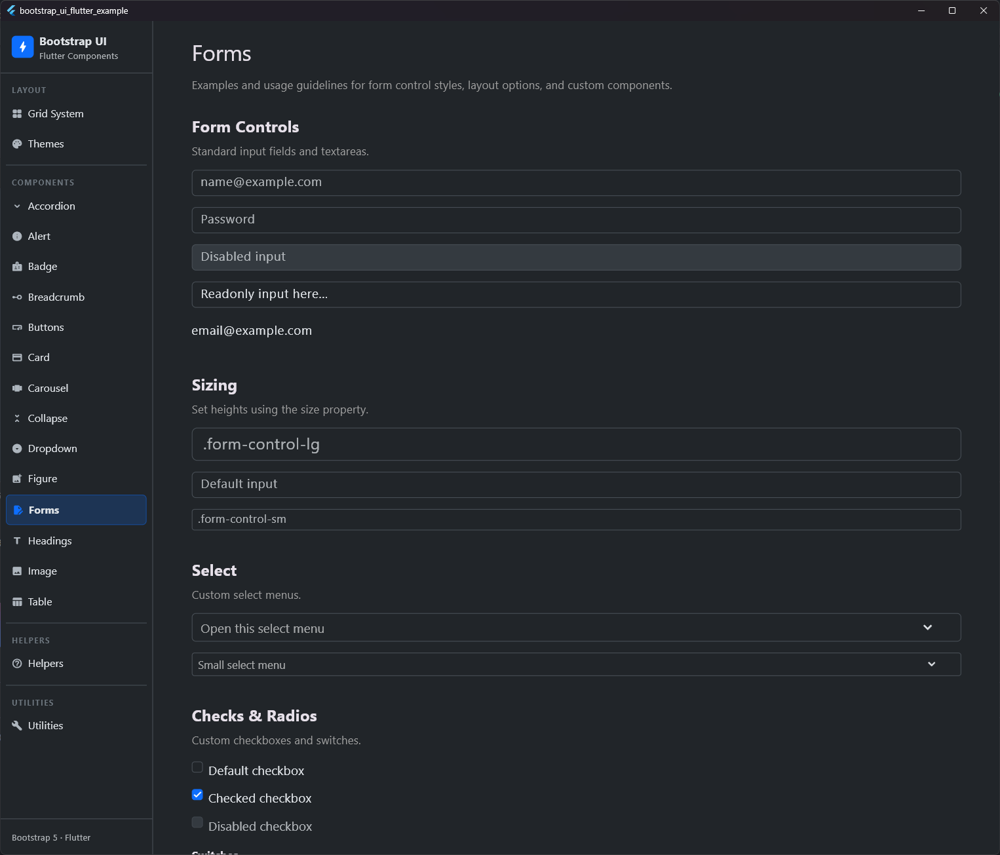
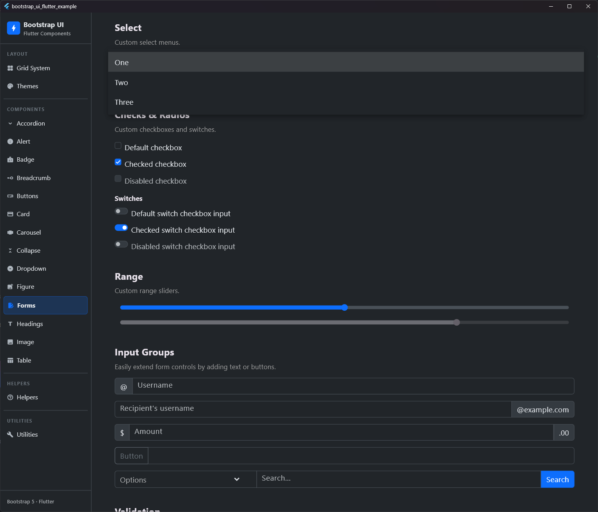
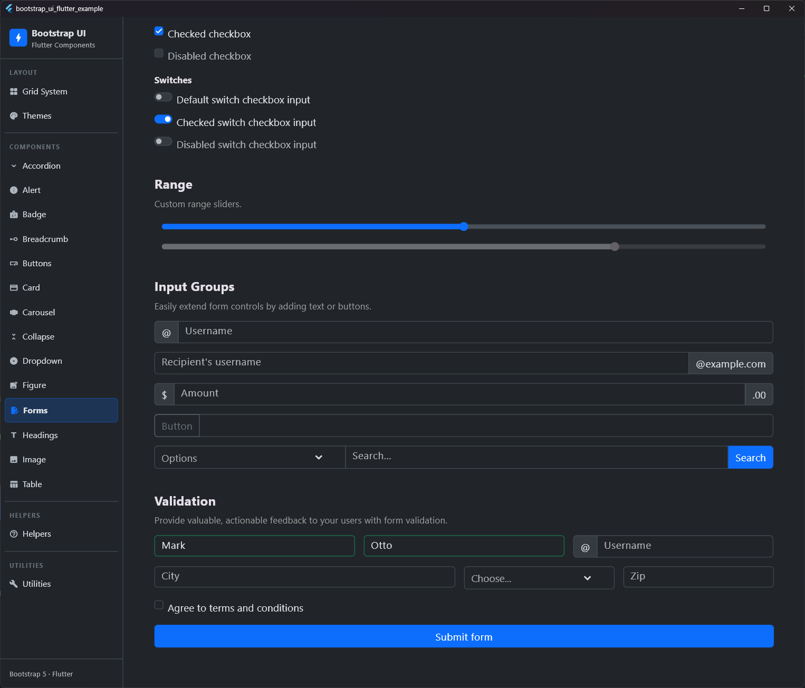
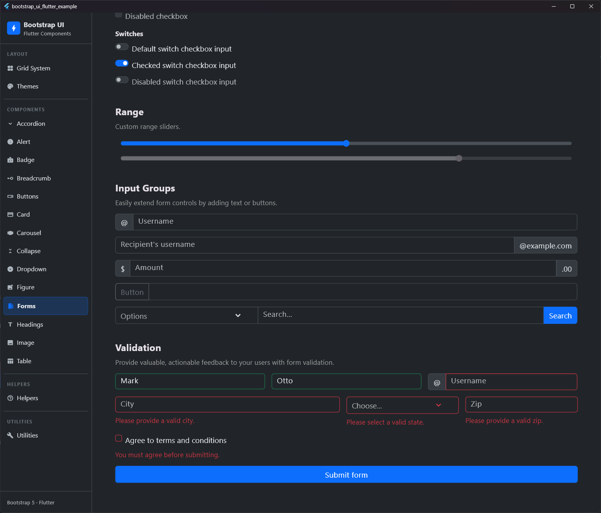

# Forms

## Preview

| Form Layout 1 | Form Layout 2 |
|:---:|:---:|
|  |  |
| **Form Layout 3** | **Form Layout 4** |
|  |  |


Form components are essential for gathering user input. The `bootstrap_ui_flutter` package provides a comprehensive set of form controls that closely mimic Bootstrap 5's `.form-control`, `.form-select`, `.form-check`, and `.input-group` behaviors, while integrating natively with Flutter's `Form` and `FormField` system.

## Features

- **Native Validation**: All form components extend `FormField<T>`, allowing you to use Flutter's standard `validator` property and `GlobalKey<FormState>`.
- **Validation Feedback**: Integrated `.is-valid` and `.is-invalid` states with automatically generated feedback messages (`BsFormFeedback`).
- **Sizing**: Support for standard Bootstrap sizes (`sm`, `md`, `lg`).
- **Focus Rings**: Bootstrap-style custom focus rings using shadows.
- **Input Groups**: Easily combine text addons, buttons, and inputs on a single horizontal line with intelligent border-radius management.

## Components

### 1. `BsInput` (Form Controls)

A versatile text input component replacing `TextFormField`.

```dart
BsInput(
  placeholder: 'name@example.com',
  size: BsInputSize.md, // .form-control-md
  disabled: false,
  readonly: false,
  plainText: false, // .form-control-plaintext
  validator: (val) => val == null || val.isEmpty ? 'Required' : null,
)
```

### 2. `BsSelect` (Select Menus)

A custom dropdown select replacing `DropdownButtonFormField`.

```dart
BsSelect<String>(
  placeholder: const Text('Open this select menu'),
  items: const [
    DropdownMenuItem(value: '1', child: Text('One')),
    DropdownMenuItem(value: '2', child: Text('Two')),
  ],
  onChanged: (val) => print(val),
)
```

### 3. `BsCheckbox` (Checks and Switches)

A unified component for standard checkboxes and toggle switches.

```dart
// Standard Checkbox
BsCheckbox(
  label: const Text('Default checkbox'),
  initialValue: false,
)

// Switch
BsCheckbox(
  label: const Text('Toggle switch'),
  isSwitch: true, // .form-switch
)
```

### 4. `BsRadio` (Radios)

A component for standard radio buttons matching Bootstrap's check/radio controls.

```dart
BsRadio<String>(
  value: 'one',
  groupValue: selectedValue,
  onChanged: (val) => setState(() => selectedValue = val),
  label: const Text('Option One'),
)
```

### 5. `BsRange` (Sliders)

A custom styled range slider matching `.form-range`.

```dart
BsRange(
  initialValue: 50.0,
  min: 0.0,
  max: 100.0,
  onChanged: (val) => print(val),
)
```

### 6. `BsInputGroup` (Input Groups)

Combine inputs with addons or buttons seamlessly. The `BsInputGroup` acts as a Flex container that communicates with its children (`BsInput`, `BsSelect`, `BsButton`, `BsInputGroupText`) to automatically adjust border radii, preventing double-thick borders between elements.

```dart
BsInputGroup(
  children: [
    const BsInputGroupText('@'), // Text Addon
    BsInput(placeholder: 'Username').expanded(), // The input itself
  ],
)
```

## Validation & State

All inputs support a `validationState` property for explicit state management (e.g., when validating via an external API without using a Flutter `Form`).

```dart
BsInput(
  validationState: BsValidationState.valid, // Forces .is-valid styling
)
```

If used inside a `Form`, simply use the `validator` property. The component will automatically switch to the `invalid` state and display a `BsFormFeedback` widget in red if the validator returns an error string.