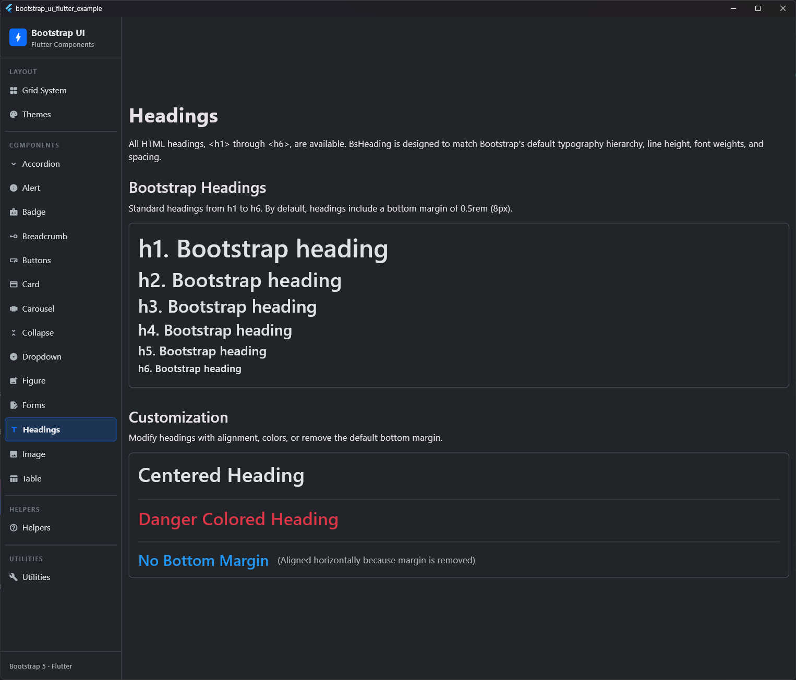

# Heading

## Preview




The `BsHeading` widget is used to render standard heading levels from `<h1>` to `<h6>` with Bootstrap-compatible styles, including the default bottom margins and correct line heights.

## Usage

```dart
BsHeading(
  'Example Heading 1',
  level: BsHeadingLevel.h1,
)

BsHeading(
  'Example Heading 6 without margin',
  level: BsHeadingLevel.h6,
  removeMargin: true,
  color: BsColors.secondary,
)
```

## Properties

| Property | Type | Default | Description |
| :--- | :--- | :--- | :--- |
| `text` | `String` | **Required** | The heading text content. |
| `level` | `BsHeadingLevel` | `BsHeadingLevel.h1` | The heading level from `h1` (largest) to `h6` (smallest). |
| `color` | `Color?` | `null` | Custom text color. Defaults to the theme's body text color. |
| `textAlign` | `TextAlign?` | `null` | Optional horizontal alignment of the text. |
| `removeMargin` | `bool` | `false` | If `true`, removes the default `0.5rem` (8px) bottom margin (applied via padding-bottom). |