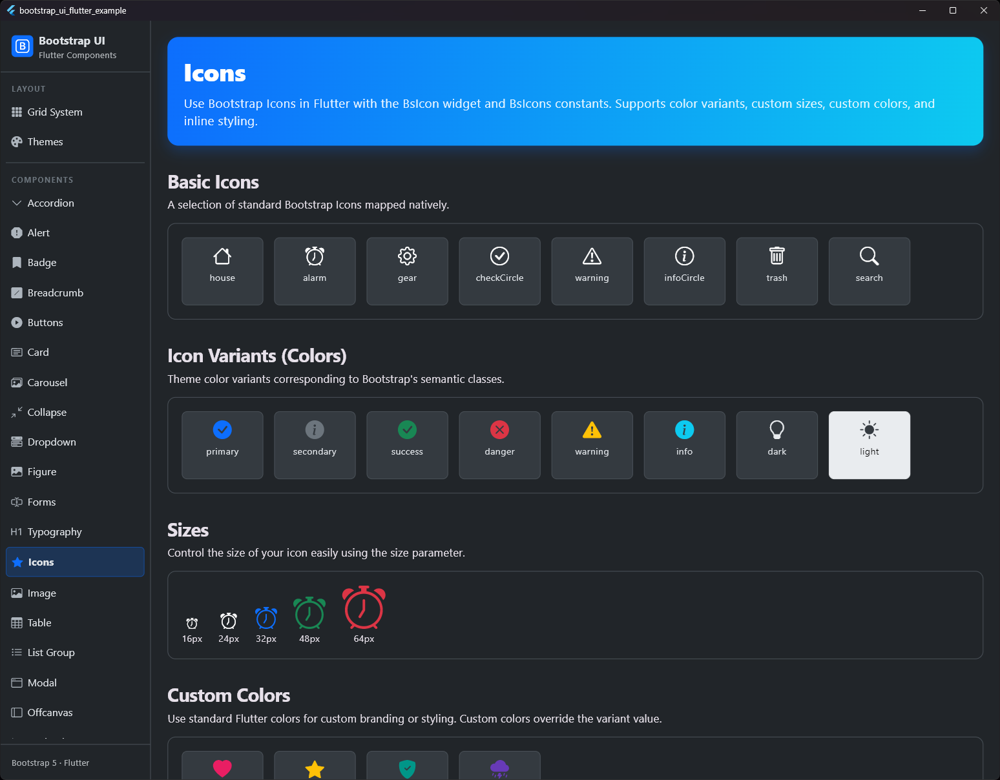
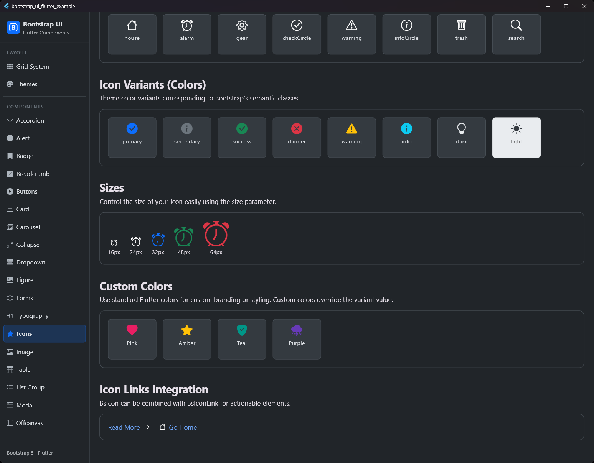

# Icon

## Preview

| Icons Preview 1 | Icons Preview 2 |
|:---:|:---:|
|  |  |

Icon component for rendering and displaying Bootstrap 5 Icons.

## Purpose
`BsIcon` provides a simple way to display Bootstrap Icons in Flutter. It supports native Bootstrap color variants, custom sizes, custom colors, and accessibility.

## Properties

| Property | Type | Default | Description |
| :--- | :--- | :--- | :--- |
| `icon` | `IconData` | *Required* | The Bootstrap icon to display (e.g., from `BsIcons`). |
| `size` | `double?` | `null` | The size of the icon (falls back to the icon theme size if `null`). |
| `color` | `Color?` | `null` | A specific color for the icon. Overrides `variant` if both are specified. |
| `variant` | `BsIconVariant?` | `null` | The Bootstrap theme color variant for the icon (e.g., `primary`, `danger`, `success`, etc.). |
| `semanticLabel` | `String?` | `null` | Accessibility description for screen readers. |
| `textDirection` | `TextDirection?` | `null` | The text direction to use for rendering the icon. |

## Usage

### Basic Icon
A basic icon is displayed by passing one of the constants from `BsIcons`.

```dart
BsIcon(BsIcons.alarm)
```

### Color Variants
You can style the icon with typical Bootstrap color variants.

```dart
BsIcon(
  BsIcons.checkCircleFill,
  variant: BsIconVariant.success,
)
```

### Custom Size and Color
The size and color can be customized freely. Custom colors override the `variant` color.

```dart
BsIcon(
  BsIcons.heartFill,
  size: 32.0,
  color: Colors.pink,
)
```

## Notes
- `color` always takes precedence over `variant`.
- Color variants are resolved using `BsThemeData` from the context, meaning they will automatically adapt when the theme changes (e.g., switching to Dark Mode).
