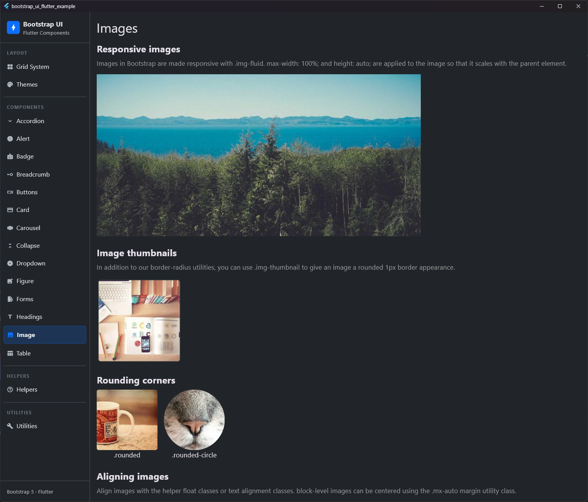
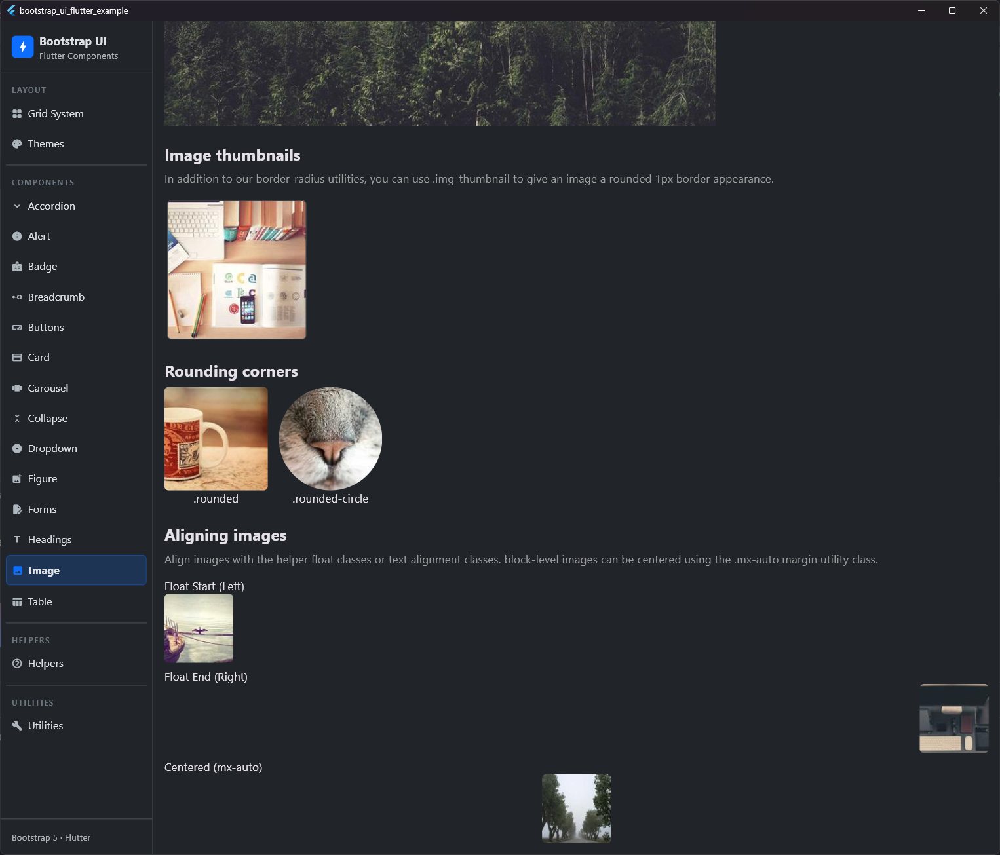

# Image

## Preview

| Fluid Image | Thumbnail Image |
|:---:|:---:|
|  |  |


Image component mimicking Bootstrap 5 image functionalities.

## Purpose
`BsImage` provides an easy way to apply Bootstrap-typical stylings like responsiveness, thumbnails, rounded corners, and alignment to images.

## Properties

| Property | Type | Default | Description |
| :--- | :--- | :--- | :--- |
| `image` | `ImageProvider` | *Required* | The image to display. |
| `fluid` | `bool` | `false` | If `true`, the image scales with its parent's width (max-width: 100%). |
| `thumbnail` | `bool` | `false` | Adds a 1px border, padding, and rounded corners. |
| `rounded` | `bool` | `false` | Rounds the corners of the image. |
| `circle` | `bool` | `false` | Makes the image circular. |
| `alignment` | `AlignmentGeometry?` | `null` | Aligns the image within its parent (e.g., left, right, center). |
| `width` | `double?` | `null` | Optional fixed width. |
| `height` | `double?` | `null` | Optional fixed height. |
| `fit` | `BoxFit?` | `null` | Determines how the image is fitted into its container. |
| `semanticLabel` | `String?` | `null` | Accessibility description for the image. |

## Usage

### Responsive images
Images are made responsive with the `fluid` property.

```dart
BsImage(
  image: AssetImage('assets/img.jpg'),
  fluid: true,
)
```

### Thumbnails
Use `thumbnail: true` to give the image the typical Bootstrap thumbnail appearance.

```dart
BsImage.network(
  'https://example.com/image.jpg',
  thumbnail: true,
)
```

### Rounded corners and circles

```dart
// Rounded corners
BsImage(
  image: NetworkImage(...),
  rounded: true,
)

// Circular
BsImage(
  image: NetworkImage(...),
  circle: true,
)
```

### Alignment
Use the `alignment` property for positioning.

```dart
BsImage(
  image: NetworkImage(...),
  alignment: Alignment.center, // Centered
)
```

## Notes
- `thumbnail` overrides `rounded` as thumbnails already have rounded corners.
- `circle` takes precedence over `rounded`.