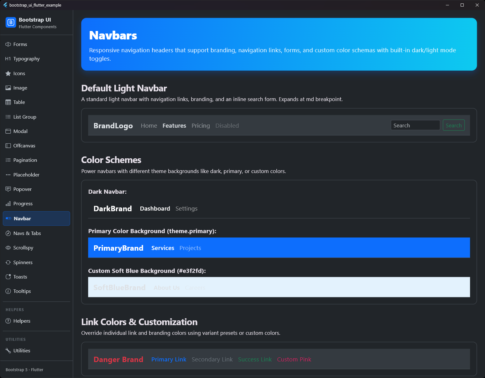
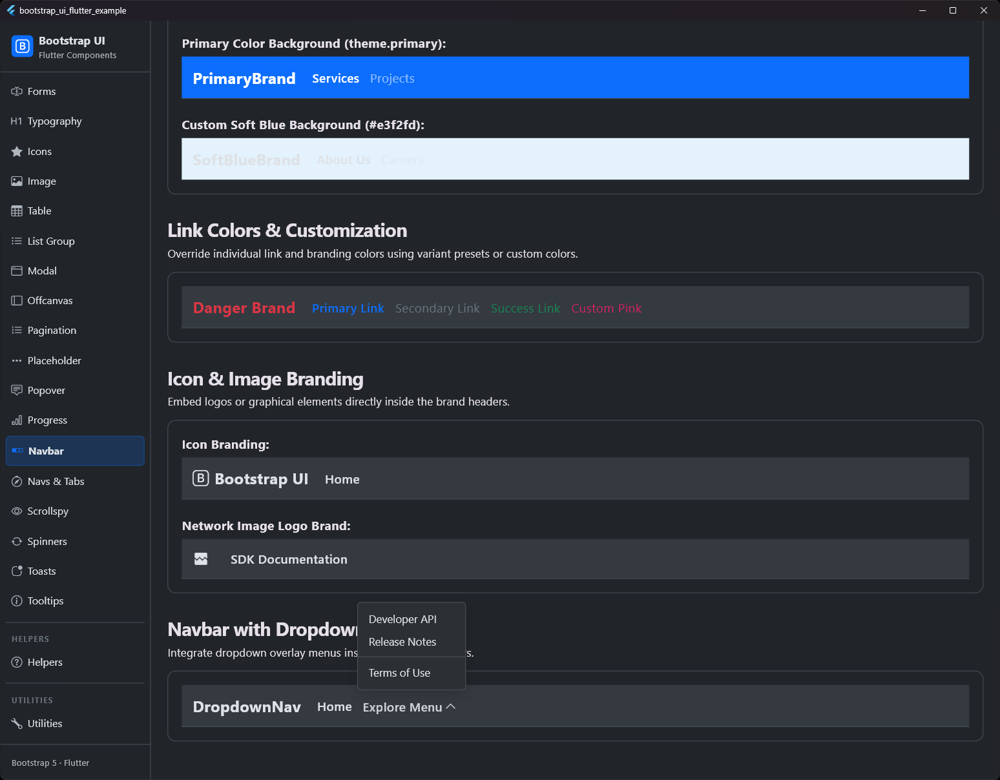

# Navbars

## Preview

| Navbar Preview 1 | Navbar Preview 2 |
|:---:|:---:|
|  |  |

The navigations bar (`BsNavbar`) is a responsive wrapper for your application's header. It supports branding, links, toggler buttons for mobile menus, forms, and secondary text.

## Features

- **Responsive Breakpoints**: Following Bootstrap 5.3 specifications, you can configure at which breakpoint the navbar expands (`expand`): `always`, `sm`, `md`, `lg` (default), `xl`, `xxl`, or `never`.
- **Built-in Toggler & Collapse**: On smaller viewports, a hamburger button (`BsNavbarToggler`) and collapsible container (`BsNavbarCollapse`) are rendered automatically to save space.
- **Color Schemes**: Built-in support for light (default) and dark (`dark: true`) color schemes, adapting text and icon opacity.
- **Nav Link States**: `BsNavbarLink` supports hover styling, active states (`active: true`), and disabled states (`disabled: true`).
- **Supported Children**:
  - `BsNavbarBrand`: Branding/logo with tap feedback.
  - `BsNavbarIconBrand`: A dedicated icon brand widget for displaying a logo icon next to or instead of the brand text. Supports network images via `BsNavbarIconBrand.network`.
  - `BsNavbarNav`: Grouping container for links that dynamically switches layout from Row (desktop) to Column (mobile).
  - `BsNavbarLink`: Text links.
  - `BsNavbarText`: Paragraph formatting for inline secondary text.
  - `BsNavbarSpacer`: A responsive spacer that acts as a `Spacer` on desktop and collapses to `SizedBox.shrink()` on mobile.

## Usage

Here is a standard example for a navbar:

```dart
BsNavbar(
  expand: .lg,
  brand: Row(
    children: [
      BsNavbarIconBrand(
        child: const Icon(Icons.code),
        onPressed: () {},
      ),
      BsNavbarBrand(
        child: const Text('MyBrand'),
        onPressed: () {},
      ),
    ],
  ),
  collapse: BsNavbarCollapse(
    children: [
      BsNavbarNav(
        children: [
          BsNavbarLink(
            label: 'Home',
            active: true,
            onPressed: () {},
          ),
          BsNavbarLink(
            label: 'Features',
            onPressed: () {},
          ),
          BsNavbarLink(
            label: 'Disabled',
            disabled: true,
          ),
        ],
      ),
      const BsNavbarSpacer(),
      const BsNavbarText(
        child: Text('Version 1.0.0'),
      ),
    ],
  ),
)
```

## Properties

### BsNavbar

| Property | Type | Default | Description |
| :--- | :--- | :--- | :--- |
| `brand` | `Widget?` | `null` | The brand component (typically a [BsNavbarBrand]). |
| `collapse` | `BsNavbarCollapse?` | `null` | The collapsible menu area (typically a [BsNavbarCollapse]). |
| `expand` | `BsNavbarExpand` | `.lg` | The breakpoint at which the navbar expands horizontally. |
| `dark` | `bool` | `false` | If `true`, adjusts color contrast for dark backgrounds (white text/icons). |
| `background` | `Color?` | `null` | Custom background color. Defaults to theme's dark/light colors. |
| `padding` | `EdgeInsetsGeometry` | `symmetric(horizontal: 16, vertical: 8)` | Internal padding of the navbar container. |

### BsNavbarBrand

| Property | Type | Default | Description |
| :--- | :--- | :--- | :--- |
| `child` | `Widget` | *required* | The child widget (e.g. text or image logo). |
| `onPressed` | `VoidCallback?` | `null` | Callback when the brand logo is tapped. |
| `variant` | `BsNavbarLinkVariant?` | `null` | The color variant for the brand text. |
| `color` | `Color?` | `null` | Custom color for the brand text. |

### BsNavbarIconBrand.network

| Property | Type | Default | Description |
| :--- | :--- | :--- | :--- |
| `src` | `String` | *required* | The network image URL. |
| `onPressed` | `VoidCallback?` | `null` | Callback when the brand logo is tapped. |
| `color` | `Color?` | `null` | Custom color override for the icon brand. |
| `size` | `double` | `24.0` | Default size of the icon/logo. |
| `padding` | `EdgeInsetsGeometry` | `only(right: 8.0)` | Padding around the icon brand. |
| `width` | `double?` | `size` | Width of the logo (overrides default size). |
| `height` | `double?` | `size` | Height of the logo (overrides default size). |
| `fit` | `BoxFit?` | `null` | Box scaling of the image. |
| `semanticLabel` | `String?` | `null` | Accessibility semantic label for screen readers. |
| `errorBuilder` | `ImageErrorWidgetBuilder?` | `null` | Custom error builder when image loading fails. Falls back to a broken image icon. |

### BsNavbarIconBrand

| Property | Type | Default | Description |
| :--- | :--- | :--- | :--- |
| `child` | `Widget` | *required* | The icon or image widget. |
| `onPressed` | `VoidCallback?` | `null` | Callback when the icon is tapped. |
| `color` | `Color?` | `null` | Custom color override for the icon brand. |
| `size` | `double` | `24.0` | Size of the icon. |
| `padding` | `EdgeInsetsGeometry` | `only(right: 8.0)` | Padding around the icon brand (defaults to 8px right padding). |

### BsNavbarLink

| Property | Type | Default | Description |
| :--- | :--- | :--- | :--- |
| `label` | `String` | *required* | The text of the navigation link. |
| `onPressed` | `VoidCallback?` | `null` | Callback when the link is tapped. |
| `active` | `bool` | `false` | Displays the link as active (bolder font, higher opacity). |
| `disabled` | `bool` | `false` | Displays the link as disabled (grayed out, unclickable). |
| `variant` | `BsNavbarLinkVariant?` | `null` | The color variant for the link text. |
| `color` | `Color?` | `null` | Custom color for the link text. |
