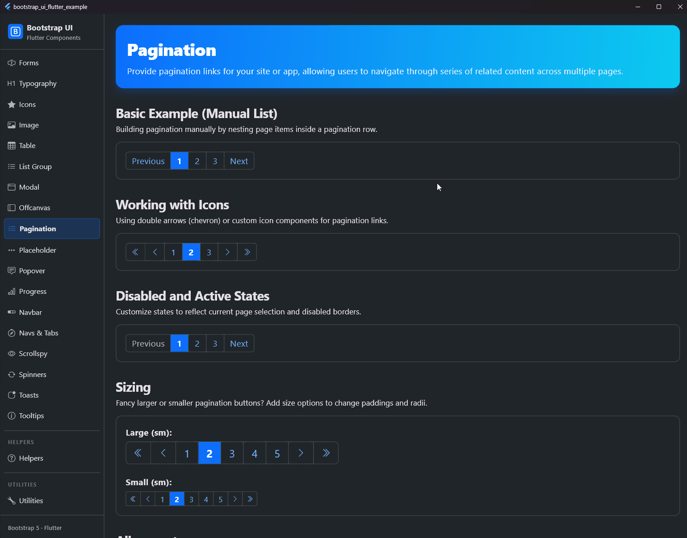

# Pagination

## Preview



Pagination components are used to divide content across multiple pages and allow users to navigate between these pages. They are designed following Bootstrap 5.3 specifications.

## Usage

Pagination can be configured manually by providing a list of `BsPaginationItem`s, or automatically using the `BsPagination.automatic` factory builder.

### 1. Manual Creation (Custom List)
Provides maximum control over every single item (e.g. customized labels, custom icons, or special states).

```dart
BsPagination(
  items: [
    BsPaginationItem(
      child: Text('Previous'),
      onPressed: () {
        // Load previous page
      },
    ),
    BsPaginationItem(
      active: true,
      child: Text('1'),
    ),
    BsPaginationItem(
      child: Text('2'),
      onPressed: () {},
    ),
    BsPaginationItem(
      child: Text('3'),
      onPressed: () {},
    ),
    BsPaginationItem(
      child: Text('Next'),
      onPressed: () {},
    ),
  ],
)
```

### 2. Automatic Creation (Recommended)
The `BsPagination.automatic` constructor automatically calculates and generates page numbers, ellipsis indicators (`...`), prev/next buttons, and optional first/last buttons based on total counts and active selection.

```dart
BsPagination.automatic(
  currentPage: 5,
  totalPages: 10,
  maxVisiblePages: 5, // Maximum number of page buttons to show in the sliding window
  onPageChanged: (page) {
    setState(() {
      _currentPage = page;
    });
  },
)
```

## Sizing

Configure different sizes using the `size` attribute: `.sm` (small), `.md` (medium/default), or `.lg` (large).

```dart
BsPagination.automatic(
  currentPage: 1,
  totalPages: 5,
  size: .lg, // Large pagination buttons
  onPageChanged: (page) {},
)
```

## Alignment

Change the horizontal alignment of the pagination row using the `alignment` attribute:
- `.start` (Left-aligned - default)
- `.center` (Centered)
- `.end` (Right-aligned)

```dart
BsPagination.automatic(
  currentPage: 1,
  totalPages: 5,
  alignment: .center,
  onPageChanged: (page) {},
)
```

## Properties

### BsPagination

| Property | Type | Default | Description |
| --- | --- | --- | --- |
| `items` | `List<BsPaginationItem>` | - | The list of pagination items to display. |
| `size` | `BsSize` | `.md` | The size variant of the pagination buttons (`sm`, `md`, `lg`). |
| `alignment` | `BsPaginationAlignment` | `.start` | The horizontal alignment of the row (`start`, `center`, `end`). |
| `activeVariant` | `BsVariant?` | `null` | Theme variant for active item background. |
| `activeColor` | `Color?` | `null` | Custom background color for active state (overrides `activeVariant`). |
| `activeTextColor` | `Color?` | `null` | Custom text/icon color for active state. |
| `textColor` | `Color?` | `null` | Custom text/icon color for normal state. |
| `hoverTextColor` | `Color?` | `null` | Custom text/icon color for hovered state. |
| `bgColor` | `Color?` | `null` | Custom background color for normal state. |
| `hoverBgColor` | `Color?` | `null` | Custom background color for hovered state. |
| `borderColor` | `Color?` | `null` | Custom border color. |

### BsPagination.automatic (Additional parameters)

| Property | Type | Default | Description |
| --- | --- | --- | --- |
| `currentPage` | `int` | - | The currently active page (1-based). |
| `totalPages` | `int` | - | The total number of pages. |
| `onPageChanged` | `ValueChanged<int>` | - | Callback when a page button is tapped. |
| `maxVisiblePages` | `int` | `5` | Maximum number of visible page numbers in the window. |
| `showFirstLast` | `bool` | `true` | Show first/last page jump buttons. |
| `showPrevNext` | `bool` | `true` | Show previous/next page navigation buttons. |
| `firstLabel` | `Widget?` | Icons.chevronDoubleLeft | Custom widget for the first page button. |
| `prevLabel` | `Widget?` | Icons.chevronLeft | Custom widget for the previous page button. |
| `nextLabel` | `Widget?` | Icons.chevronRight | Custom widget for the next page button. |
| `lastLabel` | `Widget?` | Icons.chevronDoubleRight | Custom widget for the last page button. |
| `activeVariant` | `BsVariant?` | `null` | Theme variant for active state. |
| `activeColor` | `Color?` | `null` | Custom active background color. |
| `activeTextColor` | `Color?` | `null` | Custom active text color. |
| `textColor` | `Color?` | `null` | Custom text color. |
| `hoverTextColor` | `Color?` | `null` | Custom hover text color. |
| `bgColor` | `Color?` | `null` | Custom background color. |
| `hoverBgColor` | `Color?` | `null` | Custom hover background color. |
| `borderColor` | `Color?` | `null` | Custom border color. |

### BsPaginationItem

| Property | Type | Default | Description |
| --- | --- | --- | --- |
| `child` | `Widget` | - | The label or icon widget to display inside the button. |
| `active` | `bool` | `false` | Whether this item is active (highlighted). |
| `disabled` | `bool` | `false` | Whether this item is disabled (rendered in gray, unclickable). |
| `onPressed` | `VoidCallback?` | `null` | Callback when the item is tapped. |
| `activeVariant` | `BsVariant?` | `null` | Individually overridden theme variant for active state. |
| `activeColor` | `Color?` | `null` | Individually overridden active background color. |
| `activeTextColor` | `Color?` | `null` | Individually overridden active text color. |
| `textColor` | `Color?` | `null` | Individually overridden text color. |
| `hoverTextColor` | `Color?` | `null` | Individually overridden hover text color. |
| `bgColor` | `Color?` | `null` | Individually overridden background color. |
| `hoverBgColor` | `Color?` | `null` | Individually overridden hover background color. |
| `borderColor` | `Color?` | `null` | Individually overridden border color. |
