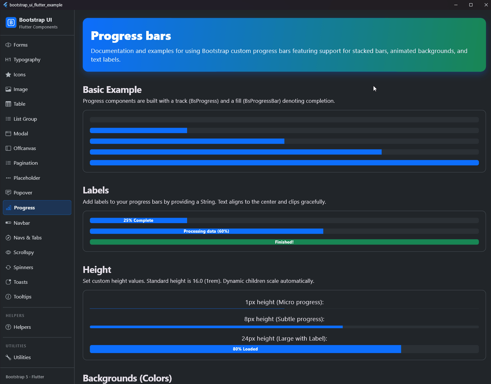

# Progress

## Preview



Progress components (progress bars) provide visual feedback for loading, uploading, downloading, or running activities. They are designed to mirror Bootstrap 5.3 specifications, supporting custom values, text labels, color variants, striped backgrounds, animations, and stacked multi-segment bars.

## Usage

The library provides two primary components:
- [BsProgress](file:///E:/FlutterProjects/bootstrap_ui_flutter/lib/ui/components/progress/bs_progress.dart): The outer track container which determines height, track background, and corner radius.
- [BsProgressBar](file:///E:/FlutterProjects/bootstrap_ui_flutter/lib/ui/components/progress/bs_progress.dart): The inner colored segment(s) representing completion.

For convenience, use `BsProgress.single()` to build a container with a single progress bar.

### 1. Basic Example

```dart
BsProgress.single(
  value: 70.0, // Values range from 0.0 to 100.0
)
```

### 2. With Label

Labels are centered inside the progress segment and will clip gracefully with ellipsis if the space is constrained.

```dart
BsProgress.single(
  value: 25.0,
  label: '25% Complete',
)
```

### 3. Custom Height

The default height is `16.0` (matching `1rem` in Bootstrap). You can easily customize it:

```dart
BsProgress.single(
  value: 45.0,
  height: 8.0, // Sleek thin bar
)
```

### 4. Color Variants (Backgrounds)

Supports standard Bootstrap theme colors or custom color choices:

```dart
// Success theme (Green)
BsProgress.single(
  value: 80.0,
  variant: BsVariant.success,
)

// Custom Colors
BsProgress.single(
  value: 60.0,
  barColor: Colors.deepPurple,
  textColor: Colors.white,
  label: 'Purple Progress',
)
```

### 5. Striped Progress Bar

Adds a diagonal striped pattern over the fill background:

```dart
BsProgress.single(
  value: 50.0,
  striped: true,
)
```

### 6. Animated Stripes

Diagonal stripes are smoothly animated from left to right, signaling an active state. The animation uses a highly optimized render-loop ticker that only consumes resources when active:

```dart
BsProgress.single(
  value: 75.0,
  animated: true, // Implicitly activates striped pattern
)
```

### 7. Multiple Bars (Stacked)

Embed multiple `BsProgressBar` components inside a single `BsProgress` container. The remaining empty space is automatically computed and left unfilled:

```dart
BsProgress(
  bars: [
    BsProgressBar(value: 15.0, variant: BsVariant.primary, label: '15%'),
    BsProgressBar(value: 30.0, variant: BsVariant.success, label: '30%'),
    BsProgressBar(value: 20.0, variant: BsVariant.info, label: '20%'),
  ],
)
```

## Properties

### BsProgress

| Property | Type | Default | Description |
| --- | --- | --- | --- |
| `bars` | `List<BsProgressBar>` | - | The list of progress segments (for stacked progress layouts). |
| `height` | `double` | `16.0` | Container height. |
| `backgroundColor` | `Color?` | `null` | Custom background color of the track (defaults to light gray or `#2b3035`). |
| `borderRadius` | `BorderRadius?` | `null` | Custom border radius of the track (defaults to `6.0`). |

### BsProgressBar

| Property | Type | Default | Description |
| --- | --- | --- | --- |
| `value` | `double` | - | Percentage value from `0.0` to `100.0`. |
| `label` | `String?` | `null` | Optional text label inside the progress bar segment. |
| `variant` | `BsVariant?` | `BsVariant.primary` | Bootstrap theme color variant. |
| `striped` | `bool` | `false` | Enables diagonal striped pattern. |
| `animated` | `bool` | `false` | Enables scrolling animation of diagonal stripes. |
| `color` | `Color?` | `null` | Custom fill color (overrides `variant`). |
| `textColor` | `Color?` | `null` | Custom text color of the label (overrides `variant` default). |

## Notes and Restrictions

* **Clip Behavior**: The container uses `Clip.antiAlias`. This ensures that inner progress segments are clipped at the boundaries, seamlessly preserving the outer track's corner radius.
* **Proportional Layout**: Multi-segment bars calculate widths dynamically using `Expanded` and flex factors (`value * 1000`), supporting fractional progress values and accurately showing unused track space.
* **Accessible Contrast**: Light backgrounds (like `BsVariant.light` and `BsVariant.warning`) automatically fall back to dark text colors to ensure high legibility and contrast.
