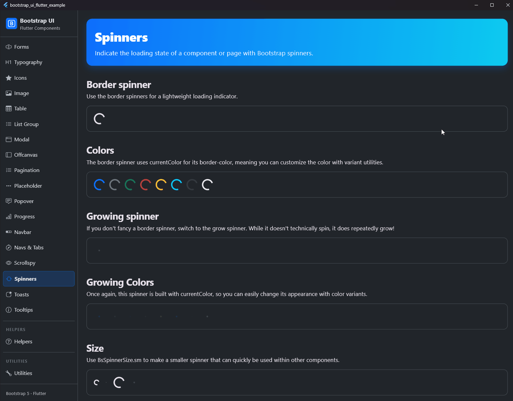

# Spinners

## Preview



Indicate the loading state of a component or page with Bootstrap spinners.

## Purpose and Use Case

Spinners are lightweight loading indicators. They can be used on their own to indicate that a page or section is loading, or inside buttons to show that an action is currently processing.

Bootstrap provides two types of spinners:
* **Border spinner** (`BsSpinner.border()`): A lightweight, rotating circle with a transparent cutout.
* **Grow spinner** (`BsSpinner.grow()`): A pulsing dot that grows and fades out.

## Available Properties

| Property | Type | Description |
| :--- | :--- | :--- |
| `type` | `BsSpinnerType` | The visual style of the spinner (`border` or `grow`). |
| `variant` | `BsVariant?` | Semantic color variant from the Bootstrap theme (e.g. `primary`, `danger`). |
| `color` | `Color?` | Custom color. If provided, overrides `variant`. Defaults to current text color. |
| `size` | `BsSpinnerSize` | The size of the spinner (`md` for default 32x32px, `sm` for 16x16px). |
| `animationDuration` | `Duration` | Speed of the animation. Defaults to `Duration(milliseconds: 750)`. |

## Examples

### Border Spinner

Use the border spinner for a lightweight loading indicator.

```dart
BsSpinner.border()
```

### Grow Spinner

If you don't fancy a border spinner, switch to the grow spinner.

```dart
BsSpinner.grow()
```

### Colors

Spinners use `currentColor` by default. You can easily customize their color using text color utilities or color variants.

```dart
BsSpinner.border(variant: .primary)
BsSpinner.border(variant: .success)

BsSpinner.grow(variant: .danger)
BsSpinner.grow(variant: .warning)
```

### Size

Use `.sm` to make a smaller spinner that can quickly be used within other components, like buttons.

```dart
BsSpinner.border(size: .sm)
BsSpinner.grow(size: .sm)
```

### Custom Duration (Speed)

If the default 750ms spinner is too fast for your taste, you can customize the duration of the animation cycle:

```dart
// Much slower spinner (1.5 seconds per rotation)
BsSpinner.border(
  animationDuration: Duration(milliseconds: 1500),
)
```

### Alignment

Following Bootstrap's principles, spinners do not contain hardcoded alignments. Use standard Flutter layout widgets like `Center()`, `Align()`, or Flexbox (`Row`/`Column` with `mainAxisAlignment`) to place spinners exactly where you need them:

```dart
// Centered spinner
Align(
  alignment: Alignment.center,
  child: BsSpinner.border(),
)

// Trailing spinner in a Row
Row(
  mainAxisAlignment: MainAxisAlignment.spaceBetween,
  children: [
    Text('Loading data...'),
    BsSpinner.border(),
  ],
)
```

### Buttons

Use spinners within buttons to indicate an action is currently processing or taking place. Just use the `isLoading: true` property on `BsButton`!

```dart
BsButton(
  onPressed: () {},
  label: 'Loading...',
  isLoading: true,
)
```

## Usage Notes
* By default, the `BsSpinner` uses the current text color (`DefaultTextStyle.of(context).style.color`) if neither `variant` nor `color` are provided.
* Both spinners have a default animation duration of 0.75 seconds to perfectly match the Bootstrap HTML/CSS specification.

## Specifics and Limitations
* Spinners in Flutter are rendered using an explicit `AnimationController`. Unlike HTML CSS animations, this guarantees consistent rendering across devices but requires the widget to be mounted to run the animation.
