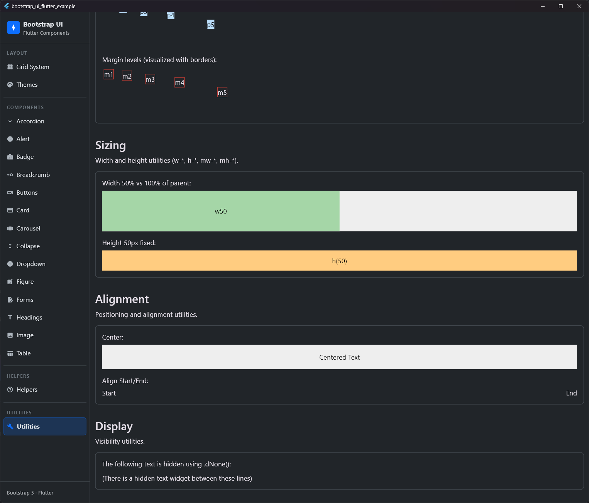

# Utility Extensions

## Preview




In addition to spacing, the library provides several other utility extensions to streamline your UI development.

## Display & Visibility

`BsDisplayExtension` handles showing, hiding, and opacity.

| Method | Description |
| :--- | :--- |
| `.visible(bool)` | Standard `Visibility` widget wrapper. |
| `.gone(bool)` | `Visibility` with `maintainState: false`. |
| `.dNone()` | Alias for `.gone(true)`. |
| `.opacity(double)` | `Opacity` widget wrapper. |

```dart
Text('Hidden').dNone();
Text('Transparent').opacity(0.5);
```

## Alignment

`BsAlignmentExtension` handles positioning.

| Method | Description |
| :--- | :--- |
| `.align(Alignment)` | `Align` widget wrapper. |
| `.center()` | `Center` widget wrapper. |
| `.alignStart()` | `Align` to `centerStart`. |
| `.alignEnd()` | `Align` to `centerEnd`. |
| `.alignTop()` | `Align` to `topCenter`. |
| `.alignBottom()` | `Align` to `bottomCenter`. |

```dart
Text('Centered').center();
Text('Left').alignStart();
```

### Inline Vertical Alignment (Vertical Align)

`BsVerticalAlignExtension` handles the vertical alignment of elements (e.g., icons, badges, or images) inside a text flow (`RichText` or `Text.rich`). These methods return a `WidgetSpan` and correspond to the Bootstrap `.align-*` classes.

| Method | Description | Corresponds to Bootstrap Class |
| :--- | :--- | :--- |
| `.alignBaseline()` | Aligns the baseline of the element with the baseline of its parent. | `.align-baseline` |
| `.alignTopInline()` | Aligns the top of the element with the top of the tallest element on the line. | `.align-top` |
| `.alignMiddle()` | Centers the element vertically within the line. | `.align-middle` |
| `.alignBottomInline()` | Aligns the bottom of the element with the bottom of the lowest element on the line. | `.align-bottom` |
| `.alignTextTop()` | Aligns the top of the element with the top of the parent element's font. | `.align-text-top` |
| `.alignTextBottom()` | Aligns the bottom of the element with the bottom of the parent element's font. | `.align-text-bottom` |

```dart
Text.rich(
  TextSpan(
    children: [
      TextSpan(text: 'Text with '),
      const Icon(Icons.star).alignMiddle(),
      TextSpan(text: ' centered icon.'),
    ],
  ),
)
```

## Sizing

`BsSizeExtension` handles dimensions and expansion.

| Method | Description | Corresponds to Bootstrap |
| :--- | :--- | :--- |
| `.w(double)` | Sets fixed width using `SizedBox`. | - |
| `.h(double)` | Sets fixed height using `SizedBox`. | - |
| `.w100()`, `.w75()`, `.w50()`, `.w25()` | Sets width factor relative to parent. | `.w-*` |
| `.h100()`, `.h75()`, `.h50()`, `.h25()` | Sets height factor relative to parent. | `.h-*` |
| `.size100()` | Sets both width and height to infinity. | `.w-100.h-100` |
| `.vw100(context)` | Sets width to 100% of viewport width. | `.vw-100` |
| `.vh100(context)` | Sets height to 100% of viewport height. | `.vh-100` |
| `.vw50(context)` | Sets width to 50% of viewport width. | `.vw-50` |
| `.vh50(context)` | Sets height to 50% of viewport height. | `.vh-50` |
| `.minVw100(context)` | Sets minimum width to 100% of viewport width. | `.min-vw-100` |
| `.minVh100(context)` | Sets minimum height to 100% of viewport height. | `.min-vh-100` |
| `.minVw50(context)` | Sets minimum width to 50% of viewport width. | `.min-vw-50` |
| `.minVh50(context)` | Sets minimum height to 50% of viewport height. | `.min-vh-50` |
| `.minW100()` | Sets minimum width to 100% of parent width. | `.min-w-100` |
| `.minH100()` | Sets minimum height to 100% of parent height. | `.min-h-100` |
| `.expanded([flex])` | `Expanded` widget wrapper. | - |

```dart
Container(color: Colors.red).w(50).h(50);
Button('50% Width').w50();
Container().vh100(context); // Occupies 100% of screen height
Container().vh50(context);  // Occupies exactly 50% of screen height
```