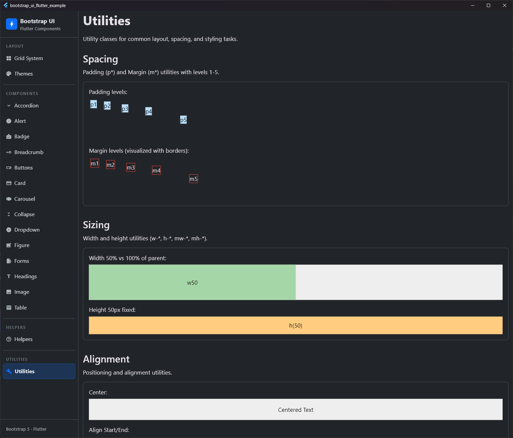

# Spacing Utilities

## Preview




The `BsSpacingExtension` provides a set of concise methods to apply padding and margin to any Flutter widget, mirroring the naming convention of Bootstrap's utility classes.

## Features

- **Concise Syntax**: Chainable methods like `.p3()`, `.mb2()`, etc.
- **Bootstrap Alignment**: Uses standard Bootstrap spacing levels (1-5).
- **Flexible**: Allows custom values via `.p(double)`, `.m(double)`, etc.
- **Context Aware**: Correctly handles padding (inner space) and margin (outer space) concepts in Flutter's widget tree.

## Usage

Instead of wrapping a widget in a `Padding` widget manually:

```dart
// Standard Flutter (Padding)
Padding(
  padding: EdgeInsets.all(16.0),
  child: Text('Hello'),
)

// With BsSpacingExtension
Text('Hello').p3()

// Margin (Applying space outside a decorated box)
Container(color: Colors.red, child: Text('Alert'))
  .mb3() // Adds margin bottom outside the red box
```

## Available Methods

### Standard Levels (0-5)

These methods use the predefined `BsSpacing` tokens (including level 0 for 0.0 value):

| Type | Padding Methods | Margin Methods | Bootstrap Equivalent |
| :--- | :--- | :--- | :--- |
| **Uniform** | `.p0()` to `.p5()` | `.m0()` to `.m5()` | `p-*` / `m-*` |
| **Horizontal** | `.px0()` to `.px5()` | `.mx0()` to `.mx5()` | `px-*` / `mx-*` |
| **Vertical** | `.py0()` to `.py5()` | `.my0()` to `.my5()` | `py-*` / `my-*` |
| **Top** | `.pt0()` to `.pt5()` | `.mt0()` to `.mt5()` | `pt-*` / `mt-*` |
| **Bottom** | `.pb0()` to `.pb5()` | `.mb0()` to `.mb5()` | `pb-*` / `mb-*` |
| **Start (Left)** | `.ps0()` to `.ps5()` | `.ms0()` to `.ms5()` | `ps-*` / `ms-*` |
| **End (Right)** | `.pe0()` to `.pe5()` | `.me0()` to `.me5()` | `pe-*` / `me-*` |

---

### Auto Margins

Corresponds to the Bootstrap classes `.m-auto`, `.mx-auto`, etc. These are perfect for aligning widgets inside parent Flexbox (Row, Column) or Stack layouts.

| Method | Description | Equivalent |
| :--- | :--- | :--- |
| `.mAuto()` | Centers the widget horizontally and vertically. | `m-auto` |
| `.mxAuto()` | Centers the widget horizontally. | `mx-auto` |
| `.myAuto()` | Centers the widget vertically. | `my-auto` |
| `.msAuto()` | Aligns the widget to the end (right) of parent (Auto-Margin Start). | `ms-auto` |
| `.meAuto()` | Aligns the widget to the start (left) of parent (Auto-Margin End). | `me-auto` |
| `.mtAuto()` | Aligns the widget to the bottom of parent. | `mt-auto` |
| `.mbAuto()` | Aligns the widget to the top of parent. | `mb-auto` |

```dart
// Pushes the widget to the far right inside a Row layout
Text('Aligned Right').msAuto();
```

---

### Custom Values

If you need a specific pixel value that is not covered by the standard levels:

- Padding: `.p(val)`, `.px(val)`, `.py(val)`, `.pt(val)`, `.pb(val)`, `.ps(val)`, `.pe(val)`
- Margin: `.m(val)`, `.mx(val)`, `.my(val)`, `.mt(val)`, `.mb(val)`, `.ms(val)`, `.me(val)`

## Example

```dart
Column(
  children: [
    Text('Title').mb3(), // Margin bottom level 3 (spacing between items)
    Row(
      children: [
        Icon(Icons.star).pe2(), // Padding end level 2
        Text('Rating'),
      ],
    ).px4(), // Horizontal padding level 4
  ],
).p5() // Uniform padding level 5 for the container
```